# 现代操作系统

## 一、概述

### 0.计算机硬件介绍


### 1. 操作系统的概念

#### 1. 进程

进程本质上是一个正在执行的程序。与每个进程相关的是进程的**地址空间**，这是从某个最小的存储位置到某个最大存储位置的列表。在这个地址空间中，进程可以进行读写。改地址空间中存放有可执行程序、程序的数据以及程序的堆栈。与每个进程相关的还有资源集，通常包括寄存器（含有程序计数器和堆栈指针）打开文件的清单、突出的报警、有关进程清单，以及运行该程序所需要的所有其他信息。进程基本上就是容纳运行一个程序所需要所有信息的容器。

与进程管理有关的最关键的系统调用是那些进行进程创建和进程终止的系统调用。典型的例子。有一个「命令解释器」或shell进程从终端上面读取命令。此时，当一个用户刚键入一条命令要求变异一个程序，shell必须创建一个新的进程来执行编译程序。当编译的进程结束时，它执行一条系统调用来终止自己。

若一个进程能够创建一个或者多个进程（子进程），而且这些进程又可以创建子进程，则很容易得到进程树。**合作完成某些作业的相关进程经常需要彼此通信**以便同步它们的行为。这种通信称为**进程间通信**。

其他可用的进程系统调用包括：申请更多的内存（或释放不再需要的内存）、等待一个子进程结束、用另一个进程覆盖该程序等。

有时，需要向一个正在运行的进程传递信息，而该进程并没有等待接收信息。例如，一个进程通过网络向另外一台机器上的进程发送消息进行通信。为了保证一条消息或者消息的应答不会丢失，发送者要求它所在的操作系统在指定的若干秒后给一个通知，这样如果对方尚未收到收到确认消息就可以进行重发。在设定该定时器后，程序可以继续做其他工作。

**在限定的秒数流逝之后，操作系统向该进程发送一个警告信号。此信号引起该进程暂时挂起，无论该进程在做什么，系统将其寄存器的值保存到堆栈，并开始运行一个特别的信号处理过程，比如重新发送可能丢失的消息**。这些信号是软件模拟的硬件中断，除了定时器到期之外，该信号可以由各种原因产生。许多由硬件检测出来的陷阱，比如执行了非法指令、使用了无效的地址等，也被转换成该信号并交给这个进程。


#### 2. 地址空间

每台机器都有一些主存，用来保存正在执行的程序。在非常简单的操作系统中，内存中一次能有一个程序。如果要运行第二个程序每一个程序就必须被移出内存，再把第二个程序装入内存。

比较复杂的操作系统允许在内存中同时运行多道程序。为了避免它们彼此之间相互干扰，需要有某种保护机制。虽然这种机制必然是硬件形式的，但是它由操作系统掌控。

这些涉及到对计算机主存的管理和保护。另外一种不同的，但是同样重要的，并与存储器有关的内容，是**管理进程的地址空间**。通常，每个进程有一些可以使用的地址集合，典型值是从0到某个最大值。然而，有的程序的大小严重超过了主存的大小，这个怎么办呢？

操作系统会把部分地址空间装入主存，部分留在磁盘上面，并且在需要的时候穿梭交换它们。**在本质上，操作系统创建了一个地址空间的抽象，作为进程可以引用地址的集合**。该地址空间和机器的物理内存解耦。对地址空间和物理空间的管理组成了操作系统功能的一个重要部分。


#### 3. 文件

支持操作系统的另一个关键概念是文件系统。操作系统的一项主要的功能就是隐藏磁盘和其他IO设备的细节特性，并提供给程序员一个良好的、清晰的独立于设备的抽象文件模型。创建文件、删除文件、读文件和写文件都需要系统调用。在文件可以读取之前，必须先在磁盘上定位和打开文件，在文件读过之后应该关闭该文件，有关的系统调用就是为了完成这类操作。

为了提供保存文件的地方，大多数操作系统支持目录的概念。从而可以把文件分类成组。

进程和文件层次都可以组成树状结构，但是又有一点区别。一般进程的树状结构层次不会超过3层。文件树状结构的层次会有更多层。进程树的结构只是暂时的，不会存在很久，而目录层次可能存在很久。在所有权和保护方面也是有区别的。典型的，只有父进程能控制和访问子进程，而在文件和目录中通常存在一种机制，是文件所有者之外的其他用户也可以访问该文件。

在UNIX中，有一个重要的概念是特殊文件。提供特殊文件是为了使IO设备看起来像文件一样。这样，就像使用系统调用读写文件一样，IO设备也可以通过同样的系统调用进行读写。有两类特殊文件：**块特殊文件**和**字符特殊文件**。

**块特殊文件**：由可随机存储的块组成的设备，如磁盘等。比如打开一个块特殊文件，然后读第四块，程序可以直接访问设备的第四块而不必考虑存放该文件的文件系统结构。

**字符特殊文件**：用于打印机、调制解调器和其他接收或输出字符流的设备。特殊文件保存在/dev目录中。

最后一个特性，既与文件又和进程有关：**管道**。管道是一种虚拟文件，它可以连接两个进程。如果进程A和B希望通过管道对话，他们必须提前设置该管道。当进程A想对进程B发送数据时，它把数据写到管道上面，管道就像输出文件一样。进程B可以通过读取该管道而得到数据，仿佛这个管道和输入文件一样。

#### 4.输入输出

所有的计算机都有用来获取输入输出的物理设备。因此，每个操作系统都有管理其IO设备的IO子系统。某些IO软件时设备独立的，既这些IO软件部分可以同样应用于许多或者全部的IO设备上。其他部分，如设备驱动程序，是专门为特定的IO设备设计的。


#### 5. 保护


#### 6.shell

操作系统是进行系统调用的代码。UNIX的命令解释器称为Shell。尽管shell本身不是操作系统的一部分，但它体现了很多操作系统的特性。

#### 7. 个体重复系统发育


### 2. 系统调用

擦做系统主要具有两种功能：为用户程序提供抽象和管理计算机资源。

在多数情况下，用户程序和操作系统之间的交互处理属于前者。对用户而言，资源管理部分主要是透明和自动完成的。这样，用户程序和操作系统之间的交互主要就是处理抽象。


#### 1.用于进程管理的系统调用

在UNIX中，fork是唯一一个可以在POSIX创建进程的途径。 他创建一个原有进程的精确副本，包括所有的文件描述符，寄存器等全部内容。在fork之后，原油的进程及其副本（父与子）就分开了。在fork时，所有的变量都具有一样的值，虽然父进程的数据被复制用以创建子进程，但是其中一个的后续变化并不会影响到另一个。

多数情况下，在fork之后，子进程需要执行与父进程不同的代码。为了等待子进程结束，父进程执行一个waitpid的系统调用，它只是等待，直至子进程终止。waitpid可以等待一个特定的子进程，或者通过将第一个参数设置为-1的方式，从而等待任何一个老的子进程。在waitpid完成之后，将把第二个参数statloc只想的地址设置为子进程的退出状态（正常或异常终止及退出值）。

使用shell为例，说明shell如何使用fork。再输入一条命令后，shell创建一个新的进程。这个子进程必须执行用户的命令。通过使用execve系统调用可以实现这一点，这个系统调用会引起其整个核心映像被一个文件代替，该文件有第一个参数给定。用一个简化的shell说明fork、waitpid、execve的使用。

```c
#define TRUE 1
while(TRUE){
  type_prompt();
  read_command(command,parameters);
  
  if(fork()!=0){       /*派生子进程 */
    /*parent code*/
    waitpid(-1,&status,0);  /*等待子进程退出 */
  }else{
    /*child code*/
    execvr(command,parameters,0);/*执行命令*/
  }
  
}
```


在UNIX中的进程将其存储空间划分为三段：正文段（程序代码）、数据段（变量）以及堆栈段。数据段向上增长，堆栈段向下增长。夹在中间的是为使用的地址空间。堆栈段数据自动增长，数据段需要使用系统调用brk。


#### 2. 用于文件管理的系统调用

要读写一个文件首先要使用open打开文件。这个系统调用通过路径名称指定需要打开的文件名称，O_RDONLY,O_WRONLY,O_RDWR。表示读写的方式。创建一个文件，使用O_CREAT参数. 然后使用返回的文件描述符进行读写操作。最后使用close关闭文件，这个调用使得该文件描述符在后续的open中被再次使用。


#### 3.用于目录管理的系统调用


#### 4.各种系统调用


### 3. 操作系统结构


#### 1.单体系统

层次结构如下：

- 需要一个主程序，用来处理**服务过程请求**；
- 需要一套服务过程，用来执行系统调用；
- 需要一套实用过程，用来辅助服务过程。

除了在计算机初启时所载入的核心操作系统外，许多操作系统支持可装载的 扩展，比如IO设备驱动和文件系统。可以按照需要载入。

#### 2. 层次式系统

把上面的系统进一步通用化，可以形成一个层次式结构的操作系统，他的上层软件都是在下一层软件的基础上构建的。

#### 3. 微内核

在分层方式中，设计者需要确定在哪里划分内核——用户的边界。传统的，所有层都在内核中，但是这样搞没有必要。应该尽可能减少内核态中功能的做法更好，因为内核中的错误会快速的拖累系统。

微内核的设计思想，为了提高可靠性，将操作系统划分成小的、良好定义的模块。只有一个模块——微内核——运行在内核上，其余的模块，由于功能相对弱些，则作为普通的用户进程运行。由于把每个设备驱动和文件系统分别作为普通用户进程，这些模块的错误虽然会中断这个模块，但是不会导致整个系统的死机。

#### 4. 客户机——服务器模式


#### 5. 虚拟机


#### 6.外核


## 二、进程与线程

### 1.进程

严格地说，在某一个瞬间，CPU只能运行一个进程。但在1秒内，他可能运行多个进程，造成同时运行多个进程的错觉。

#### 1. 进程模型

在进程模型中，计算机上所有可运行的软件，通常也包含操作系统，被组织称若干的顺序进程，简称进程。一个进程就是一个正在执行程序的实例，包括程序计数器、寄存器和变量的当前值。从概念上说，每个进程有自己的虚拟CPU。

#### 2. 创建进程


#### 3. 进程的终止


#### 4.进程的层次结构


#### 5. 进程的状态


#### 6. 进程的实现

为实现进程模型，操作系统维护着一张表，即进程表。每个进程占用一个进程表项。该表项包含了进程状态的重要信息，包括程序计数器、堆栈执政、内存分配状态、所打开的文件状态、账号和调度信息，以及因为调度运行状态转换到就绪状态或者阻塞态时必须保存的信息，从而保证该进程随后能再次启动。


与每一IO类关联的是一个称为中断向量的位置，靠进内存底部的固定区域。它包含中断服务程序的入口地址。假如当一个磁盘发生中断时，用户进程3正在运行，则**中断硬件**将程序计数器、程序状态字，相关寄存器压入对战，计算机随后跳转到中断向量所指的地址。这些是硬件完成的所有操作，然后软件（中断服务例程）就会接管一切剩余的工作。

所有的中断都从保存寄存器开始，对于当前进程来说，通常是在进程表项中。随后，会从堆栈中删除有中断硬件机制存入堆栈的那部分信息，并将堆栈指针指向一个有进程处理程序所使用的临时堆栈。这些保存寄存器值和设置指针等操作，无法使用C语言描述，所以这些操作通过短小的汇编语言例程来完成，这些例程可以供所有的中断使用。

当该例程结束后，他调用一个C过程处理某个特定的中断类型剩下的工作。在完成有关工作之后，大概就会是某些进程就绪，接着调用调度程序，决定随后该运行哪个进程。随后将控制转给一段汇编语言代码，为当前的进程装入寄存器值以及内存映射并启动该进程运行。

#### 7.多道程序设计模型


### 2. 线程

在传统操作系统中，每个进程有一个地址空间和一个控制线程。不过，经常存在在同一个地址空间中准并行的运行多个控制线程的状态，这些线程就像分离的进程（除了地址空间共享）。

#### 1. 线程的使用

为什么有了进程之后，还需要另外一类进程呢？

主要原因：

- 许多应用中，同时发生着多种活动。其中，某些活动随着时间的推移会被阻塞。通过将这些应用程序分解成可以**准并行**运行的多个顺序线程，程序设计模型会变得简单。

正是之前关于进程模型的讨论。有了这样的抽象，我们才不必考虑中断、定时器、上下文切换。而只需考察并行进程。类似的，只有在有了多线程概念之后，才加入一种新的元素。并行实体共享同一个地址空间和所有可用数据的能了。对于某些应用，这种能力是必须的，而这正是多进程模型（他们具有不同的地址空间）所无法表达的。

- 第二个需要多线程的理由，由于线程比进程更轻量级。更加容易创建、销毁。速度快10～100倍。
- 第三个理由，主要涉及性能方面的考虑。多多个线程都是CPU密集型的，那么并不能获得性能上的增强。但是如果存在着大量的计算和大量的IO，拥有多线程能够加快应用程序的执行速度。
- 最后，在多CPU系统中，多线程是有益的，真正的并行有了实现的可能。


案例分析：p56 画图说明


| 模型       | 特性                         |
| ---------- | ---------------------------- |
| 多线程     | 并行性、阻塞系统调用         |
| 单线程进程 | 无并行性、阻塞系统调用       |
| 有限状态机 | 并行性、非阻塞系统调用、中断 |


#### 2. 经典线程模型

进程模型基于两种独立的概念：资源分组处理与执行。有时，将这两个概念分开会更有益，这也映入了"线程"这一个概念。

首先，我们学习一下经典的线程模型；后面研究一下"模糊进程与线程分界线"的Linux线程模型。


理解进程的一个角度：通过某种方法把相关的资源集中在一起。进程有存放程序正文和数据以及其他资源的地址空间。这些资源中包括打开的文件、子进程、即将发生的报警、信号处理程序、账号信息。把他们都放到进程中更容易管理。

另外一个概念，**进程拥有一个执行的线程。在线程中有一个程序计数器，用来记录接着要执行哪一条指令。线程拥有寄存器，用来保存当前线程的工作变量。线程还拥有一个堆栈，用来记录执行历史，其中每一帧保存了一个一调用的，但是还没有从中返回的过程**。尽管线程必须在某一个进程中执行，但是线程和他的进程是不同的概念，并且可以分别处理。

**进程用于将资源集中在一起，而线程则是在CPU上被调度执行的实体**。

线程给进程模型增加一项内容，即在同一个环境进程中，允许彼此之间有较大独立性的多个线程执行。在同一个进程中并行运行多个线程，是对在同一台计算机上并行运行多个进程的模拟。前一种情况下，多个线程共享同一个地址空间和其他资源。而后一种情形下，多个进程共享物理内存、磁盘和其他资源。由于线程具有进程的某些性质，所以有时被称为轻量级进程。多线程，用来描述在同一个进程中允许多个线程的情况。一些CPU已经有直接硬件支持多线程，并允许线程在纳秒级完成。

TODO  画图


在上图a中，可以看到三个传统的进程。每个进程有自己的地址空间和单个控制线程。相反，b中，可以看到一个进程带有三个控制线程。尽管在两种情况中都有三个线程，但是a中，每个线程都在不同的地址空间中运行，而b中的这三个线程全部在相同的地址空间中运行。


进程中的不同线程不像不同进程之间那样存在很大的独立性。所有的线程都有完全一样的地址空间，这也为这她们也会共享同样的全局变量。由于各个线程都可以访问进程地址空间中的每一个内存地址，所以一个线程可以读、写或着清除另外一个线程的堆栈。线程之间是没有保护的，原因如下：1. 不可能 2. 没必要。

这个和不同进程是有差别的。不同的进程会来自不同的用户，它们彼此之间可能有敌意，一个进程总是由某个用户所拥有，该用户创建多个线程应该是为了他们之间的合作而不是彼此之间进行争斗。出了共享地址空间之外，所有的线程还共享同一个打开文件集、子进程、报警以及相关信号等。

| 每个进程中的内容                                             | 每个线程中的内容               |
| ------------------------------------------------------------ | ------------------------------ |
| 地址空间、全局变量、打开文件、子进程、即将发生的报警、信号与信息处理程序、账户信息 | 程序计数器、寄存器、堆栈、状态 |


**线程概念试图实现的是，共享一组资源的多个线程的执行能力，方便这些线程可以为完成一个任务而共同工作**。

线程和传统的进程一样（只有一个线程的进程），线程可以处于若干种状态的热河一个：运行、阻塞、就绪、终止。正在运行的线程拥有CPU并且是活跃的。被阻塞的线程正在等待某个释放他的事件。比如，当一个线程执行从键盘读入数据的系统带哦勇士，该线程就被阻塞直到键入了输入为止。线程可以被阻塞，以便等待某个外部事件的发生或者等待其他线程来释放他。就绪线程可以被调度运行，并且只要轮到它就很快可以运行。线程状态之间的转换和进程状态之间的转换是一样的。


每个线程又自己的堆栈。**每个线程的堆栈都有一帧**，供各个**被调用但是还没有从中返回的过程使用**。在该帧中存放了相应过程的局部变量以及过程调用完成后使用的返回地址。例如，如果过程X调用过程Y，Y又调用Z，那么当Z执行时，供X、Y、Z使用的帧全部存在堆栈中。通常每个线程回调用不同的过程，有各自不同的执行历史。因此，每个线程需要有自己的堆栈。

在多线程的情况下，进程通常会从当前的单个线程开始。这个线程有能力通过调用库函数创建新的线程。thread——create的参数专门制定了新线程要运行的过程名。这里，没有必要对新线程的地址空间进行限定，因为新线程会自动在创建线程的地址空间中运行。所有的线程都是平等的。不论有无层次，创建新的线程都会返回一个线程标识符，该标识符就是新线程的名字。

当一个线程完成之后，可以通过调用一个库过程（thread_exit）退出。该线程接着就会消失，不再可调度。在某些线程系统中，通过调用一个过程，例如thread_join，一个线程可以等待一个特定线程退出。这种情况，线程的创建和终止非常类似于进程的创建和终止，并且有着同样的选项。


另一个常见的线程调用时thread_yield，它允许线程自动放弃CPU从而让另一个线程运行。这样一个调用很重要，因为不同于进程，线程库无法利用时钟中断强制线程让出CPU。

要使多线程的程序正确工作，就需要仔细思考和设计。

#### 3. POSIX线程

为了实现可移植的线性程序，IEEE在IEEE标准1003.1c中定义了线程的标准。他定义的线程包叫做Pthread。大部分UNIX系统都支持该标准。这个标准定义了超过60个函数调用。下面主要描述一些主要的函数，说明他是如何工作的。

所有Pthread线程都有某些特性。每个都包含一个标识符、一组寄存器（包括程序计数器）和一组存储在结构中的属性。这些属性包括堆栈大小、调度参数以及使用线程所需要的其他项目。

| 线程调用             | 描述                           |
| -------------------- | ------------------------------ |
| Pthread_create       | 创建一个新线程                 |
| Pthread_exit         | 结束调用的过程                 |
| Pthread_join         | 等待一个特定的线程退出         |
| Pthread_yield        | 释放CPU来运行另外一个线程      |
| Pthread_attr_init    | 创建并初始化一个线程的属性结构 |
| Pthread_attr_destroy | 删除一个线程的属性结构         |


#### 4. 在用户空间中实现线程

有两种主要的方法实现线程包：在用户空间和内核中。这两种方法互有利弊，不过混合实现方法也是有可能的。

第一种方法，把整个线程包放在用户态空间中，内核对线程包一无所知。从内核的角度考虑，就是按正常的方式管理，即单线程进程。这种方法第一个，也是最明显的优点：用户级线程包可以在不支持线程的操作系统上实现。过去所有的操作系统都属于这个范围，即使现在也有一些操作系统还是不支持线程。通过这一方法，可以用函数库实现线程。

所有的这类实现都有同样的通用结构，如下左图，线程在一个运行时系统的顶部运行，这个运行时系统是一个管理线程的过程的集合。之前我们见到过其中的四个过程：pthread_create,pthread_exit,pthread_join和pthread_yield。不过一般还有跟多的过程process。


在用户空间管理线程时，每个进程需要有其专用的线程表，用来跟踪该进程中的线程。这些表盒内核中的进程表类似，不过它仅仅记录各个线程的属性，如每个线程的程序计数器、堆栈指针、寄存器和状态等。该线程表由运行时系统管理。**当一个线程转换到就绪或者阻塞状态时，在该线程表中存放重新启动该线程所需要的信息**，与内核在进程表中存放进程的信息一样。

当某个线程做了一些会引起在本地阻塞的事情后，比如，等待进程中另一个线程完成某项工作，他调用一个运行时系统的过程，这个过程检查该线程是否必须进入阻塞状态。如果是。他在线程表中保存该线程的寄存器（即它本身的）。查看表中可运行的就绪程序，并把新线程的保存值重新装入即起的寄存器中。只要堆栈指针和程序计数器一被切换，新的线程就会自动运行。进行这样的线程切换比内核要快一个数量级，这就是用户级线程包的优势。


不过，线程和进程的一个关键差别。在线程完成运行时，比如，调用thread_yield时，thread_yield代码可以把该线程的信息保存在线程表中，进而，它可以调用线程调度程序来选择另外一个要运行的线程。保存该线程状态的过程和调度程序都是本地过程，所以启动他们比进行内核调用效率更高。另外，不需要陷阱，上下文切换，也不需要对内存高速缓存进行刷新，这个使线程调度非常快。


用户级线程还有一个优点。他允许每个进程有自己定制的调度算法。此外，还具有较好的可扩展性，这是因为在内核空间中内核线程需要一些固定表空间哥堆栈空间，如果内核线程的数量非常大，就会出现问题。

虽然用户级线程有很多优点，但是也会有一些问题。第一个问题，如何实现阻塞系统调用。使用线程的目的就是，**首先要允许每个线程使用阻塞调用，但是还要避免阻塞的线程影响其他的线程。有了阻塞系统调用，这个目的不是能够轻易实现的**。


系统调用可以全部改成非阻塞的，但是这需要修改操作系统，所以这个方法不可行。而且，用户级线程的一个优点就是它可以在现有的操作系统上运行。该操作系统是不可以的，因为它会影响其他的应用程序，需要对他们进行修改。

还有一个替代方案，就是如果某个调用会阻塞，就提前通知。

与阻塞系统调用问题有些类似的是页面故障问题。计算机的工作方式：不是所有的程序都一次性放在内存中。如果某个程序调用或者跳转到了一条不在内存上的指令，就会发生页面故障，二操作系统将到从磁盘读取这个丢失的指令（和这条指令的邻居们），这就称为页面故障。在对所需的指令进行定位和杜如是，相关的进程就会被阻塞。如果又一个线程引起页面故障，内核由于不知道有线程的存在，通常会把整个进程阻塞直到磁盘IO完成为止，尽管其他的线程是可以运行的。

用户级线程包的另一个问题：如果线程开始运行，那么在该进程中的其他线程就不能运行，除非第一个线程自动放弃CPU。在一个单独的进程内部，没有时钟中断，所以不可能用轮转调度的方式调度进程。除非某个线程能够按照自己的意志进入运行时系统，否则调度程序就没有任何机会。

反对者，程序员通常在经常发生线程阻塞的应用中才希望使用多个线程。这些线程持续的进行系统调用，而一旦发生内核陷阱进行系统调用，如果原有的线程已经阻塞，就很难让内核进行线程的切换，如果要让内核消除这种情形，就需要持续进行select系统调用，以便检查read系统调用是否安全。对于这些基本上是CPU密集型而期望极少有阻塞的应用程序而言，使用多线程的目的是啥？这样的做法并不能够得到任何好处，所以没有人会真正提出使用多线程计算。。。


#### 5. 在内核空间中实现线程

此时，我们不再需要运行时系统。另外，每个进程中也没有线程表。相反，在内核中有用来记录系统中所有的线程表。**当某个线程希望创建一个新的线程或者撤销一个已有线程时，它进行一个系统调用，这个系统调用通过对线程表的更新完成线程创建或撤销工作**。

内核的线程表保存了每个线程的寄存器、状态和其他信息。这些信息和在用户空间中的线程是一样的，但是现在保存在了内核中。这些信息是传统内核所维护的每个单线程进程的子集。另外，内核还维护了传统的进程表，以便跟踪进程的状态。

所有能够阻塞线程的调用，都是以系统调用的形式实现，和运行时系统过程相比，代价相当可观。当一个线程阻塞时，内核根据其选择，可以运行同一个进程中的另外一个线程或者运行另一个进程的线程。而在用户级线程中，运行时系统始终运行自己进程里面的线程，直到内核回收了他的cpu。

由于在内核中创建、撤销线程的代价较大，某些系统采取"环保"的方式，回收其线程。当某个线程被撤销时，就把它标记为不可运行的，但是其内核数据结构没有受到影响。在创建一个新的线程的时候，就会复用这个旧的线程。从而节省一些资源的开销。在用户级线程中线程回收也是可以的。但是由于线程的管理代价很低，所以没有必要进行这种方式。

内核线程不需要任何新的、非阻塞的系统调用。如果某个进程中的线程引起页面故障，内核可以很方便的检查该进程是否有其他可运行的线程，如果有，在等待所需要的页面从磁盘读入时，就选择一个可以运行的线程运行。这样做的主要缺点就是系统调用的代价比较大，所以如果线程的操作比较多，就会带来很大的开销。

虽然使用内核线程可以解决很多问题，但是不会解决所有的问题。比如，当一个多线程进程创建新的进程时，会发生什么？新的进程拥有河原来进程相同数量的线程，还是只有一个线程？在很多情况下，最好的选择取决于进程下一步做什么。如果他要调用exec来启动一个新的程序，或许一个线程时正确的选择，但是如果它继续执行，则应该复制所有的线程。

另外一个问题：信号。信号是发给进程而不是线程的，至少在经典模型中是这样的。当一个信号到达时，应该由哪一个线程处理它？线程可以注册他们感兴趣的信号，因此，当一个信号到达的时候，可把它交给需要它的线程，但是如果两个或者更多的线程注册了相同的信号，会发生什么呢？

这只是线程引起问题中的两个，但是还有更多的问题。


#### 6. 混合实现

使用内核级线程，然后将用户级线程与某些或者全部内核线程多路复用起来。如下图所示。如果采用这种方法，编程人员可以决定多少个内核线程和多少个用户级线程彼此多路复用。

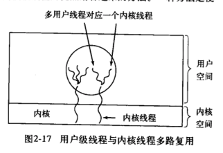

采用这种方法，内核只识别内核线程，并对其进行调度。其中一些内核级线程会被多个用户级线程多路复用。如同在没有多线程能力操作系统中某个进程中的用户级线程一样，可以创建、撤销和调度这些用户级线程。这种模型中，每个内核级线程又一个可以轮流使用的用户级线程集合。

#### 7. 调度程序激活机制

尽管内核级线程在一些关键点上优于用户级线程，但是无可争议的事内核级线程的速度比较慢。因此，研究人员在寻找在保持其优良特性的前提下改进其速度的方法。下面介绍Scheduler activation机制。

**调度程序激活工作的目的是模拟内核线程的功能，但是为线程包提供通常在用户空间中才能实现的更好的性能和更大的灵活性。**如果用户线程从事某种系统调用时是安全的，那就不应该进行专门的非阻塞调用或者进行前提检查。无论如何，如果线程阻塞在某个系统调用活着页面故障上，只要在同一个进程中有任何就绪的线程，就应该有可能运行其他的线程。

由于避免了在用户空间和内核空间之间的不必要切换，从而提高了效率。例如，如果某个线程犹豫等待另一个线程的工作而阻塞。此时没有理由请求内核，这样就减少了内核——用户转换的开销。用户空间的运行时系统可以阻塞同步的线程而调度另外一个新线程。

当使用**调度程序激活机制**时，内核给每个进程安排一定数量的虚拟处理器。并且让用户空间的运行时系统将线程分配到处理器上，这个机制也可以用在多处理器中，此时虚拟处理器可能成为真实的CPU。分配给一个进程的虚拟处理器的初始数量是一个，但是该进程可以申请更多的处理器并且在不用时退回。内核也可以取回已经分配出去的虚拟处理器，以便把他们分给需要更多处理器的进程。

这个机制的工作的基本思路，当内核了解到一个线程阻塞之后（执行了一个阻塞系统调用或者产生了一个页面故障），内核通知该进程的运行时系统，并且在堆栈中以参数的形式传递有问题的线程编号和所发生时间的一个描述。内核通过一个已知的起始地址启动运行时系统，从而发出通知，这是对UNIX中信号的一种模拟。这个机制称为**上行调用upcall**。

一旦这样激活，运行时系统就重新调度其线程，过程如下：把当前的线程标记为阻塞并从就绪表中取出另一个线程，设置其寄存器，然后再启动。稍后，当内核知道原来的线程又可运行时（例如，原先试图读取的管道又了数据，或者已经从磁盘中读取了故障的页面），内核就又一次上行调用运行时系统，通知它这一事件。此时该运行时系统按照自己的判断，或者立即重启被阻塞的线程，或者把他放到就绪表中，稍后运行。

当某个用户线程运行的同时发生一个硬件中断时，被中断的CPU切换进核心态。如果被中断的进程对引起该中断的事件不感兴趣，比如，是另外一个进程的IO完成了，那么中断处理程序结束之后，就把中断的额线程恢复到中断之前的状态。不过，如果该进程对中断感兴趣，比如，是该进程的某个线程所需要的页面到达了，那么被中断的线程就不再启动，代之为挂起被中断的线程。而运行时系统则启动对应的虚拟CPU，此时被中断线程的状态保存在堆栈中。随后，运行时系统决定在CPU上调度哪个线程：被中断的线程、就绪的线程或者某个第三种选择。

#### 8. 弹出式线程

在分布式系统中经常使用线程。

一个消息到达导致系统创建一个新的处理该消息的线程，称为弹出式线程。优点：新，没有历史。这样就没有必要存储寄存器、堆栈这类的内容，每个线程从新开始。

在使用弹出式线程之前，需要提前计划。哪个进程中的线程线运行？如果系统支持在内核上下文中运行线程，线程就有可能在那里运行。在内核空间中运行弹出式线程通常比在用户空间中容易、快捷，而且内核空间中的弹出式线程很容易访问所有的表格和IO设备，这些也许在处理中断时很有用。但是内核出错比用户空间出错更可怕。

### 3. 进程间通信（Inter  Process Communication,IPC）

进程间需要和其他进程通行。例如，在一个shell管道中，第一个进程的输出必须要传递给第二个进程。因此，在进程之间需要通信，而期望最好使用一种良好的方式，不需要使用中断。

主要有三个问题：

- 一个进程如何把消息传递给另一个进程；
- 确保两个或更多的进程在关键活动中不会出现交叉；竞争
- 与正确的顺序有关，即如何保证进程之间有序的执行，确保业务没有问题；

#### 1. 竞争条件

在一些操作系统中，协作的进程可能共享一些彼此都能读写的公用存储区。这个公用存储区可能在内存中，也可能是一个共享文件。这里的共享存储区的位置并不影响通信的本质及其带来的问题。

例如，一个假脱机打印程序。当一个进程需要打印一个文件时，他将文件名放在一个特殊的假脱机目录下。另一个进程则周期性的检查是否有文件需要打印，若有则打印并将该目录下的文件删除。

假设有两个进程在争夺一个资源的时候，会发生冲突。

在Murphy法则（任何可能出错的地方终将出错）生效时，可能发生以下的情况。进程A读取共享变量in的值为7，将7保存到一个局部变量next_free_slot中。此时发生一次时钟中断，CPU认为A已经运行了足够长的时间了，决定切换到进程B。B发现读取的in也是7，存在了局部变量中。这时两个进程会发生冲突。

即两个或多个进程读写某些共享数据，而最后的结果取决于精确的时序，称为**竞争条件**（race condition）

#### 2. 临界区

怎样避免竞争条件呢？实际上凡是涉及到共享内存、共享文件以及共享任何资源的情况都会发生前面类似的错误，要避免错误，关键是找到某个途径来阻止多个进程同时读写共享的数据。换言之，需要**互斥**（mutual exclusion），即以某种手段来确保当一个进程在使用一个共享变量或文件时，其他进程不能做同样的操作。

避免竞争条件的问题，也可以通过一种抽象的方式进行描述。

一个进程的一部分时间做内部计算或者另外一些不会引起竞争条件的操作。在某些时候进程可能需要访问共享内存或者共享文件，或者执行另外一些会导致竞争的操作。我们把对共享内存进行访问的程序片段称作**临界区域(critical region)**或者**临界区(critical section)**。如果我们能够适当的安排，**使得两个进程不能同时处于临界区中，就能够避免竞争条件**。

这样虽然避免了金正条件，但它不能保证使用共享数据的并发进程能够正确和高效地进行协作。对于一个好的方案，需要满足以下4个条件：

- 任何两个进程不能同时处于其临界区
- 不应对CPU的速度和数量做任何假设
- 临界区外运行的进程不得阻塞其他进程
- 不得使进程无限期等待进入临界区

#### 3. 忙等待的互斥

几种实现互斥的方案。

##### 1. 屏蔽中断

在单处理器系统中，最简单的方法是使每个进程在刚刚进入临界区后立即屏蔽所有中断，并在就要离开之前再打开中断。屏蔽中断之后，时钟中断也会被屏蔽。CPU直邮在发生时钟中断的时候才会进行进程切换，这样，在屏蔽中断之后CPU将不会被切换到其他进程。因此，一个进程屏蔽中断之后，他就可以检查和修改共享内存，而不必单行其他进程的介入。

这种方案并不好，因为把屏蔽中断的权利交给用户进程是不明智的。如果系统时多处理器，则屏蔽中断仅仅对执行disable指令的那个CPU有效。其他CPU将继续进行，并可以访问共享内存。

l另一方面，对内核来说，当它在更新变量或列表的几条指令期间将中断屏蔽是很方便的的。当就绪进程队列之类的数据状态不一致时发生中断，则将导致竞争条件。所以结论是：屏蔽中断对于操作系统本身而言是一项很有用的技术，但是对于用户进程层则不是一种合适的通用互斥机制。

##### 2. 锁变量

这是一种软件解决方案。设想有一个共享（锁）变量，其初始值为0。当一个进程想进入其临界区时，他首先测试这把锁。如果该锁的值为0，则该进程将其设置为1并进入临界区。若这把锁的值已经为1，则该进程只能等待他的值变成0.。

该机制有一个漏洞，就是这个共享变量存在竞争。大家都可以搞。

##### 3. 严格轮换法

在一个等待循环中不停的测试变量turn，看其值何时变成1.连续测试一个变量直到某个值出现为止，称为忙等待。由于这种方式浪费CPU的时间，所以通常应该避免。

直有在有理由认为等待时间是非常短的情况下，才使用忙等待。**用于忙等待的锁**，称为**自旋锁（spin lock）**。

这个说明，在一个进程比另外一个进程慢很多事，轮流进入临界区不是一个好的办法。


##### 4. Peterson解法

   


##### 5. TSL指令

硬件支持的方案。计算机中都会有类似的指令：

TSL RX,LOCK

称为测试并加锁，他将一个内存字lock读到寄存器RX中，然后在该内存地址上村一个非零值。读字和写字操作保证是不可分割的，即该指令结束之前其他处理器均不允许访问该内存字。执行TSL指令的CPU将锁住在内存总线，以禁止其他CPU在本指令结束之前访问内存。

锁住存储总线不同于屏蔽中断。屏蔽中断，然后再读取内存字之后更着写操作并不能阻止总线上的第二个处理器在读操作和写操作之间访问该内存字。事实上，在处理器1上屏蔽中断处理对处理器2根本没有什么影响。让处理器2原理内存，直到处理器1处理完成的唯一方法就是锁住总线，这个需要一个特殊的硬件设施（基本上，一根总线就可以确保总线由锁住她的处理器使用，其他的不可以）。

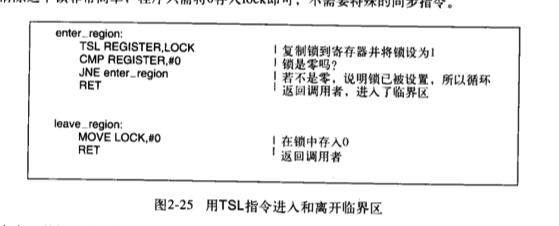

一个可替代的指令XCHG，它原子性的交换了两个位置的内容。


#### 4. 睡眠和唤醒

PeterSon解法和TSL或者XCHG解法都是正确的，但是他们都有忙等待的缺点。这些解法本质上是这样的：当一个进程想进入临界区时，先检查是否允许进入，若不允许进入，则该进程原地等待，直到允许为止。

这种做法不经浪费了CPU时间，而且还可能引起预想不到的结果。例如，当一台计算机有两个进程，H进程优先级高，L优先级较低。调度规则规定，只要H处于继续状态他就可以运行。在某一时刻，**L处于临界区中，此时H变到就绪，准备运行。**现在H开始忙等待，但是**由于当H就绪时L不会被调度，也就无法离开临界区**，**所以H将永远等待下去**。优先级反转问题。

考察几个进程间的通信原语，他们在无法进入临界区时将被阻塞，而不是忙等待。最简单的是sleep和wakeup。sleep是一个将引起调用进程阻塞的系统调用，即被挂起，直到另一个进程将其唤醒。wakeup调用有一个参数，即要被唤醒的进程。另外一种方法是让sleep和wakeup各有一个参数，即有一个用于匹配sleep和wakeup的内存地址。

**进程间通信原语**

- 生产者——消费者问题

两个进程共享一个公共的固定大小的缓冲区。其中一个是生产者，将消息放到缓冲区，另一个是消费者，从缓冲区取出消息。

当缓冲区已经满了。此时生产者还想放入一个新的数据。解决方案：让生产者睡眠，带消费者从缓冲区中取出一个活多个数据项时再唤醒它。同样的，当消费者试图从缓冲区获取数据的时候，为空时睡眠，直到生产者向其中放入一些数据时再将它唤醒。

为了跟踪缓冲区中的数据项数，我们需要一个变量count。如果缓冲区最多存放N个数据项，则生产者代码将首先检查count是否达到了N。若是生产者睡眠，否则生产者向缓冲期放入一个数据并增加count的值。

在本质上这个并没有解决任何问题。

#### 5. 信号量

信号量使用一个整型变量来累计唤醒次数，共以后使用。一个信号量的曲直可以为0（标水没有保存下来的唤醒操作）或者为正值（表示一个或者多个唤醒操作）。

设立两种操作：down和up。对一个信号量执行down操作，则是检查其值是否大于0.若大于0，则将其值减1（即用掉一个保存的唤醒信号）并继续；若为0，则进程将睡眠，而且此时down操作并未结束。检查数值、修改变量值以及可能发生的睡眠操作均作为一个单一的、不可分割的原子操作完成。保证一旦一个信号量开始操作，则在该操作完成或阻塞之前，其他进程均不允许访问该信号量。这种原子操作对于解决同步问题和避免竞争条件是绝对必要的。所谓原子操作，是指一组相关联的操作要么搜不间断的执行，要么都不执行。


信号量的另一个用途用于同步（synchromization）.信号量full和empty用来保证某种事件的顺序发生或者不发生。他保证当缓冲区满的时候生产者停止运行，以及当缓冲区空的时候消费者停止运行。


#### 6.互斥量

如果不需要信号量的计数能力，优势可以使用信号量的一个简化版本，称为互斥量（mutex）。互斥量仅仅适用于管理共享资源或者一小段代码。由于互斥量实现时，既容易又有效，这使得互斥量在实现用户空间线程包是非常有用。

互斥量是一个可以出狱两态之一的变量：加锁和解锁。

使用的过程：

- 当一个线程或者进程需要访问临界区时，他调用mutex_lock.如果该互斥量当前是解锁的，此调用成功，调用线程可以自由进入该临界区。
- 如果该互斥量已经枷锁，调用线程被阻塞，直到在临界区中的线程完成并调用mutex_unlock。如果多个线程被阻塞在该信号量上，将随机选择一个线程并允许它获得锁。


#### 7. 管程

wait、signal

#### 8.消息传递

进程间通信的方法使用两条原语send和receive，他们想信号量而不像管程，时系统调用而不是语言成分。


#### 9.屏障

主要用于进程组，而不是两个进程。在有些应用中划分了若干阶段，并且规定，除非所有的进程都进入了就绪状态，准备进入下一个阶段，否则任何进程都不能进入下一个阶段。可以通过在每个阶段的结尾安置屏障（barrier）来实现这种行为。当一个进程到达屏障式，他就会被拦截，直到所有的人都到达。

### 4. 调度

当计算机系统是多道程序设计系统时，通常会有多个进程货线程同时竞争CPU。只要有两个或者更多的进程处于就绪状态，这种情况就会发生。若果只有一个CPU可以使用，那么就必须选择下一个要运行的进程。在操作系统中，完成选择工作的这一部分称为调度程序，该程序使用的算法称为调度算法。

虽然有一些不同，但是许多适用于进程调度的处理方法也同样适用于线程调度。当内核管理线程的时候，调度经常按照线程级别的，与线程所属的进程基本上没有关联。


#### 1. 调度介绍

由于这些机器中，CPU是稀缺资源，所以好的调度程序可以在提高性能和用户的满意度方面取得很大的成果。因此，大量的研究工作都花费在创造聪明而又高效的调度算法上面。

调度程序还需要考虑CPU的利用率，因为进程切换的代价是比较高的。首先用户态必须切换到内核态；然后要保存当前进程的状态，包括在进程表中存储寄存器值一遍以后重新装载。在许多系统中，内存映像也必须保存；接着，通过运行调度算法选定一个新进程；之后，应该将新进程的内存映像重新装入MMU。最后新进程开始运行。此外，进程切换还要使整个内存告诉缓存失败，强迫缓存从内存中动态重新装入两次。总之，如果每秒钟切换进程的次数太多，会耗费大量的CPU实践，所以有必要提醒注意。

##### 1. 进程行为

所有进程的IO请求或者计算都是交替突发的。CPU不停顿地运行一段时间，然后发出一个系统调用以便读写文件。完成系统调用后，CPU又开始计算，直到它需要读取更多的数据或者写更多的数据为止。请注意，有些IO活动可以看作是计算。例如，当CPU向视频RAM复制数据以更行屏幕时，因为使用了CPU，所以这是计算，而不是IO活动。按照这种观点，当一个进程等待外部设备完成工作而被阻塞时，才是IO活动。

**计算密集型进程**具有较长时间的CPU集中使用和较小频度的IO等待。

**IO密集型进程**具有较短时间的CPU集中使用和频繁的IO等待。

有必要说明一下，随着CPU变得越来越快，更多的进程倾向于IO密集型。

##### 2. 何时调度

关于调度的另一个核心的问题是何时进行调度决策。存在着需要调度处理的各种情形。

第一，创建一个新的进程之后，需要决定是父进程还是子进程运行。由于这两个进程都是处于就绪状态，所以这是一个正常的调度决策，可以任意决定。

第二，在一个进程阻塞在IO和信号量上或者其他原因阻塞时，必须选择另一个进程运行。有时，阻塞的因素会成为选择参考。

第三，当一个进程退出时必须要做出调度决策。一个进程不再运行，所以必须要从就绪进程集合中选择另外某个进程。如果没有就绪进程，通常会运行一个系统提供的空闲进程。

第四，在一个IO中断发生时，必须做出调度决策。如果中断来自IO设备，而该设备现在完成了工作，某些被阻塞的等待该IO的进程就可称为可运行的就绪进程了。是否让就绪的进程运行，这取决于调度程序的决定，或者让中断发生时运行的进程继续运行，或者应该让某个其他进程运行。

如果硬件时钟提供50Hz、60Hz的周期性中断，可以在每个时钟中断活着在每k个时钟中断时作出调度决策。根据如何处理时钟中断，可以把调度算法分为两类。

**非抢占式调度算法**挑选一个进程，然后让该进程运行直至被阻塞（阻塞在IO上或等待另一个进程），或者直到该进程自动释放CPU。即使该进程运行了若干个小时，他也不会被迫挂起。结果是，在时钟发生中断时不会进行调度。在处理完时钟中断，如果没有更高优先级的进程等待到时，则被中断的进程会继续执行。

抢占式调度算法挑选一个进程，并且让该进程运行某个固定时段的最大值。如果在该时段结束时，该进程仍在运行，它就被挂起，而调度程序挑选另一个进程运行。


##### 3. 调度算法分类

在不同的系统中，调度程序的优化是不同的。主要有三种环境：

- 批处理
- 交互式
- 实时

批处理系统在商业领域广泛应用，用来处理薪水、存货清单、账目支出、利息计算、索赔处理和其他的周清醒作业。在批处理系统中，不会有用户不耐烦的在终端旁等待一个短请求的快捷响应。减少进程的切换从而改善了性能。这些批处理算法实际上相当普及。

在交互式用户环境中，为了避免一个进程霸占了CPU拒绝为其他进程服务，抢占是必须的。

在有实时限制的系统中，抢占优势是不需要的，因为进程了解他们可能会长时间得不到运行，所以很快的完成各自的工作并阻塞。实时与交互系统的差别是，实时系统之运行那些用来推进现有应用的程序，而交互式系统是通用的，它可以运行任意的非协作甚至是恶意的程序。

##### 4. 调度算法的目标

所有系统：

- 公平——给每个进程公平的CPU份额
- 策略强制执行——看到所宣布的册类执行
- 平衡——保持系统的所有部分都忙碌

批处理系统：

- 吞吐量——每小时最大作业数
- 周转时间——从提交到种植时间的最小时间
- CPU利用率——保持CPU始终忙碌

交互系统：

- 响应时间——快速响应请求
- 均衡性——满足用户的期望

实时系统：

- 满足截止时间——避免丢失数据
- 可预测性——在多媒体系统中避免品质降低


#### 2. 批处理系统中的调度

##### 1. 先来先服务


##### 2. 作业最短优先


##### 3. 最短剩余时间优先


#### 3. 交互式系统中的调度

##### 1. 轮转调度


##### 2. 优先级调度


##### 3. 多级队列


##### 4. 最短进程优先


##### 5. 保证调度


##### 6. 彩票调度


##### 7.公平分享调度


#### 4. 实时系统中的调度


#### 5. 策略和机制


#### 6. 线程调度


### 5.经典的IPC问题


#### 1. 哲学家就餐问题


#### 2. 读者——写者问题


## 三、存储管理

内存（RAM）是计算机中需要认真管理的资源。

操作系统中管理**分层存储器体系**的部分称为**存储管理器**，他的任务是有效的**管理内存，即记录哪些内存时正在使用的，哪些是空闲的**;

在进程需要的时候为其分配内存，在进程使用完成后释放内存。

由于最底层的高速缓存的管理是由硬件来完成的，因此，将主要介绍针对编程人员的内存模型，以及怎么优化管理内存。

### 1. 无存储器抽象

最简单的存储器抽象就是没有抽象。每一个程序都直接访问物理内存。当执行如下命令：

```
MOV RG1，1000
```

计算机为江位置为1000的物理内存中的内容转移到RG1中。编程人员看到的存储器模型就是简单的无路内存：从0到某额上限的地址集合，每个地址对应一个可以容纳一定数目的而精致位的存储单元。

这种情况一下，要像贼内存中同时运行扛个程序是不可能的。

不过即使存储器模型就是物理内存，还是存在一些可行选项的。

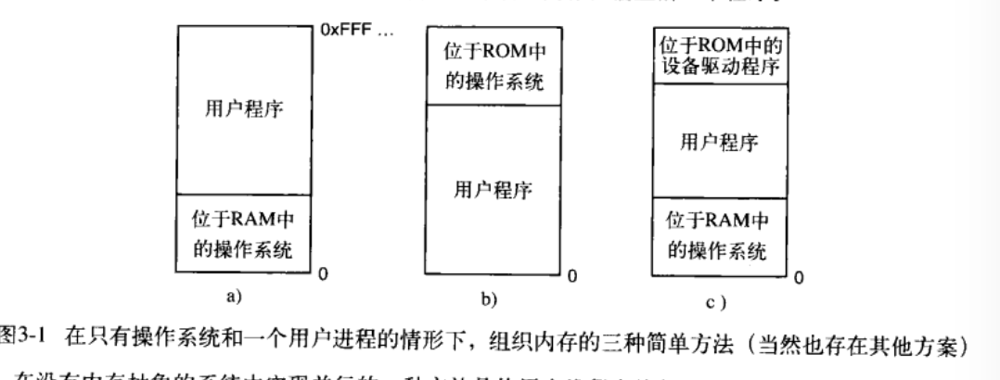

第三种方案用于早期的个人计算机中，在ROM中的系统部分称为BIOS（基本输入输出系统）。第一、三方案的缺点时用户程序出现错误时，可能摧毁操作系统，引发灾难性后果。

在没有内存抽象的系统中实现并行的一种方法就是使用多线程来编程。在引入线程时就假设一个进程中的所有线程对统一内存映像课件，那么实现并行也就没有啥问题。

### 2. 一种存储器抽象：地址空间

#### 1. 地址空间的概念

要保证多个应用程序同时处于内存中并且不互相影响，则需要解决两个问题：保护和重定位。

首先来看一个原始的针对前者的方法：给内存块标记上一个保护键，并且比较执行进程进程的键和其访问的内存键。这种方法没有解决重定位的问题，并且效率太低。

更好的办法是创造一个新的抽象的内存：地址空间。就先进程的概念创造了一类抽象的CPU以运行程序一样，地址空间为程序创造了一个抽象的内存。地址空间是一个进程可以用于殉职内存的一套地址集合。每个进程都有一个自己的地址空间，并且这个地址空间独立于其他进程的地址空间。

先介绍一个简单的方法：

**基址寄存器与界限寄存器**

使用一种简单的动态重定位。他所做的工作就是简单的把每个进程的地址空间映射到物理内存的不同部分。

#### 2. 交换技术

如果计算机的物理内存足够大，可以保存所有进程，那么之前提及的方案是可以的。但是，实际上所有进程所需的RAM数量总和特别大。

有两种方案处理内存超载。

最简单的就是交换技术。即把一个进程完整调入内存，是该进程运行一段时间，然后把它存会磁盘。空闲进程主要是存储在磁盘上，所以当他们不运行的时候就不会占用内存。

另一个策略是虚拟内存，该策略甚至能使程序在只有一部分被调入内存的情况下运行。

减缓系统的操作如下所示。

开始时内存只有进程A。之后创建建成B和C或者从磁盘将它们换入内存。


交换在内存中产生了多个空闲区（hole，也称为空洞），通过把所有的进程尽可能向下移动，有可能将这些小的空闲区块合成一个大块。该技术称为内存紧缩。这个草错通常不会进行，因为他要耗费大量的CPU时间。

有一个问题值得注意，即当进程被创建或换入时应该为它分配多大的内存。若进程创建时其大小是固定不变的并且不再改变，则分配很简单，操作系统准确的按其需要的大小进行分配。

但是如果进程的数据段可以增长，即允许程序从堆中动态的分配内存，那么当进程空间试图增长时，就会出现问题

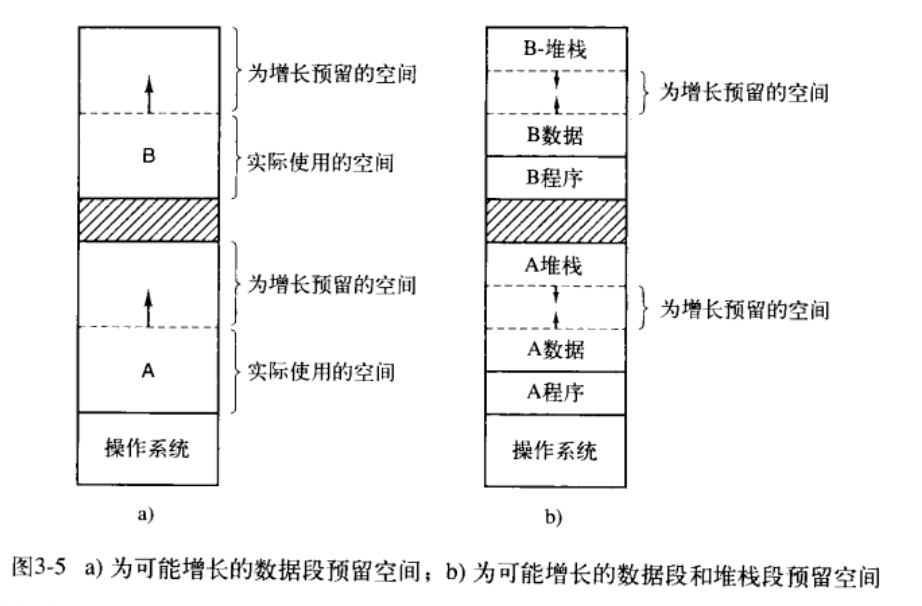

#### 3.空闲内存管理

在动态分配内存的时候，操作系统必须对其进行管理。一般有两种方式跟踪内存使用情况：**位图**和**空闲列表**。

##### 1.使用位图的存储管理

使用位图方法，**内存可能被划分成小到几个字或大到几千个字节的分配单元**。每个**分配单元**对应于位图中的一位，0表示空闲，1表示占用。一块内存区和其对应的位图如下图：

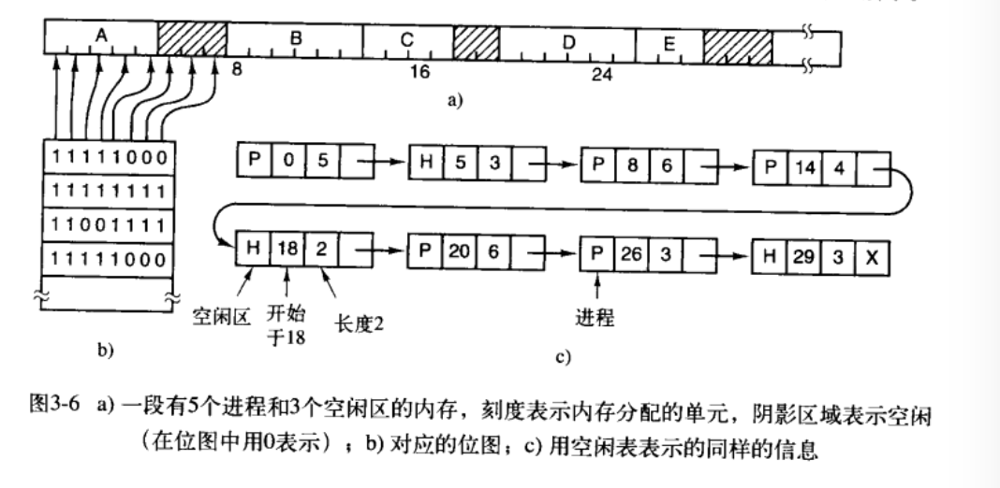

分配单元的大小是一个重要的设计因素。分配单元越小，位图越大。


##### 2. 使用链表的存储管理

维护一个记录**已分配内存段**和**空闲段的链表**。其中链表中的一个节点或者**包含一个进程**，或者是**两个进程间的一个空的空闲区**。链表中的每一个节点都包含以下域：空闲区（H）或进程（P）的指示标志、其实地址、长度和指向下一节点的指针。

**段链表是按照地址排序的**，**好处：当进程终止或被换出时链表的更新非常直接**。

为创建的进程分配内存算法。

##### 1. 首次适配算法

存储管理器沿着链表进行搜索，知道找打一个足够大的空闲区，除非空闲区大小和要分配的空间大小正好一样，否则将该空闲区分为两个部分，一部分共进程使用，另一部分形成新的空闲区。速度快，减少搜索链表的节点。

##### 2. 下次适配算法（修改首次适配算法）

每次找到合适的空闲区时都记录当时的位置。一边在下次选招空闲区时从上一次技术的地方开始搜索，而不是像首次适配算法那样每次冲头开始，性能低于首次适配算法。

##### 3. 最佳适配算法

搜索整个链表，找出能够容纳进程最小的空闲区。。最佳适配的空闲区会分裂出很多非常小的空闲区，为了避免这个问题，可以考虑最差适配算法。分配最大的空闲区。表明最差也不是很好的主意。


如果为进程和空闲区维护各自独立的链表，那么这四个算法的速度都能够得到提高。这样就可以集中精力只检查空闲区而不是进程。

### 3.虚拟内存

**基址寄存器**和**界限寄存器**可以用于**创建地址空间的抽象**，但是**有一个问题：管理软件的膨胀**。虽然存储器的容量在增大，但是软件的体积也在不断的增大。需要运行的程序大到内存无法容纳，而且必然需要系统能够支持程序同时运行。交换技术并不是一个很好的解决方案，因为典型的SATA磁盘的峰值最高为100MB／s，那么至少需要10秒，才能将1GB的程序换出，还需要10s将1GB的程序换入。

**虚拟内存的基本思想**：<u>每个进程拥有自己的地址空间，这个空间被划分成多个块，每一块称作一页或者页面。每一页有连续的地址范围。这些页被映射到物理内存，但并不是所有的页都必须在内存中才能运行程序。当程序引用到一部分在物理内存中的地址空间时，由硬件立即执行必要的映射。当程序引用到一部分不在物理内存中的地址空间时，由操作系统负责将缺页的部分装入物理内存并重新执行失败的命令。</u>

从某个角度讲，虚拟内存是对基址寄存器和界限寄存器的综合。

虚拟内存很适合在多道程序设计系统里面使用，许多程序的片段同时保存在内存中。**当一个程序等待它的一部分读入内存时，可以把CPU交给另一个进程使用**。

#### 3.1 分页

**大部分虚拟内存系统中都使用了一种称为分页的技术**，我们现在简单的来了解一下。在任何一台计算机上，程序应用了一组内存地址。当程序执行指令

```
MOV REG，1000
```

它把地址为1000的内存单元的内容复制到REG中。地址可以通过索引、基址寄存器、段寄存器或者其他方式产生。

**由程序产生的这些地址称为虚拟地址，他们构成了一个虚拟地址空间**。在没有虚拟内存的计算机上，系统直接将虚拟地址送到内存总线上，读写操作使用具有相同地址的物理内存字；在使用虚拟内存的情况下，虚拟地址不是直接送到内存总线上，而是被送到内存管理单元（MMU），MMU把虚拟地址映射为内存地址，如下图所示：

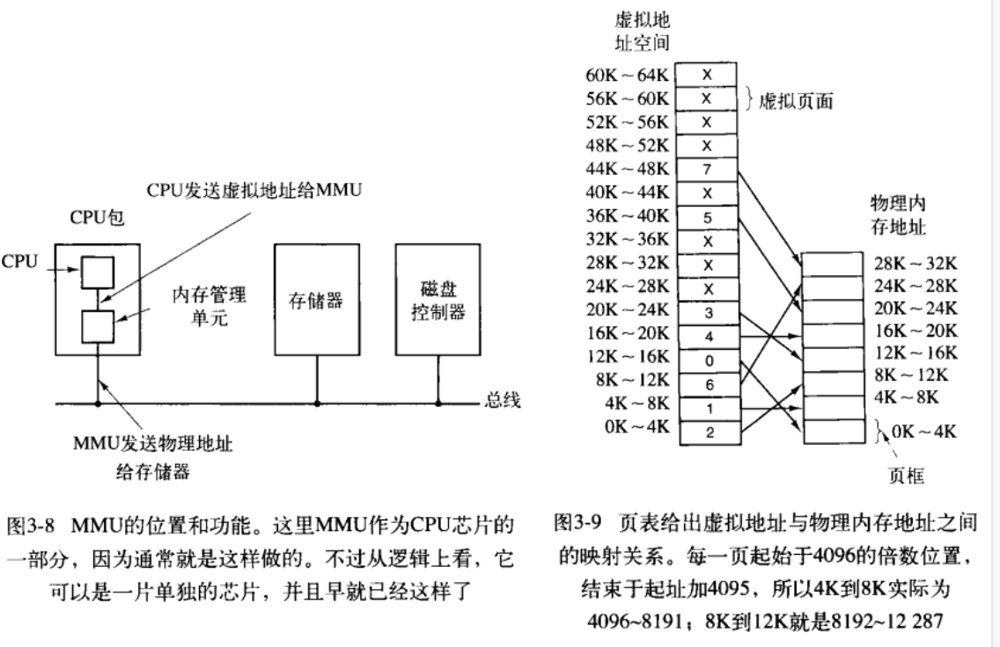


图3-9中一个简单的例子说明了映射是如何工作的。

虚拟地址空间安好固定大小划分成称为页面的若干单元。在物理内存中对应的单元称为页框。页面和页框的大小通常是一样的。对于64KB的虚拟地址空间和32KB的物理内存，我们得到了16个虚拟页面和8个页框。

当程序试图访问地址0时，执行下面的指令：

MOV REG，0

将虚拟地址0送到MMU。MMU看到虚拟地址落在了页面0（0～4096），根据其映射结果，这一页面对应的页框2（8192～12287），因此MMU把地址变换成8192，并把地址8192送到总线上。内存对MMU一无所知，他只是看到了一个读或者写的请求并执行它。MMU从而有效地把所有从0——4095的虚拟地址表映射到物理地址中。

在实际的硬件中，用一个"在／不再"位记录页面在内存中的实际存在情况。

当程序访问了一个未映射的页面。将会发生什么情况呢？

MMU注意到该页面没有被映射，于是使CPU陷入到操作系统，这个陷阱称为"却也中断"。操作系统找到一个很少使用的页框并把它的内容写入到磁盘（如果他不在磁盘上）。随后把需要访问的页面读到刚才回收的页框中，修改映射关系，然后重新启动引起陷阱的指令。

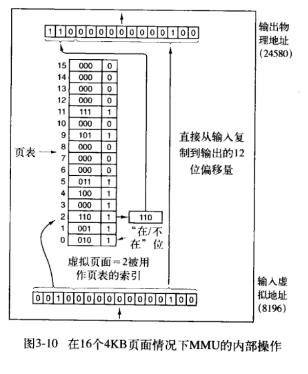

下面看一下MMU的内部结构以便了解他是如何工作的，意义为什么我们选用的页面大小时2的整数次幂。图3-10中可以看待一个虚拟地址的例子，虚拟地址8196用图3-9所示的MMU映射机制将你从映射，输入的16胃虚拟地址被分为4位的页号和12位的偏移量。4位的页号可以表示16个页面，12位的偏移量可以为一页内的全部4096个字节编址。

可用页号作为页表的索引，一的畜对应于该虚拟页面的页框号。如果"在／不再"位是0，则将引起一个操作系统陷阱。如果在，则将在页表中查找的页框号复制到输出寄存器的高3为，再加上输入虚拟地址中的低12位偏移量。这样就构成了15为的物理地址。输出寄存器的内容随机被作为物理地址送到内存总线。

#### 3.2 页表

作为一种最简单的实现，虚拟地址到物理地址的映射可以总结如下：虚拟地址被分成**虚拟页号**（高位部分）和**偏移量**（低位部分）两部分。

虚拟页号可以作为页表的所用，已找到该虚拟页面对应的页表项。有页表项可以找到页框号。然后把页框号平街道偏移量的高尾短，一替换虚拟也好，形成送往内存的物理地址。

页表项的目的是把虚拟页面映射为页框。从数学的角度看，也表示个函数，他的参数是虚拟也好，结果是物理页框号。通过这个函数把虚拟地址中的虚拟页面替换成页框书，从而形成物理地址。


##### 页表项的结构


#### 3.3 加速分页过程

在任何分页式系统中，都需要考虑两个主要问题：

- 虚拟地址到物理地址的映射必须非常快
- 如果虚拟地址空间很大，页表也会很大

第一个问题，主要是由于每次访问内存，都需要进行虚拟地址到物理地址的映射。所有的指令最终都必须来自内存，并且很多指令也会访问内存中的操作数。因此，每条指令进行一两次或更多页表访问时必要的。

第二个问题，现代计算机至少使用32位的虚拟地址，而且64位变得越来越普通。假设页长为4KB，32位的地址空间将有100万页。如果虚拟地址空间中有100万个页，那么页表必然有100万条表项，每个进程都需要自己的页表（因为他有自己的虚拟地址空间）。

对大而快的页映射的需求成为了构建计算机的重要约束。最简单的设计是使用由一组"快速精简寄存器"组成的单一页表 ，每一个表项对应一个虚页，虚页号作为索引。当启动一个进程时，操作系统把保存在内存中的进程页表的副本载入到寄存器中。在进程运行过程中，不必再为页表而访问内存。这个方法简单，并且在进程访问页表时不需要访问内存。缺点：在页表很大的时候，代价很高。而且每一次上下文切换都必须装载整个页表，降低效率。

另外一种极端做法是，整个页表都在内存中。

#####  1.转换检测缓冲区

前提：大多数程序总是对少量的页面进行多次访问。因此，只有很少的页表项会被反复读取，而其他的页表很少被访问。

上面提到的解决方案是为计算机设置一个小型的硬件设备，将虚拟地址直接映射到物理内存，而不必再访问内存。这种设备称为转换检测缓冲区（TLB），有时又称为相联存储器。它通常在MMU中，包含少量的表项，在此例中为8个，实际中很少会超过64个。每个表项纪录了一个页面的相关信息，包括虚拟页号、页面的修改位、保护码和该页对应的物理页框。除了虚拟页号，这些域与页表中的域是一一对应的。此外还有一位用来记录这个表项是否有效。

TLB工作流程：

将一个虚拟地址放入到MMU中进行转换时，硬件首先通过将该**虚拟页号**与**TLB中的所有表项同时进行匹配**，判断虚拟页面是否在其中。如果发现了一个有效的匹配并且要进行的访问操作并不违反保护位，则将页框号直接从TLB中取出而不必再访问页表。如果虚拟页面好确实是在TLB中，但指令仕途在一个制度页面上进行写操作，则会产生一个保护错误，就像对一个页表进行非法访问一样。

当虚拟页号不在TLB中时发生的事情值得讨论。

如果MMU检测到没有有效的匹配项时，就会进行正常的页表查询。接着从TLB淘汰一个表项，然后用新的页表项代替它。如果一个页面很快在被访问，第二次访问TLB是自然会命中。当一个表项被清除出TLB时，将修改位复制到内存中的页表项，而除了访问位，其他的值不变。当页表项中从页表转入到TLB中时，所有的值都来自内存。


##### 2. 软件TLB管理

到此为止，我们已经架设每一台具有虚拟内存的机器都具有硬件识别的页表，以及一个TLB。在此设计中，duiTLB的管理和TLB的失效处理都完全是由MMU硬件来实现的。只有在内存中没有找到某个页面时，才会陷入到操作系统中。

但是现代的RISC机器，包括SPARC、MIPS，几乎所有的页面管理都是在软件中实现的。TLB表项被操作系统显式的装载。当发生TLB访问失效时，不再是由MMU到页表中查找并去除所需要的页表项，而是发生一个TLB失效并将问题交给操作系统解决。系统必须先找到该页面，然后从TLB中删除一个项，接着装入一个新的项，最后在执行先前出错的指令。所有的这一切都必须在有限的几条指令中完成，因为TLB失效比却也中断发生的更加频繁。

如果TLB大到可以减少失效率，TLB的软件管理会变得足够有效。这种方法的最主要的好处就是获得一个非常简单的MMU，这就在CPU芯片上为高速缓存以及其他的改善性能的设计腾出了相当大的空间。

无论是使用硬件好事软件来处理TLB失效。常见的方法是找到页表并执行索引操作以定位将要访问的页面。可以早内存中的fusing 位置维护一个大的TLB表项的全歼高速缓存来减少TLB失效。通过手贱检查软件高速缓存，擦偶哦子系统能够实质性的减少TLB失效。

当使用软件TLB管理师，一个基本要求就是要理解两种不同的TLB失效的区别在哪里。当一个页面访问在内存中而不在TLB中时，将产生软失败。此时需要做的就是更新一下TLB，并不需要产生磁盘IO。当页面不在内存中时，将产生硬失效。此时需要一次磁盘存取一装入该页面，这个过程大概需要几毫秒。


#### 3.4 针对大内存的页表

在原有的内存页表的方案之上，引入快表（TLB）可以用来加快虚拟地址到物理地址的转换。不过这不是唯一需要解决的问题，另一个问题是怎样处理巨大的虚拟地址空间。

#####  1. 多级页表

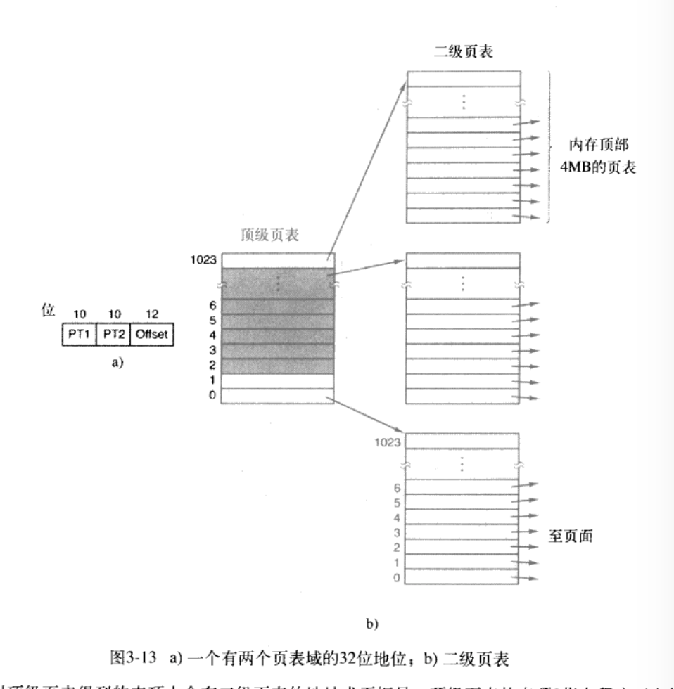

a图中，32位的虚拟地址被划分为10位的PT1域、10位的PT2域和12位的Offset（偏移量）域。因为偏移量时12位，所以页面长度是4KB，共有2的20次方个页面。

引入多几页表的远影是避免把全部的页表直至保存在内存中。特别是那些从不需要的页面就不应该保留。比如一个需要12MB内存的进程，第最底端是4MB的程序正文段，后面是4MB的数据段，顶端是4MB的堆栈段，在数据段上方和对战下方之间是大量根本没有使用的空闲区域。

图b中的耳机页表是如何工作的呢？

在最左边是顶级页表，它具有1024个表项，对应10位的PT1域。当一个虚拟地址被送到MMU时，MMU首先是提取PT1域并把该值作为访问顶级页表的索引。因为整个4GB（32位）虚拟地址空间已经被分成1024个4MB的块，所以这1024个表项中的每一个都表示4MB的虚拟地址空间。

由索引顶级页表得到的表项中含有耳机页表的地址或页框号。顶级页表的表项0指向程序正文的页表，表项1指向数据的页表，表项1024指向堆栈的页表，其他的表项（阴影部分）未用。现在把PT2域作为访问选定耳机页表的索引，一边找到该虚拟页面的对应页框号。


##### 2. 倒排页表

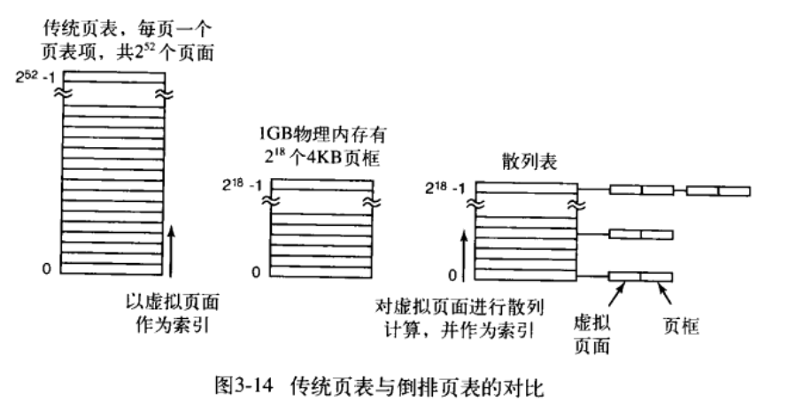

对于32位虚拟地址空间，多级页表可以发挥很好的作用。但是64位计算机变得更加普遍。

因此，需要新的倒排页表。在实际内存中每一个页框有一个表项，而不是每一个虚拟页面都有一个表项。

例如，对于64位虚拟地址，4kb的页，1GB的RAM，一个倒排页表仅需262144个页表项。表项纪录哪一个（进程、虚拟页面）对定位于该页框。

虽然倒排页表大大缩减了空间，但是存在不足：从虚拟地址到物理地址的转换会变得十分困难。当进程n访问虚拟页面p时，硬件不能再通过把p当作只想页表的一个索引来查找物理页框。相反，他必须搜索整个倒排页表来查找某一个表项（n,p）。该搜索必须对每一个内存访问都要操作执行一次，而不是仅仅发生在阙特中断时执行。

走出这种两难局面的方法是使用TLB。如果TLB能够记录所有频繁使用的页面，地址转换就可能变的像通畅的页表一样快。但是，当发生TLB是小事，需要软件搜索整个倒排页表。一个可行的搜索方法是建立一张三列表，用虚拟地址来散列。当前所有在内存中的具有相同散列值的虚拟页面被链接在一起。如果散列表中的槽数与机器中的物理页面一样多，那么散列表中的冲突链的平均长度将会是一个表项。一旦页框号被找到，新的（虚拟页号，物理页框号）对就会被装载到TLB中。


### 4.页面替换算法

当发生却也中断的时候，操作系统必须在内存中选择一个页面将其换出内存，一边为即将调入的页面腾出空间。如果要换出的页面在内存主流旗舰已经被修改过，就必须把它协会磁盘以更新该页面在磁盘上的副本；如果该页面没有被修改过，那么他在磁盘上的副本已经是最新的了，不需要回写。直接用掉入的页面覆盖被淘汰的页面就可以了。

#### 1. 最优页面置换算法

在阙夜中断发生时，有些页面在内存中，其中有一个页面（包含境界这一下条指令的那个页面）将很快被访问，其他页面则可能要等到10、100、1000条指令之后才会被访问，每个页面都可以用在该页面首次被访问前所要执行的指令数作为标记。

最有页面置换算法规定应该置换标记的最大的页面。


#### 2.最近卫使用页面置换算法


#### 3.先进先出页面置换算法


#### 4. 第二次机会页面置换算法


#### 5. 时钟页面置换算法


#### 6. 最近最少使用页面算法


#### 7. 用软件模拟LRU


#### 8. 工作集页面置换算法


#### 9. 工作集始终页面置换算法


#### 10. 页面置换算法小结


###  5. 分页系统中的设计问题


### 6. 有关实现的问题


#### 1. 与分页有关的工作


#### 2. 缺页中断处理


#### 3. 指令备份


#### 4. 锁定内存中的页面


#### 5. 后备存储


#### 6. 策略与机制分离


### 7. 分段


## 四、文件系统

所有的计算机应用程序都需要存储和信息检索。进程运行时，可以在他自己的地址空间存储一定的信息，但是存储容量受虚拟地址空间的大小限制。对于某些应用程序，他自己的地址空间已经足够用了；但是对于其他一些应用程序，这些存储比较小。

在进程的地址空间上保存信息的第二个问题：进程终止时，他保存的信息也随之丢失。对于数据库而言，有关的信息必须持久化。在使用信息的进程终止时，这些信息不可以消失。

第三个问题：经常需要多个进程同时存取同一信息。如果只在一个进程的地址空间保存，那么只有该进程才可以对他进行读取。

因此，长期存储信息有三个条件：

- 能够存储大量的信息；
- 能够保证使用信息的进程终止时，信息仍旧存在。
- 必须能够使多个进程并发存取有关信息。

磁盘具有长期存储的性质，当前我们可以先吧磁盘当作一个固定块大小的线性序列，并且支持以下两种操作：

- 读块k；
- 写块k。

事实上磁盘支持更多的操作，但是只要有了这两种。原则上就可以解决长期存储的问题。

当前会存在这些问题：

- 如何找到信息？
- 如何防止一个用户读取另一个用户的数据？
- 如何知道哪些块是空的？

和之前一样：

- 提取处理器的概念来建立进程的抽象；
- 提取物理存储器的概念来建立进程（虚拟）地址空间的抽象；

这样我们可以新建一个抽象——文件。来解决这个问题。**进程（与线程）**、**地址空间**和**文件**都是操作系统中最重要的概念。深入理解了这三个概念，我们就迈上了成为操作系统专家的道路。

文件是进程创建的信息逻辑单元。一个磁盘一般包含成百上千的文件，每个文件都是独立于其他文件的。文件不仅仅被用来对磁盘建模，来替代对RAM的建模，事实上，如果把文件看成一种地址空间，那么基本上算是理解了文件的本质。

操作系统中处理文件的部分称为文件系统。

从用户的角度看，文件系统中最重要的是它在用户眼中的表现形式，也就是文件是由什么组成的。怎么给文件命名，怎么保护文件，以及可以对文件进行哪些操作等。至于具体的细节，是用链表还是位图来记录空闲存储区一级在一个逻辑盘块中有多少个扇区，用户都不会关心，对文件系统的设计者来讲，相当重要。

前两节讲述用户关心的部分——文件和目录，后面讲解具体的实现原理。

### 1. 文件

#### 1. 文件命名

文件是一种抽象机制，它提供了一种在磁盘上面保留信息而且方便以后读取的方法。这种方法可以使用户不用了解存储信息的方法、位置和实际磁盘工作方式等细节。

任何一种抽象机制的最重要的特性就是对管理对象的命名方式。因此，我们从文件的命名开始考察文件系统。

文件的具体命名规则在各个操作系统中不一致。许多操作系统支持文件名用圆点隔开分为两个部分。后面的称为文件扩展名。

#### 2. 文件结构

三种结构：（加图160页）

- **字节序列**
- **记录序列**
- **树**

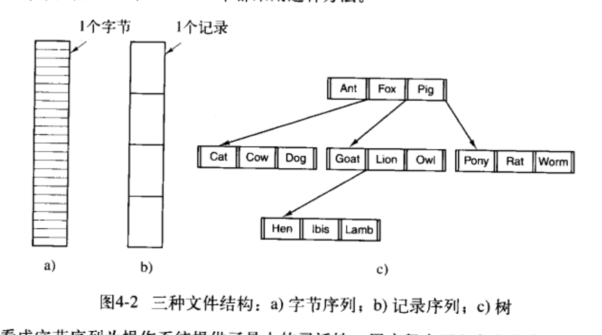

操作系统实际上并不关心文件的内容是什么，操作系统看到的都是字节，其任何含义只在用户程序中解释。

把文件看成字节序列为操作系统提供了更大的灵活性。用户程序可以想文件中加入任何内容，并以任何方便的形式命名。操作系统不会提供任何帮助，也不会构成障碍。

**记录序列**在文件结构上做了第一步改进。在这个模型中，文件具有固定长度记录的序列，每个记录都有其内部结构。把文件作为记录序列的中心思想是：读操作返回一个记录，而写操作重写活着追加一个记录。

第三种文件结构：树。文件在这种结构中由一棵记录树组成，每个记录并不具有同样的长度，而记录的位置上有一个"键"字段。这棵树就是按照"键"字段进行排序，从而可以对特定"键"进行快速的查找。

#### 3. 文件类型

很多操作系统支持多种文件类型：

- **普通文件**（regular file）：上面的三种结构文件
- **字符特殊文件**（character special file）：和输入输出有关，用于串行IO类设备，如终端、打印机、网络等。
- **块特殊文件**（block special file）：用于磁盘类设备。

##### 1.普通文件

一般分为：

- ASCII文件

  > 文件是由多行正文组成。在某些系统中，每行用回车符结束，其他系统则用换行符结束。有些系统号同时采用回车符和换行符。文件中各行的长度不一定相同。
  >
  > 优势：
  >
  > - 可以显示和打印，还可以用文本编辑器进行编辑；
  > - 如果很多程序都以ASCII文件作为输入和输出，就很容易吧一个程序的输出当成另一个程序的输入，比如，shell的管道

- 二进制文件

  > 打印出来的二进制文件无法理解，充满混乱字符。通常，二进制文件有一定的内部结构，使用该文件的程序才知道这个结构。


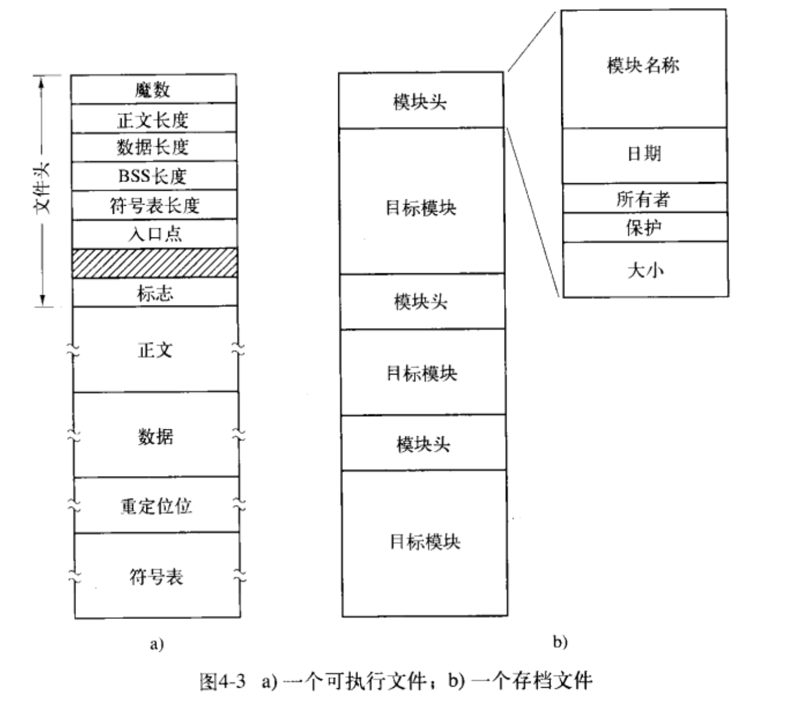


上图a是一个简单的可执行二进制文件，来自某个版本的UNIX。虽然这个文件只是一个字节序列，但是只有文件的格式正确时，操作系统彩绘执行这个文件。该文件有五个部分组成：

- **文件头**
  - 魔数：表明这个是一个可执行的文件。
  - 文件中各段的长度
  - 执行的起始地址
  - 标志位
- **正文**
- **数据**
- **重定位位**
- **符号表**

这些被装入内存，并使用重定位位重新定位。符号表则用于测试。

上图b，即UNIX的存档文件。它由已编译但没有连接的库过程（模块）集合而成。每个文件以模块头开始，其中记录了名称、创建日期、所有者、保护码和文件大小。该模块头与可执行文件一样，也都是二进制数字。

所有的操作系统必须能够识别它们自己的可执行文件和文件类型，其中有些操作系统还可以识别更多的信息。

#### 4.文件存取

早期操作系统只有一种文件存取方式：顺序存取。进程在这些系统中可从头吮吸读取文件的全部字节或者记录，但是不能跳过某一些内容，也不能不按顺序读取。

当用磁盘来存储文件时，我们可以不按顺序地读取文件中的字节或记录，或者按照关键字而不是位置来存取记录。这种能够以任何次序读取其中字节或记录的文件称作**随机存取文件**。

随机存取文件对很多应用程序必不可少，比如数据库系统。

有两种方式可以指示从何处开始读取文件。一种是每次read操作都给出读取文件的位置。另外一种是用一个特殊的seek操作设置当前位置，在seek操作之后，从这个位置顺序的开始读写文件。


#### 5. 文件属性

文件都有文件名和数据。另外，所有的操作系统还会保留其他与文件相关的信息，比如文件创建的时间、文件的大小等。

除此之外，还有一些其他的附加信息称为文件**属性**或者**元数据**。

| 属性              | 含义                                                       |
| ----------------- | ---------------------------------------------------------- |
| 保护              | 谁可以存取文件，以什么方式存储文件                         |
| 口令              | 存储文件需要的口令                                         |
| 创建者            | 创建文件人的id                                             |
| 只读标志          | 0:读写，1:只读                                             |
| 隐藏标志          | 0:正常，1:不在列表中展示                                   |
| 系统标志          | 0:普通文件，1：系统文件                                    |
| 存档标志          | 0:已经备份，1:需要备份                                     |
| ASCII／二进制标志 | 0:ASCII，1:二进制文件                                      |
| 随机存取标志      | 0:顺序存取，1:随机存取                                     |
| 临时标志          | 0:正常，1:进程退出时删除该文件                             |
| 加锁标志          | 0:为加锁，非零加锁                                         |
| 记录长度          | 一个记录中的字节数                                         |
| 键的位置          | 每个记录中键的偏移量                                       |
| 键的长度          | 键字段的字节数                                             |
| 创建时间          |                                                            |
| 最后一次存取时间  |                                                            |
| 最后一次修改时间  |                                                            |
| 当前大小          |                                                            |
| 最大长度          | 文件可能增长到的字节数，方便老的操作系统留出足够的存储空间 |
|                   |                                                            |


#### 6. 文件操作

使用文件的目的：存储信息并方便以后的检索，不同系统提供了不同的操作。常用的系统调用：

1. create。创建不包含任何数据的文件。该调用的目的是表示文件即将建立，并设置一些属性。
2. delete。当不再需要某个文件时，必须删除该文件已释放磁盘空间。
3. open。使用文件之前，必须先打开文件。调用的目的：把文件属性和磁盘地址表装入内存，便于后续调用的快速读取。
4. close。存取结束后，不再需要文件属性和磁盘地址，这时应该关闭文件以释放内部表空间。很多系统限制进程打开文件的个数，以鼓励用户关闭不再使用的文件。磁盘以块为单位写入，关闭文件时，写入该文件 的最后一块，即使这个块还没有写满。
5. read。在文件系统中读取数据。一般地，读出数据来自文件的当前位置。调用者必须指明需要读取多少数据，并且提供存放这些数据的缓冲区。
6. write。想文件写数据，写操作一般也是从文件当前位置开始。如果文件当前位置是文件末尾，文件长度增加。如果当前位置在文件中间，则现有这些数据被覆盖，并且永远丢失。
7. append。次调用是write的限制形式。他只能在文件的末尾添加数据。若系统只提供最小系统调用集合，则通常没有append。很多系统对同一操作提供了很多的视线方法，这些系统中有时数据有append操作。
8. seek。对于随机存储文件，要指定从何处开始取数据，通常的方法是用seek系统调用把当前位置的指针指向文件中的特定位置。seek调用之后，就可以从该位置开始读写数据。
9. get attributes。
10. set attributes。
11. rename。


#### 7. 使用文件调用系统示例


### 2.目录

文件系统通常提供目录和文件夹用于记录文件，在很多系统中目录也是文件。

主要学习目录的组成、目录的特性和可以对目录进行的操作。

#### 1. 一级目录系统

最简单的形式是在一个目录中包含所有的文件。这个称为根目录，但是由于只有一个目录，所以其名称并不重要。早期的计算机系统中，这个系统很普遍。部分原因是只有一个用户。只要是为了软件设计的简单。

#### 2. 层次目录系统

对于简单的特殊应用来说单层目录系统比较合适，但是现在的用户有着成千上万的文件，如果都在一个目录下面显然不合适。

因此，需要有层次结构（即，一个目录树）。通过这种方式，可以用很多目录把文件以自然的方式进行分组。

#### 3. 路径名

两种方式：

- 绝对路径
- 相对路径


#### 4. 目录操作

系统调用：

1. create。创建目录。
2. delete。删除目录。
3. opendir。
4. closedir。
5. readdir。
6. rename。
7. link。连接技术允许在多个目录中出现一个文件。这个系统调用指定一个存在的文件和一个路径名，并建立从该文件到路径所指名字的连接。该链接增加了该文件的i节点计数器的计数（记录含有该文件的目录项目数），有时称为硬连接。
8. unlink。

### 3. 文件系统的实现

现在从用户的角度切换到是实现者的角度考察文件系统。实现者感兴趣的是文件和目录是怎样存储的，磁盘空间是怎样管理的以及怎样使系统有效而可靠地工作。

#### 1. 文件系统布局

​		文件系统存放在磁盘上。**多数磁盘划分为一个或者多个分区，每个分区中有一个独立的文件系统。磁盘的0号扇区称为主引导记录（Master Boot Record，MBR），用来引导计算机。在MBR的结尾是分区表。<u>该表给出了每个分区的起始和结束地址</u>。<u>表中的一个分区被标记为活动分区</u>。在计算机被引导时，BIOS读入并执行MBR。<u>MBR做的第一件事是确定活动分区</u>，读入它的第一个块，称为引导块（boot block），并执行之。引导块中的程序将装载该分区中的操作系统。**为统一起见，每一个分区都从一个启动块开始，即使它不含有一个可启动的操作系统。不过，将来可能会成为一个操作系统。

​		**除了引导块之外，磁盘分区布局是随着文件系统的不同而变化的**。

文件系统通常还包含以下几个部分。

​		第一个是**超级块（superblock）**，超级块**包含文件系统所有关键参数，在计算机启动时，或者在该文件系统首次使用时，把超级块读入内存。**超级块中的典型信息包括：**确定文件系统类型的魔数**、**文件系统中数据块的数量**以及**其它重要的管理信息**。

​		其次，文件系统中的**空闲块的信息**，例如，**可以用位图或指针列表的形式给出**。

​		后面，也许会**有一组i节点**，这是一个数据结构数组，每个文件一个，i节点说明了文件的方方面面。

​		接着，可能是**根目录**，**存放文件系统目录树的根部**。

​		最后，**磁盘的其他部分存放了其他所有目录和文件**。

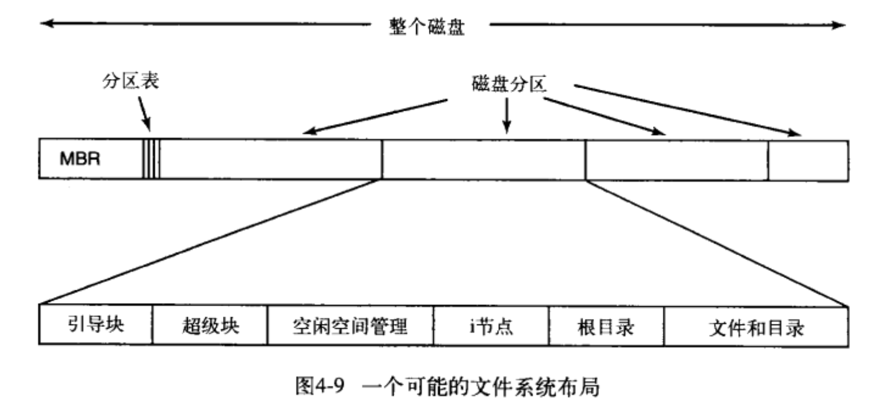

#### 2. 文件的实现

文件存储的实现，关键是**记录各个文件分别用到了哪些磁盘块**。不同操作系统采用不同的方式。

##### 1. 连续分配

最简单的分配方案是把每个文件作为一连串连续数据块存储到磁盘上。

请注意，每一个文件都是从一个新的块开始，如果文件实际上只有3.5个块，那么最后一个块会浪费一些空间。

连续磁盘空间分配方案优势：

- 实现简单。记录每个文件用到的磁盘块简化为只需要记住两个数字：磁盘地址和文件块数；
- 读操作性能较好。只需要一次寻找。之后不再需要寻道和旋转延迟。

缺点：

- 随着时间的推移，部分文件被删除。磁盘会变得十分零碎。开始时，碎片不是问题。但是磁盘最终会被充满，所以要么压缩磁盘，要么重新使用磁盘的空洞空间。前者的代价太大而不可行；后者需要维护一个空洞列表，这个是可行的。但是，当创建一个新的文件时，为了挑选合适大小的空洞存入文件，就必须要知道这个文件的最终大小。

##### 2. 链表分配

每个文件构造磁盘块链表。每个块的第一个字作为指向下一块的指针，块的其他部分存放数据。

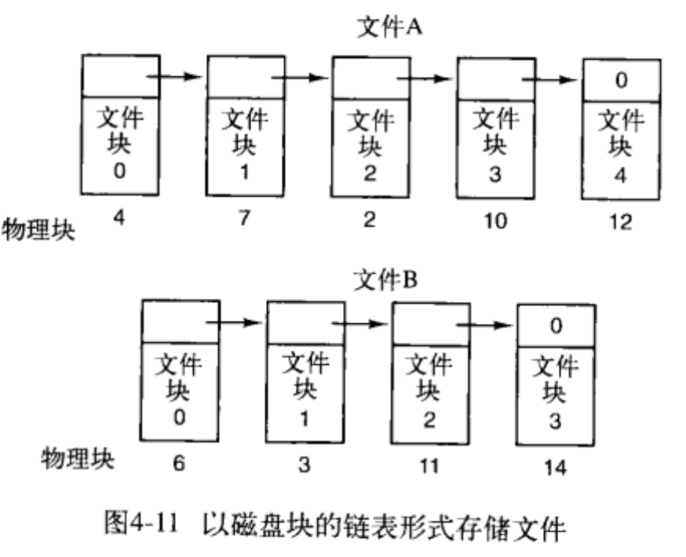

与连续分配不同，这个方案可以充分的利用每个磁盘块。这样，只要在目录项中存放第一块的磁盘地址，文件的其他块就可以从这个首地址查找到。

另一方面，虽然在链表分配方案中，顺序读取非常方便，但是随机存取却相当缓慢。要获得块n，操作系统每次都必须从头开始，并且要先读前面的n-1块。显然，这样的读操作太慢了。

而且，指针占去了一些字节，每个磁盘块存储的字节数不再是2的整数次幂。虽然这个问题不严重，但是怪异的大小会降低系统的运行效率。因为很多程序都是以长度为2的整数次幂来读写磁盘块的。由于每个块的前几个字节被指向下一个块的指针占据，所以要读出完整的一个块，就需要从两个磁盘块中获得和拼接信息，引发了额外的开销。

##### 3. 在内存中采用表的链表分配

如果把每个磁盘块的指针字放到内存的一个表中，就可以解决上述链表的两个不足。

**这种方法的缺点：**必须把整个表都存放在内存中。对于200G的磁盘和1KB的块，这张表需要有2亿项，每一项对应于这2亿个磁盘块中的一个块。每项至少3个字节，很显然FAT（文件分配表）方案对于大的磁盘很不合适。

##### 4. i节点

**给每一个文件赋予一个称为i节点的数据结构，其中列出了<u>文件属性</u>和<u>文件块的磁盘地址</u>**。给定i节点，就能够找到文件的所有块。相对于内存中采用表的方式，这种机制具有很大的优势，即**只有在对应文件打开时，其i节点才在内存中。**

**i节点的问题**，如果每个i节点只能存储固定数量的磁盘地址，那么当一个文件所含的磁盘块的数目超过i节点所能容纳的数目怎么办？

一个解决方案，**最后一个磁盘地址不指向数据块，而是指向一个包含磁盘块地址的块的地址**。

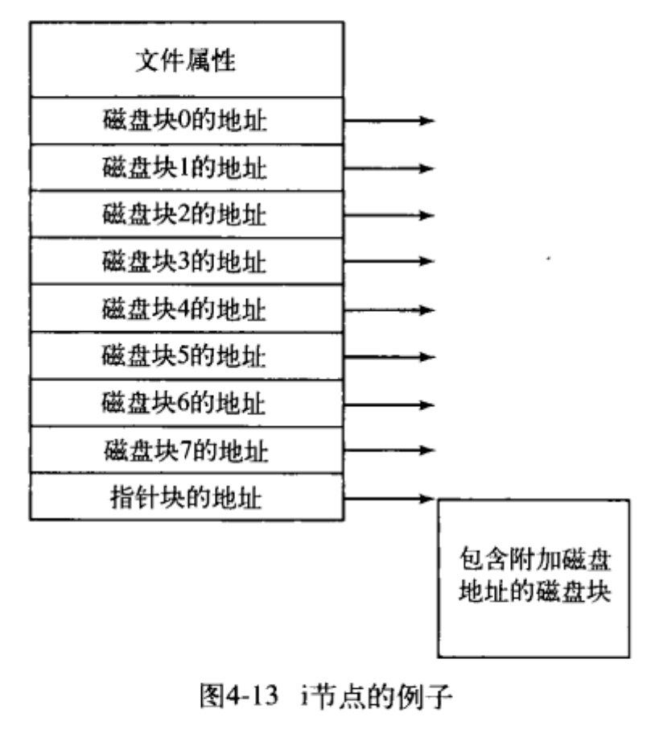

更高级的解决方案：可以有两个或者更多个包含磁盘地址的块，或者**指向其他存放地址的磁盘块的磁盘块**。

#### 3. 目录的实现

**在读文件之前，必须先打开文件**。打开文件时，**操作系统利用用户给出的路径名找到相应的目录项**。

**目录项中提供了查找磁盘块所需要的信息**。

因系统而异，这些信息可能是整个文件的磁盘地址（连续分配方案）、第一个块的编号或者i节点。

**总之，目录系统的主要功能：把AscII文件名映射成定位文件数据所需的信息。**

与此相关的是在哪里存放文件属性。每个文件系统维护诸如文件所有者以及创建时间等文件属性，他们必须存在于某个地方。

**一种简单的方法**：把文件属性直接放在目录项中。目录项中有一个固定大小的目录项表，每个文件对应一项，其中包括文件名、一个文件属性结构以及用以说明磁盘块位置的一个或多个磁盘地址。

**针对采用i节点的系统**，把文件属性存放在i节点中而不是目录项中。在这种情形下，目录项更短：只有文件名和i节点号。

在需要查询文件名时，如果只是线性地从头到尾对目录进行搜索。**对于非常长的目录，线性查询太慢了。为了加速查询速度，采用散列表的方式，将文件名映射到n个表项里面**。

#### 4. 共享文件

文件系统本身是一个有向无环图，而不是一个树。

**第一种方法**：磁盘块不列入目录，而是列入一个与文件本身关联的小型数据结构中。目录只想这个小型数据结构。UNIX采用了这个方案（小型数据结构就是inode）；

**第二种方法**：**符号连接**。通过让系统建立一个类型为LINK的新文件，并把该文件放在B的目录下，使得B与C的文件存在一个连接。新的文件中只包含了它所连接的文件的路径名。当B读该连接文件时，操作系统查看要读的文件为LINK类型，则找到该文件所连接的文件名，并且去读取那个文件。

#### 5. 日志结构文件系统

促使设计LFS的主要原因，CPU的运行速度越来越快，RAM内存容量越来越大，同时磁盘高速缓存也迅速的增加。今儿不需要磁盘访问操作，就有可能满足直接来自**文件系统高速缓存**的很大一部分读请求。所以可以看出，未来多数的磁盘访问时写操作，这样，在一些文件系统中使用的提前读机制，并不能获得更好的性能。

更糟糕的是，在大多数文件系统中，写操作是零碎的。一个50us的磁盘写操作通常需要10ms的寻道时间和4ms的旋转延迟时间，可见零碎的磁盘写操作是极其没有效率的。

如果在写操作完成之前发生司机，就可能在文件系统中造成严重的不一致性。因此，i 节点的写操作一般是立即完成的。

因此，LFS的设计者决定重兴市县一中UNIX文件系统，该系统即使对于一个大部分由零碎的随机写操作组成的任务，同样能够充分利用磁盘的带宽。其基本思想是将整个磁盘结构化为一个日志。每隔一段时间，或者特殊需要时，被缓冲在内存中的所有关于味觉的写操作都被放到一个单独的段中，作为在日志末尾的一个邻接段写入磁盘。一个单独的段可能会包含i节点、目录块、数据块或者都有。每一个段的开始都是该段的摘要，说明该段中都包含了哪些内容。

在LFS的设计中，也采用了i节点，且具有UNIX中一样的结构，但是i及诶单分散在整个日志中，而不是存在磁盘的某个固定的位置。当一个i 节点被定为之后，定位一个块就用通畅的方式。为了能够找到i节点，比需要维护一个由i 节点标号索引组成的i节点图。在这个途中的表项i指向磁盘中的第i个i 节点。这个图保存在磁盘上，但是也保存在高速缓存中。

总之，所有的写操作最初是被缓冲在内存中，然后周期性的把所有以缓冲的写作为一个单独的段，在日志的末尾出写入磁盘。要打开一个文件，则首先需要从i 节点图中找到文件的i 节点，一旦i 节点定为之后就可以找到相应的块的地址。所有的块都存放在段中，在日志的某个位置。

如果磁盘空间无限大，那么前面的套路已经够了。但是，实际的磁盘空间有限，这样最终导致日志将会占用整个磁盘，到那个时候将不能够写任何新的段。幸运的是，许多已有的段包含了很多不在需要的块，比如，一个文件被覆盖之后，那么她的i 节点将会只相信的块，但是旧的块仍然占据着空间。

LFS为此映入了一个清理线程。周期性地扫描日志进行磁盘压缩。该县承受限度去日志中的第一段的摘要，检查有哪些i节点和文件。然后该县城查看当前i 节点图，判断该i 节点是否有效一集文件块是否在用。如果没有，则该信息被丢弃。如果在使用，那么i 节点个块进入内存等待写回到下一个段中。接着，原来的段被标记为空闲，一边日志可以使用它来存放新的数据。因此，整个磁盘就是一个大型的环形缓冲区，写进程将新的段写到前面，而清理的线程则讲究的段从后面移走。

#### 6. 日志文件系统

LFS性能很好，但是呢和现有的文件系统不兼容，因此，没有得到推广。但是，内在的思想，即面对出错的鲁棒性，却可以被其他文件系统借鉴。

基本思想：保存一个用于记录系统下一步要做什么的日志。这样当系统在完成他们即将完成的任务崩溃时，重启之后，可以通过日志，获取崩溃之前计划完成的任务，并完成他们。这样的系统称为：日志文件系统。

NTFS、Linux的ext3和ReiserFS都使用日志。

#### 7. 虚拟文件系统

同一个操作系统下，也会使用不同的文件系统。

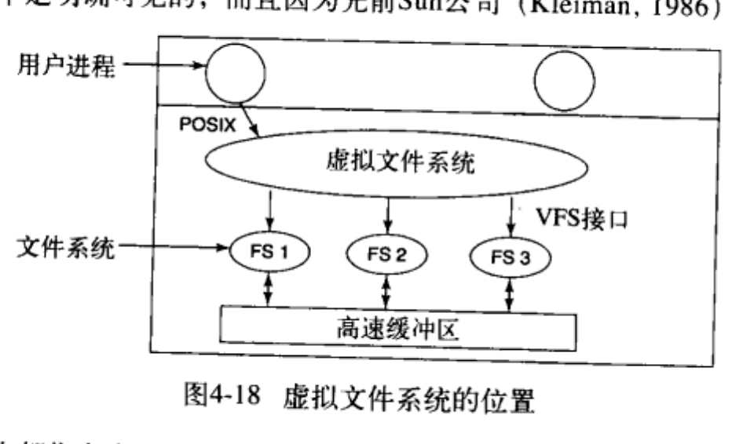

所以和文件相关的系统调用在最初的处理上都指向虚拟文件系统。这些来自用户进程的调用，都是标准的POSIX系统调用，比如open、read、write和seek操作等。因此，虚拟文件系统对用户进程又一个更高层的接口，就是著名的POSIX接口。

VFS也有一个对于更低层的时间文件系统的"更低层"接口，就是上图中标为VFS接口的部分。这个接口包含了许多功能调用，这样VFS可以使每一个文件系统完成任务。因此，当创造一个新的文件系统和VFS一起工作时，新的文件系统的设计者就必须确定它提供VFS所需要的功能调用。关于这个功能的例子就是从磁盘中读某个特定的块，把它放在文件系统的高速缓存中，并返回他的指针。因此，VFS有两个不同的借口：上层给用户进程的接口和下层给实际文件系统的接口。

VFS设计只要实际的文件系统提供VFS需要的功能，VFS就不必知道数据具体存储在什么地方或者底层的文件系统怎么样。

大多数VFS应用本质上是面向对象的，即使它是使用C语言写的。

对象类型，包括：

- **超块**（描述**文件系统**）；
- **v节点**（描述**文件**）；
- **目录**（描述**文件系统目录**）。

这些在实际文件系统中都必须支持相关的操作。另外，VFS还有一些供他自己使用的数据结构，包括用于跟踪用户进程中所有打开文件的装载表和文件描述符的数组。

VFS如何工作的呢？我们来按时间顺序进行分析：

**当系统启动时，根文件系统在VFS注册。另外，在装载其他文件系统的时候，不管是在启动时还是在操作过程中，它们也必须在VFS中注册。**

**当一个文件系统注册时，它做的最基本的工作就是提供一个VFS所需要的函数地址列表，可以使一个长的调用矢量表，或者很多个这样的表，每一个VFS对象一个。**因此，只要一个文件系统在VFS注册之后，VFS就知道如何从它那里读一个块。

装载文件系统之后，就可以使用它了。比如，一个文件系统装在/usr并且一个进程调用它。

```c
open("/usr/include/xxx.h",O_RDONLY)
```

**当解析路径的时候，VFS看到新的文件系统被装载在/usr，并且通过搜索<u>已经装载文件的超块表</u>来确定它的超块**。做完这些，它可以找到它所装载的文件的根目录，在那里查找路径include/xxx.h。然后VFS创建一个v节点并调用实际的文件系统，以返回所有的在文件i节点中的信息。这个信息和其他的所有信息一起复制到v节点中（在RAM中），而**这些信息中最重要**的是指向**<u>包含调用v节点操作的功能表</u>**的**指针**，比如write、read和close等。

当v节点被创建之后，VFS在**文件描述符表**中为调用进程创建一个入口，并且将它指向一个新的v节点。最后，VFS向调用者返回文件描述符，所以调用者可以用它进行文件的读写或者关闭文件。

随后，当进程用文件描述符进行一个读操作，VFS通过进程表和文件描述符表确定v节点的位置，并跟随指针指向功能表（所有这些都是被请求文件所在的实际文件系统红的地址）。这样就调用了处理read的功能，在实际文件系统中的代码运行并得到请求的块。VFS并不知道数据来自哪里。

为了加入一个新的文件系统，设计者首先获得一个VFS期待的功能调用的列表，然后编写文件系统实现这些功能。或者，如果文件系统已经存在，它们必须提供VFS需要的包装功能，通常通过建造一个或者多个内在的指向实际文件系统的调用来实现。

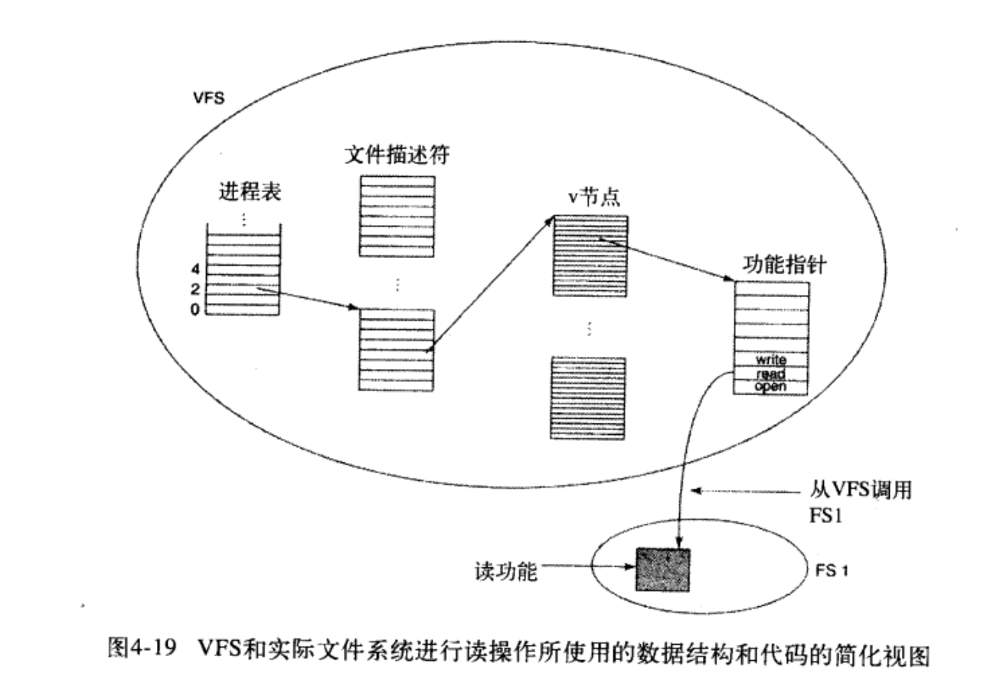


### 4.文件系统管理和优化

#### 4.1 磁盘空间管理

文件通常是放在磁盘里面的，所以对磁盘空间的管理是设计者需要关注的一个主要问题。存储n个字节的文件通常有两个方式：分配n个连续的磁盘空间，或者把文件分割成很多个连续（或者不连续）的块。

在存储管理系统中，分段处理和分页处理之间也要进行相同的权衡。

连续存储有一个明显的缺陷，在增加文件的时候，可能需要在磁盘上面移动文件。内存中分段也存在着同样的问题。不同的是，内存中移动的速度比磁盘的移动快的很多。因此，所有的文件系统都把文件分割成很多固定大小的块来存储，各个块之间不一定相连。

##### 1. 块大小

块的大小应该多大呢？按照磁盘的组织方式，扇区、磁道、柱面都可以作为分配单位。在分页系统中，分页的大小也是需要讨论的主题之一。

##### 2. 记录空闲块

一旦选定了块的大小，下一个问题是怎样解决空闲块。有两种广泛采用的方式。

第一种：采用磁盘块链表，每个块中包含尽可能多的空闲磁盘块号。


第二种：采用位图。n个块的磁盘需要n位的位图。

##### 3. 磁盘配额

防止用户贪心，疯狂使用。


#### 4.2 文件系统备份


#### 4.3 文件系统的一致性


#### 4.4 文件系统性能

##### 1. 高速缓存


#####  2. 块提前读

在需要用到块之前，提前将它写入到高速缓存，从而提供命中率。

当然，块提前读策略只适用于顺序读取的文件。对于随机读取的文件，就很不适合，反而会帮倒忙。

##### 3. 减少磁盘臂运动


#### 4.5 磁盘碎片管理


### 5. 文件系统实例


## 五、输入、输出

首先介绍I/O硬件的基本原理，然后介绍一般的IO软件。IO软件可以分层构造，每层都有明确的任务。

### 1. I/O硬件原理

#### 1.1 I/O设备

IO设备大致分为两类：

- **块设备**
- **字符设备**

**块设备**把信息存储在固定大小的块中，每个块有自己的地址。所有的传输以一个或者多个完整的块为单位。块设备的特征是每个块都可以独立于其他块进行读写。

**字符设备**以字符为单位发送、接收一个字符流，而不考虑任何块结构。字符设备是不可以寻址的，也没有任何寻道操作。比如，打印机、网络接口等设备。

#### 1.2 设备控制器

IO设备一般是由机械部件和电子部件构成。通常可以将这两部分分开处理，以提供更加模块化和更加通用的设计。电子部件称作设备控制器或者适配器。主要以主板上面的芯片的形式出现，或者PCI扩展槽中的电路板的形式。机械部件则是设备本身。

控制器卡上面通常有一个连接器，**通向设备本身的电缆**可以插入到这个连接器。很多控制器可以控制两个、四个或者八个相同的设备。控制器和设备之间采用的是标准的接口。很多公司生产符合IDE、SATA、SCSI接口的磁盘驱动器。

控制器和设备之间的接口通常是一个很低层次的接口。例如，磁盘读取。

控制器的任务是把串行的位流转换为字节块，并进行必要的错误校正工作。字节块通常首先在控制器内部的一个缓冲区中进行组装，然后对校验和进行校验并证明字节块没有错误后，再将它复制到主存中。

在同样低的层次上，监视器的控制器也是一个串行设备。它从内存中读取需要显示的字符字节，并产生用来调用CRT电子束的信号，以便将结果显示到显示器上。有了控制器，操作系统就可以使用几个参数对其进行初始化，并让控制器实际驱动电子束。

#### 1.3 内存映射I/O

每个控制器有几个寄存器用来与CPU进行通信。通过写入这些寄存器，操作系统可以通过这些命令设备发送数据、接收数据、开启或者关闭，或者执行其他的操作。通过读取这些寄存器，操作系统可以了解设备的状态，是否准备好接收新的命令。

除了这些控制寄存器之外，许多设备还有一些操作系统可以直接读写的数据缓冲区。

那么，问题出现了：CPU如何与设备的控制寄存器和数据缓冲区进行通信？存在两个可选的方法。

第一个方法，每个控制寄存器被分配一个IO端口号。所有的端口号形成端口空间，并且受到保护，普通用户不能对其进行操作。

第二个方法，将控制寄存器映射到内存空间中。每个控制寄存器被分配唯一的地址空间，并且不会有内存分配这个地址。成为内存映射IO。

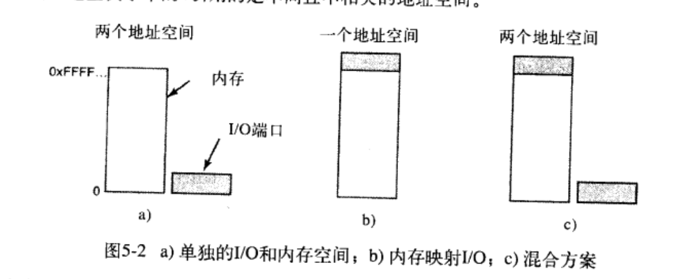

这些方案是怎么工作的呢？

在各种情况下，当CPU需要读入一个字的时候，不论是从内存还是io设备，他都会将需要的地址放到总线的地址上，然后在总线的另外一条控制线上，置一个READ信号。还需要第二条线来表明是从内存空间还是IO空间。如果是内存空间，内存将会响应请求。如果是IO空间，IO设备将响应请求。

这两种寻址控制器的方案，都有各自的优缺点。

内存映射IO优点：

- 设备控制寄存器只是内存中的变量，访问快速。因此，对于内存映射IO，IO设备驱动程序可以完全使用C语言编写。如果不使用内存映射io，就需要用到汇编编码。
- 不需要特殊的机制来阻止用户进程执行IO操作。操作系统要做的是避免把包含控制寄存器的地址放到任何用户的虚拟地址空间中。
- 可以引用内存的每一条指令，都可以用来引用控制寄存器。

内存映射IO缺点：

- 

#### 1.4 直接存储器存储（DMA）

无论CPU是否具有内存映射IO，它都需寻址设备控制器与它们进行数据交换。CPU可以从IO控制器每次请求一个字节，但是这样很浪费CPU时间。因此，用到了直接存储器存储（DMA）的不同方案。只有硬件支持DMA控制器时操作系统才能使用DMA。有时DMA控制器集成到磁盘控制器和其他控制器之中，但是这样的设计要求每个设备有一个单独的DMA控制器。更为普遍的是，只有一个DMA控制器可以利用（主板上），由他控制到许多设备的数据传送，而这些数据传送经常同时发生的。

无论DMA控制器在物理上处于什么地方，他都能够独立于CPU而访问系统总线。

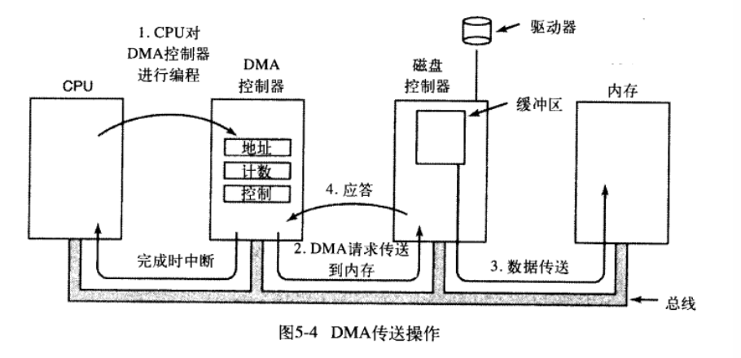

它包含若干个可以被CPU读写的寄存器，其中包含一个**内存地址寄存器**，一个**字节数寄存器**和**一个或多个控制寄存器**。控制寄存器指定要使用的IO端口、传送方向（从IO设备读或者写到IO设备）、传送单位（每次一个字节或者每次一个字）以及在一次突发传送中要传送的字节数。

DMA工作原理：

首先看一下没有使用DMA的时候，磁盘如何读。

- 首先，控制器从磁盘驱动器串行地、一位一位地读一个块（一个或者多个扇区），直到将整块信息放入控制器的内部缓冲区中。
- 接着，他计算教研和，以保证没有读错误发生。
- 然后，控制器产生一个终端。
- 当操作系统开始运行时，他重复的从控制器的缓冲区中一次一个字节或者一个字的读取块的信息，并将其存入到内存。

使用DMA时，过程如下：

- 首先CPU痛殴设置DMA控制器的寄存器对他进行编程，所以DMA控制器知道将什么数据传送到什么地方。如上图的第一步。
- DMA控制器向磁盘控制器发送一个命令，通知他从磁盘读数据到其北部的缓冲区中，并且对娇艳和进行校验。日过磁盘控制器的缓冲区中的数据是有效的，那么DMA就可以开始了。
- DMA控制器通过在总线上发出一个读请求到磁盘控制器，来发起DMA传送（第二步）。这一读请求看起来与任何其他读请求是一样的，并且磁盘控制器并不知道或者并不惯性他是来自CPU还是DMA控制器。
- 一般情况一，要写的内存地址在总线的地址上，所以当磁盘控制器从其内部缓冲区中取下一个字的时候，他知道将该字写到什么地方。
- 写到内存是另一个标准总线周期（第三步）。
- 当写操作完成时，磁盘控制器在总线上发出一个应答信号到DMA（第四步）。
- 于是，DMA控制器步增要使用的内存地址，并且步减字节计数。如果字节计数仍然大于0，则重复第二步到第四步，直到字节数到达0.
- 此时，DMA控制器将中断CPU以便让他知道传送现在已经完成了。当操作系统开始工作室，用不着将磁盘块复制到内存中，因为他现在已经在内存中了。


#### 1.5 重温中断


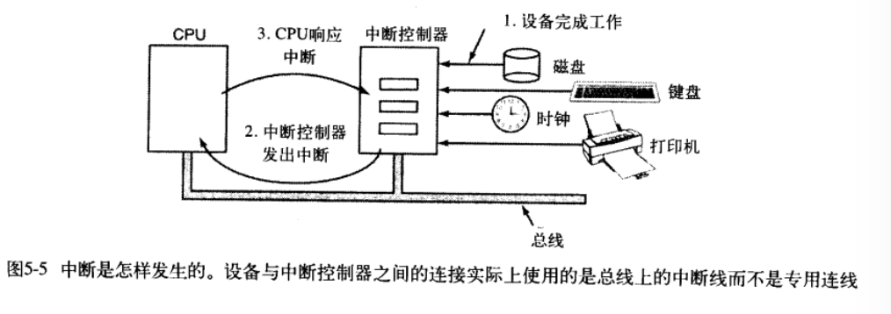

在硬件层面，终端的工作如下所示。

- 当一个IO设备完成交给他的工作室，它就产生一个中断（假设操作系统已经开放中断），它是通过**在分配给它的一条总线信号线**上置起信号而产生中断的。
- 该信号被主办上的中断控制器芯片检测到，它由中断控制器芯片决定做什么。
- 如果没有其他的中断还没有处理结束，中断控制器将立即对中断进行处理。如果有一个中断正在处理中，或者另一个设备在总线上具有更高优先级的一条中断请求线上同时发出中断请求，该设备将暂时不被理睬。在这种情况之下，该设备将继续在总线上置起中断信号，直到得到CPU的服务。
- 为了处理中断，中断控制器**在地址线**上**放置一个数字**表明**哪个设备需要关注**，并且**置起一个中断CPU的信号**。
- 中断信号导致CPU停止当前正在作的工作并且开始干其他的事情。**地址线上面的数字**被用做**指向**一个称为**中断向量的表格的索引**，以便读取一个新的程序计数器。这个程序计数器指向相应的**中断服务过程**的开始处。一般情况下，陷阱和中断从这一点上看使用相同的机制，并且常常共享相同的中断向量。中断向量的位置可以硬布线到机器中，也可以在内存中的任何地方通过一个CPU寄存器指向其起点。
- 中断服务过程开始运行后，他立即通过一个确定的值写到中断控制器的某个IO端口来对中断作出应答。这一应答告诉中断控制器可以自由的发出另一个中断。
- 在开始服务程序之前，硬件总是要保存一定的信息。哪些信息要保存以及将其保存到什么地方，不通的CPU之间存在巨大的差别。作为最低限度，必须保存程序计数器，这样被中断的进程才能重新开始。在另一个极端，所有可见的寄存器和内部寄存器或许也要保存。
- 将这些信息保存到什么地方也是一个问题。一种选择是将其放入到内部寄存器中，在需要时操作系统可以读出这些内部寄存器。存在的问题：中断控制器之后无法得到应答，直到所有可能的相关信息被读出，以免第二个中断重写内部寄存器保存状态。这一策略在中断被禁止时将导致长时间的死机，并且可能丢失中断和丢失数据。
- 因此，大多数CPU在对战中保存信息。这种方法也存在问题。首先，使用谁的对战？如果使用当前对战，则他很有可能是用户进程的堆栈。堆栈指针升值可能是不合法的，这样硬件试图在他所知的地址处写某些字时，将导致致命的错误。此外，它可能指向一个页面的末端。若干次内存写之后，页面边界可能被超出并且产生一个页面故障。
- 如果使用内核对战，将存在更多的堆栈指针是合法的并且指向一个固定的页面。但是，切换到核心态可能要求改变MMU上下文，并且可能使高速缓存和TLB的大部分全部失效。静态地或动态地重新装载所有这些东西将增加处理一个中断的时间，因而浪费CPU的时间。

##### 精确中断和不精确中断

将机器留在一个明确状态的中断称为精确中断。有以下特征：

- PC（程序计数器）保存在一个已知的地方。
- PC所指向的指令之前的所有指令已经完全执行。
- PC所指向的指令之后的所有指令没有执行。
- PC所指向的指令的执行状态是已知的。

不满足这些要求的中断称为不精确中断。

### 2. I/O软件原理

#### 2.1 IO软件的目标

在设计IO软件时，一个关键的概念就是**设备独立性**。意思是应该可以编写出这样的程序：它可以访问任意IO设备而无序事先指定设备。例如，读取一个文件作为输入的程序，应该能够在磁盘、CD-ROM、USB等读取文件，无需为每一种不同的设备修改程序。

与设备独立性密切相关的是统一命名。一个文件或者设备的名字应该是一个简单的字符串或一个证书，他不依赖于设备。在UNIX系统中，所有存储盘都能以任意方式集成到文件系统层次结构中，因此，用户不必知道哪个名字对应哪个设备。

IO软件另一个重要的问题是**错误处理**。一般来说，错误应该尽可能的在接近硬件的层次得到处理。当控制器发现一个读错误时，如果他能够处理，那么就应该自己设法纠正这一错误。如果控制器解决不了，那么设备驱动程序应当予以处理，可能只需要一次重读一次这块数据就正确了。只有在低层软件处理不了的情况下，才将错误上交高层处理。在许多情况下，错误恢复可以在底层透明地得到解决，而高层软件甚至不知道存在这一错误。

另外一个问题是**同步和异步传输**。大多数物理IO是一部的——CPU启动传输后便转去做其他事情，直到中断发生。

另一个问题是**缓冲**。数据离开一个设备之后通畅并不能直接存放带其最终的目的地。例如，从网络上进来一个数据包时，直到将该数据包存放在某个地方过并对其进行检查，操作系统菜知道要将其置于何处。此外，某些设备具有严格的实时约束，所以数据必须预先放置到输出缓冲区之中，从而消除缓冲区填满速率和缓冲区清空速率之间的相互影响，以避免缓冲区欠载。缓冲区涉及大量的肤质工作，经常对IO性能有重大影响。

#### 2.2 程序控制IO

CPU要不断的查询设备以了解一下它是否准备好。这种行为称作轮询或忙等待。

程序控制IO十分简单，但是缺点很明显：即知道全部IO完成之前都要占用CPU的全部时间。

#### 2.3 中断驱动IO

如果大赢家每秒钟可以打印100个字符，那么打印每个字符将花费10ms。也就是说，当每个字符写到打印机的数据寄存器之中后，CPU将有10ms处于无价值的循环之中，等待允许输入下一个字符。这10ms足以进行一次上下文切换并运行其他进程，否则浪费了。

像这种允许CPU在等待打印机变为就绪时，干其他的事情就称为使用中断 。

当打印字符串的系统调用被发出时，字符串缓冲区被复制到内河空间。并且一旦打印机准备好接受第一个字符时就将第一个字符复制到打印机中。这时，CPU要**调用调度程序，并且某个其他进程将运行**。请求打印字符串的进程将被阻塞，直到整个字符串打印完成。

当打印机打印完成一个字符，并准备接收下一个字符时，它将产生一个中断。这一中断将停止当前进程并保存当前的状态。然后，打印终端服务过程将运行。

#### 2.4 使用DMA的IO

中断驱动IO的一个明显的缺点是中断发生在每一个字符。中断将花费一些时间，这些会导致部分CPU的浪费。


DMA的重大成功，是将中断从每打印一个字符一次，到每打印完成一个缓冲区一次。


### 3. I/O软件层次

每一层具有**一个要执行的定义明确的功能**和**一个定义明确的和临近层次的接口**。功能和接口随着不同的系统而不同。


#### 3.1 中断处理程序

对于大多数的IO来说，中断是令人不愉快的，并且不可避免。应当将其深深的隐藏在操作系统 内部，以便系统的其他部分尽量不与它发生联系。最好的办法是将**启动一个IO操作**的驱动程序阻塞起来，**直到IO操作完成**并且**产生一个中断**。驱动程序阻塞自己的手段有：在一个**信号量**上执行down操作、在一个**条件变量**上执行wait操作、在一个消息上**执行receive操作**或者某些类似的操作。

当中断发生时，**中断处理程序**将做它必须要做的全部工作以便对中断进行处理。然后，它可以**将启动中断的驱动程序**解除阻塞。在一些情形中，它只是在一个信号量上面执行up操作；其他情形中，对管程中的条件变量执行signal操作。或者向被阻塞的驱动程序发一个消息。中断最终的结果是使先前被阻塞的驱动程序现在能够继续运行。如果驱动程序构造为内核进程，具有它们自己的状态、对战喝程序计数器，那么这一模型运转的最好。

现实没有这么简单。对一个中断进行处理并不只是简单地捕获中断，在某个信号量上执行up操作，然后执行一条IRET指令从中断返回到先前的进程。对操作系统而言，还涉及更多的工作。一系列步骤给出这一工作的轮廓，这些步骤是硬件中断完成之后必须在软件中执行的。应该注意的是，细节是非常依赖于系统的。下面的步骤不一定适用于所有的机器，步骤也可能不一样。

1. 保存**没有被中断硬件保存**的**所有寄存器**（包括PSW）。
2. 为**中断服务过程**设置上下文，可能包括**设置TLB、MMU、页表**。
3. 为中断服务过程**设置堆栈**。
4. **应答中断控制器**，如果不存在集中的中断控制器，则再次开放中断。
5. **将寄存器从他们被保存的地方复制到进程表中**。
6. 运行**中断服务过程**，**从发出中断的设备控制器寄存器提取信息**。
7. **选择下一次运行哪个进程**，如果中断导致某个被阻塞的高优先级进程变为就绪，则可能选择它立即运行；
8. 为下一次要运行的进程设置MMU上下文，也许还需要设置某个TLB。
9. 装入新进程的寄存器，包括其PSW。
10. 开始运行新进程。

可见，中断处理需要花费很多的CPU指令，特别是在**存在虚拟内存**并且**必须设置页表或者必须保存MMU状态**的机器上，当在用户态与核心态之间切换时，可能还需要管理TLB和CPU高速缓存，这就需要额外的机器周期。

#### 3.2 设备驱动程序

前面简单介绍了设备控制器所做的工作。每一个控制器都设有某些寄存器来向设备发出命令，或者设有某些设备寄存器用来读出设备的状态。

设备寄存器的数量和命令的性质在不同的设备之间有着本质的区别。

因此，每个连接到计算机上面的IO设备都需要某些设备特定的代码来对其进行控制。这些代码称为设备驱动程序，它一般由设备的制造商编写并且随同设备一起交付。因为每一个系统都需要自己的驱动程序，所以设备制造商要为多个操作系统提供驱动程序。

为了访问设备的硬件（设备控制器寄存器），设备驱动程序必须是系统内核的一部分。还可能构建运行在用户空间的驱动程序，使用系统调用来读写设备寄存器，这使内核和驱动程序相隔离，并且驱动程序之间相互隔离。

操作系统设计人员指导有外人编写的驱动代码片段将被安装在操作系统内部，所以需要有一个体系结构来允许这样的安装。这意味着需要定义明确的模型，规定驱动程序做什么事情以及如何与操作系统其余部分互相作用。设备驱动程序通常位于操作系统其余部分的下面。

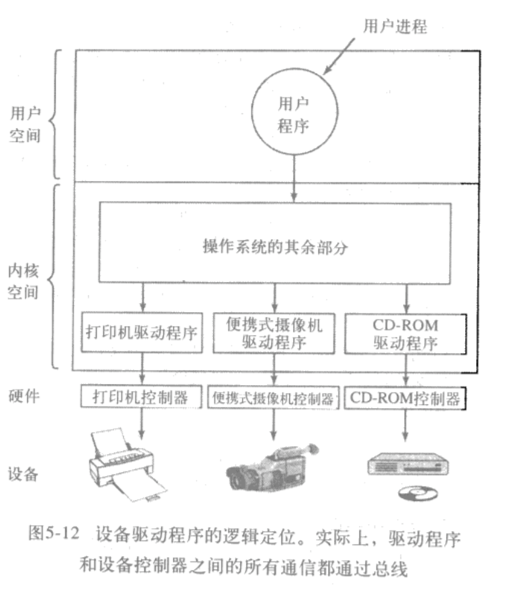

大多数操作系统都定义了一个所有块设备都必须支持的标准接口，并且还定一个所有字符设备都必须支持的标准接口。这些接口有许多过程组成，操作系统的其余部分可以调用它们让驱动程序工作。

但是，这个需要编译内核，不太实用。

出现了另一模型。操作系统在驱动程序执行期间动态的装载到系统。

设备驱动程序的功能如下：

- 接收来自其上方的和设备无关的软件发出的抽象读写请求，并且目睹这些请求被执行；
- 对设备进行初始化等


#### 3.3 与设备无关的IO软件

- 设备驱动程序统一接口
- 缓冲
- 错误报告
- 分配与释放专用设备
- 提供与设备无关的块大小


#### 3.4 用户空间的IO软件

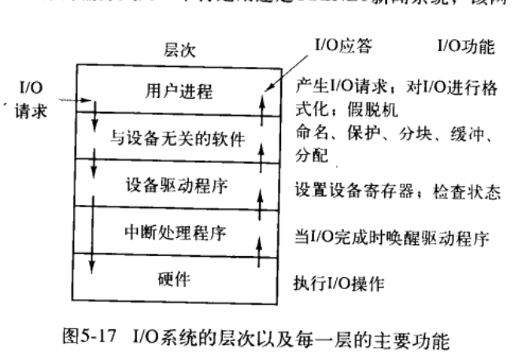


### 4. 盘


### 5. 时钟


### 6. 用户界面：键盘、鼠标和监视器


### 7.瘦客户机


### 8. 电源管理


## 六、死锁

### 1. 资源


### 2. 死锁概述


### 3. 鸵鸟算法


### 4.死锁检测和死锁恢复


### 5. 死锁避免


### 6. 死锁预防


### 7. 其他问题


##  七、多媒体操作系统

### 1. 多媒体简介


### 2， 多媒体文件


### 3. 视频压缩


### 4. 音频算法


### 5. 多媒体进程调度


### 6. 多媒体文件系统范型


### 7. 文件存放


### 8. 高速缓存


### 9. 多媒体磁盘调度


## 八、多处理机系统


### 1. 多处理机


### 2. 多计算机


### 3.虚拟化


### 4. 分布式系统


## 九、安全

### 1. 环境安全


### 2. 密码学原理


### 3. 保护机制


### 4. 认证


### 5， 内部攻击


### 6. 利用代码漏洞


### 7. 恶意软件


### 8. 防御


## 十、实例研究： Linux

### 1.Linux概述

  程序通过把参数放入寄存器来调用系统调用，并发出陷阱指令从用户模式切换到内核模式。由于不能够用C语言写一条陷阱指令，因此系统提供了一个库，每个函数对应一个系统调用。这些函数使用汇编语言写的，不过可以从C中调用。每个函数首先将参数放到合适的地方，然后执行陷阱命令。因此，为了执行read系统调用，一个C程序需要调用read库函数。由POSIX指定的是库接口，而不是系统调用接口。POSIX规定哪些库函数是一个符合标准规范的系统必须提供的，它们的参数是什么，他们的功能是什么，以及它们返回的什么样的结果。POSIX根本没有提到真正的系统调用。

#### 1. 内核结构

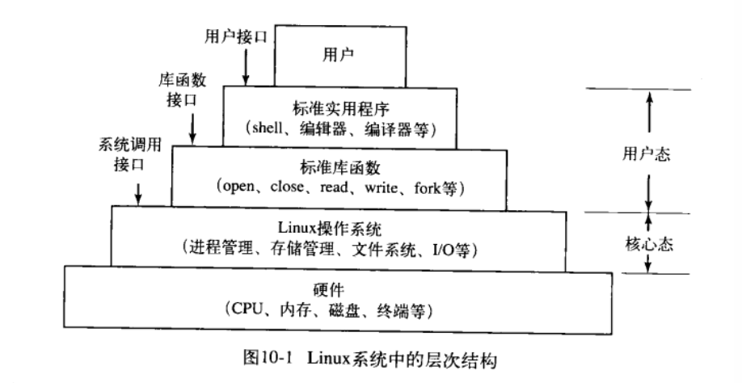

在图10-1中，我们看到了Linux系统的总体结构。在近一倍研究内核的组成部分，如Linux的进程调度和文件系统之前，先从整体的角度看一下Linux的内核。

内核坐落在硬件之上，负责实现与IO设备和存储管理单元的交互，并控制CPU对前述设备的访问。如下图，在最底层，内核包含中断处理程序，它们是与设备交互的主要方式，以及底层的分派机制。这种分派在中断时发生。底层的代码中止正在运行的进程，将其状态存储在内核进程结构中，然后启动相应的驱动程序。进程分派也在内核完成某些操作，并且需要再次启动一个用户进程时发生。进程分派的代码是汇编代码，并且和进程调度代码有很大不同。

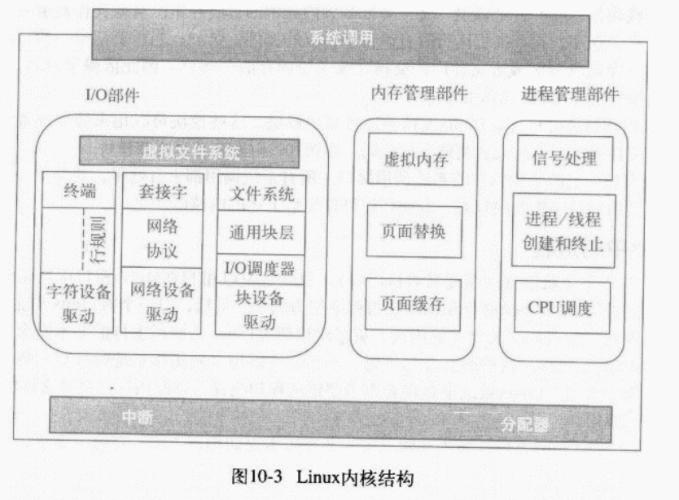

下面我们将内核子系统氛围三个主要的部件。

IO部件包含所有负责与设备交互以及实现联网和存储的IO功能的内核部件。在最高层，这些IO功能全部整合在一个虚拟文件系统层中。也就是说，从顶层来看，对一个文件进行读操作，不论是在内存还是此案中，都和从中断输入中读取一个字符是一样的。从底层来看，所有的IO操作都需要通过一个设备驱动器。所有的Linux驱动程序都可以被分类为字符驱动程序或块驱动程序，两者之间最主要的区别是块设备允许查找和随机访问而字符设备不允许。从技术上讲，网络设备实际上是字符设备，不过她们的处理和其他字符设备不太一样，因此为了清晰起见，将它们单独分类。

在设备驱动程序之上，每个设备类型的内核代码都不一样。字符设备有两种不同的使用方式。有些程序，如可是编辑器vi等，需要每一个键盘输入。原始的中断（tty）IO可以实现这种功能。其他程序，比如shell等，是面向行的，因此允许用户在输入回车并将字符串发送程序之前整行的进行编辑。

网络软件通常是模块化的，由不同的设备和协议来支持。网络设备的上一个层次负责一种馋鬼程序，确保每一个包被送到了正确的设备或协议处理器。大多数Linux系统在内核中包含一个完整的硬件路由器和功能，尽管其性能比硬件路由器的性能差一点。在路由器代码之上的是实际的协议栈，他总是包含IP和TCP协议，也包含一些其他协议。在整个网络之上的是socket接口，它允许程序来为特定的网络和协议创建socket，并为每一个socket返回一个待用的文件描述符。

在磁盘驱动器之上是IO调度器，它负责排序和分配磁盘读写操作，以尽可能减少磁头的去用移动活着满足一些其他的系统原则为方法。


### 2. Linux中的进程


###3. Linux中的内存管理


###4. Linux中的IO系统


### 5. Linux中的文件系统


### 6. Linux的安全性


