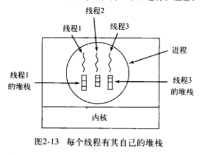
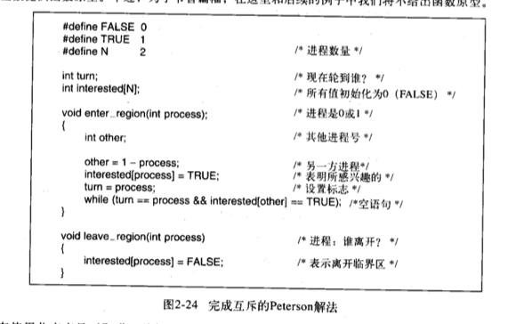

## 概述

### 0.计算机硬件介绍


### 1. 操作系统的概念

#### 1. 进程

进程本质上是一个正在执行的程序。与每个进程相关的是进程的**地址空间**，这是从某个最小的存储位置到某个最大存储位置的列表。在这个地址空间中，进程可以进行读写。改地址空间中存放有可执行程序、程序的数据以及程序的堆栈。与每个进程相关的还有资源集，通常包括寄存器（含有程序计数器和堆栈指针）打开文件的清单、突出的报警、有关进程清单，以及运行该程序所需要的所有其他信息。进程基本上就是容纳运行一个程序所需要所有信息的容器。

与进程管理有关的最关键的系统调用是那些进行进程创建和进程终止的系统调用。典型的例子。有一个「命令解释器」或shell进程从终端上面读取命令。此时，当一个用户刚键入一条命令要求变异一个程序，shell必须创建一个新的进程来执行编译程序。当编译的进程结束时，它执行一条系统调用来终止自己。

若一个进程能够创建一个或者多个进程（子进程），而且这些进程又可以创建子进程，则很容易得到进程树。**合作完成某些作业的相关进程经常需要彼此通信**以便同步它们的行为。这种通信称为**进程间通信**。

其他可用的进程系统调用包括：申请更多的内存（或释放不再需要的内存）、等待一个子进程结束、用另一个进程覆盖该程序等。

有时，需要向一个正在运行的进程传递信息，而该进程并没有等待接收信息。例如，一个进程通过网络向另外一台机器上的进程发送消息进行通信。为了保证一条消息或者消息的应答不会丢失，发送者要求它所在的操作系统在指定的若干秒后给一个通知，这样如果对方尚未收到收到确认消息就可以进行重发。在设定该定时器后，程序可以继续做其他工作。

**在限定的秒数流逝之后，操作系统向该进程发送一个警告信号。此信号引起该进程暂时挂起，无论该进程在做什么，系统将其寄存器的值保存到堆栈，并开始运行一个特别的信号处理过程，比如重新发送可能丢失的消息**。这些信号是软件模拟的硬件中断，除了定时器到期之外，该信号可以由各种原因产生。许多由硬件检测出来的陷阱，比如执行了非法指令、使用了无效的地址等，也被转换成该信号并交给这个进程。


#### 2. 地址空间

每台机器都有一些主存，用来保存正在执行的程序。在非常简单的操作系统中，内存中一次能有一个程序。如果要运行第二个程序每一个程序就必须被移出内存，再把第二个程序装入内存。

比较复杂的操作系统允许在内存中同时运行多道程序。为了避免它们彼此之间相互干扰，需要有某种保护机制。虽然这种机制必然是硬件形式的，但是它由操作系统掌控。

这些涉及到对计算机主存的管理和保护。另外一种不同的，但是同样重要的，并与存储器有关的内容，是**管理进程的地址空间**。通常，每个进程有一些可以使用的地址集合，典型值是从0到某个最大值。然而，有的程序的大小严重超过了主存的大小，这个怎么办呢？

操作系统会把部分地址空间装入主存，部分留在磁盘上面，并且在需要的时候穿梭交换它们。**在本质上，操作系统创建了一个地址空间的抽象，作为进程可以引用地址的集合**。该地址空间和机器的物理内存解耦。对地址空间和物理空间的管理组成了操作系统功能的一个重要部分。


#### 3. 文件

支持操作系统的另一个关键概念是文件系统。操作系统的一项主要的功能就是隐藏磁盘和其他IO设备的细节特性，并提供给程序员一个良好的、清晰的独立于设备的抽象文件模型。创建文件、删除文件、读文件和写文件都需要系统调用。在文件可以读取之前，必须先在磁盘上定位和打开文件，在文件读过之后应该关闭该文件，有关的系统调用就是为了完成这类操作。

为了提供保存文件的地方，大多数操作系统支持目录的概念。从而可以把文件分类成组。

进程和文件层次都可以组成树状结构，但是又有一点区别。一般进程的树状结构层次不会超过3层。文件树状结构的层次会有更多层。进程树的结构只是暂时的，不会存在很久，而目录层次可能存在很久。在所有权和保护方面也是有区别的。典型的，只有父进程能控制和访问子进程，而在文件和目录中通常存在一种机制，是文件所有者之外的其他用户也可以访问该文件。

在UNIX中，有一个重要的概念是特殊文件。提供特殊文件是为了使IO设备看起来像文件一样。这样，就像使用系统调用读写文件一样，IO设备也可以通过同样的系统调用进行读写。有两类特殊文件：**块特殊文件**和**字符特殊文件**。

**块特殊文件**：由可随机存储的块组成的设备，如磁盘等。比如打开一个块特殊文件，然后读第四块，程序可以直接访问设备的第四块而不必考虑存放该文件的文件系统结构。

**字符特殊文件**：用于打印机、调制解调器和其他接收或输出字符流的设备。特殊文件保存在/dev目录中。

最后一个特性，既与文件又和进程有关：**管道**。管道是一种虚拟文件，它可以连接两个进程。如果进程A和B希望通过管道对话，他们必须提前设置该管道。当进程A想对进程B发送数据时，它把数据写到管道上面，管道就像输出文件一样。进程B可以通过读取该管道而得到数据，仿佛这个管道和输入文件一样。

#### 4.输入输出

所有的计算机都有用来获取输入输出的物理设备。因此，每个操作系统都有管理其IO设备的IO子系统。某些IO软件时设备独立的，既这些IO软件部分可以同样应用于许多或者全部的IO设备上。其他部分，如设备驱动程序，是专门为特定的IO设备设计的。


#### 5. 保护


#### 6.shell

操作系统是进行系统调用的代码。UNIX的命令解释器称为Shell。尽管shell本身不是操作系统的一部分，但它体现了很多操作系统的特性。

#### 7. 个体重复系统发育


### 2. 系统调用

擦做系统主要具有两种功能：为用户程序提供抽象和管理计算机资源。

在多数情况下，用户程序和操作系统之间的交互处理属于前者。对用户而言，资源管理部分主要是透明和自动完成的。这样，用户程序和操作系统之间的交互主要就是处理抽象。


#### 1.用于进程管理的系统调用

在UNIX中，fork是唯一一个可以在POSIX创建进程的途径。 他创建一个原有进程的精确副本，包括所有的文件描述符，寄存器等全部内容。在fork之后，原油的进程及其副本（父与子）就分开了。在fork时，所有的变量都具有一样的值，虽然父进程的数据被复制用以创建子进程，但是其中一个的后续变化并不会影响到另一个。

多数情况下，在fork之后，子进程需要执行与父进程不同的代码。为了等待子进程结束，父进程执行一个waitpid的系统调用，它只是等待，直至子进程终止。waitpid可以等待一个特定的子进程，或者通过将第一个参数设置为-1的方式，从而等待任何一个老的子进程。在waitpid完成之后，将把第二个参数statloc只想的地址设置为子进程的退出状态（正常或异常终止及退出值）。

使用shell为例，说明shell如何使用fork。再输入一条命令后，shell创建一个新的进程。这个子进程必须执行用户的命令。通过使用execve系统调用可以实现这一点，这个系统调用会引起其整个核心映像被一个文件代替，该文件有第一个参数给定。用一个简化的shell说明fork、waitpid、execve的使用。

```c
#define TRUE 1
while(TRUE){
  type_prompt();
  read_command(command,parameters);
  
  if(fork()!=0){       /*派生子进程 */
    /*parent code*/
    waitpid(-1,&status,0);  /*等待子进程退出 */
  }else{
    /*child code*/
    execvr(command,parameters,0);/*执行命令*/
  }
  
}
```


在UNIX中的进程将其存储空间划分为三段：正文段（程序代码）、数据段（变量）以及堆栈段。数据段向上增长，堆栈段向下增长。夹在中间的是为使用的地址空间。堆栈段数据自动增长，数据段需要使用系统调用brk。


#### 2. 用于文件管理的系统调用

要读写一个文件首先要使用open打开文件。这个系统调用通过路径名称指定需要打开的文件名称，O_RDONLY,O_WRONLY,O_RDWR。表示读写的方式。创建一个文件，使用O_CREAT参数. 然后使用返回的文件描述符进行读写操作。最后使用close关闭文件，这个调用使得该文件描述符在后续的open中被再次使用。


#### 3.用于目录管理的系统调用


#### 4.各种系统调用


### 3. 操作系统结构


#### 1.单体系统

层次结构如下：

- 需要一个主程序，用来处理**服务过程请求**；
- 需要一套服务过程，用来执行系统调用；
- 需要一套实用过程，用来辅助服务过程。

除了在计算机初启时所载入的核心操作系统外，许多操作系统支持可装载的 扩展，比如IO设备驱动和文件系统。可以按照需要载入。

#### 2. 层次式系统

把上面的系统进一步通用化，可以形成一个层次式结构的操作系统，他的上层软件都是在下一层软件的基础上构建的。

#### 3. 微内核

在分层方式中，设计者需要确定在哪里划分内核——用户的边界。传统的，所有层都在内核中，但是这样搞没有必要。应该尽可能减少内核态中功能的做法更好，因为内核中的错误会快速的拖累系统。

微内核的设计思想，为了提高可靠性，将操作系统划分成小的、良好定义的模块。只有一个模块——微内核——运行在内核上，其余的模块，由于功能相对弱些，则作为普通的用户进程运行。由于把每个设备驱动和文件系统分别作为普通用户进程，这些模块的错误虽然会中断这个模块，但是不会导致整个系统的死机。

#### 4. 客户机——服务器模式


#### 5. 虚拟机


#### 6.外核


## 进程与线程

### 1.进程

严格地说，在某一个瞬间，CPU只能运行一个进程。但在1秒内，他可能运行多个进程，造成同时运行多个进程的错觉。

#### 1. 进程模型

在进程模型中，计算机上所有可运行的软件，通常也包含操作系统，被组织称若干的顺序进程，简称进程。一个进程就是一个正在执行程序的实例，包括程序计数器、寄存器和变量的当前值。从概念上说，每个进程有自己的虚拟CPU。

#### 2. 创建进程


#### 3. 进程的终止


#### 4.进程的层次结构


#### 5. 进程的状态


#### 6. 进程的实现

为实现进程模型，操作系统维护着一张表，即进程表。每个进程占用一个进程表项。该表项包含了进程状态的重要信息，包括程序计数器、堆栈执政、内存分配状态、所打开的文件状态、账号和调度信息，以及因为调度运行状态转换到就绪状态或者阻塞态时必须保存的信息，从而保证该进程随后能再次启动。


与每一IO类关联的是一个称为中断向量的位置，靠进内存底部的固定区域。它包含中断服务程序的入口地址。假如当一个磁盘发生中断时，用户进程3正在运行，则**中断硬件**将程序计数器、程序状态字，相关寄存器压入对战，计算机随后跳转到中断向量所指的地址。这些是硬件完成的所有操作，然后软件（中断服务例程）就会接管一切剩余的工作。

所有的中断都从保存寄存器开始，对于当前进程来说，通常是在进程表项中。随后，会从堆栈中删除有中断硬件机制存入堆栈的那部分信息，并将堆栈指针指向一个有进程处理程序所使用的临时堆栈。这些保存寄存器值和设置指针等操作，无法使用C语言描述，所以这些操作通过短小的汇编语言例程来完成，这些例程可以供所有的中断使用。

当该例程结束后，他调用一个C过程处理某个特定的中断类型剩下的工作。在完成有关工作之后，大概就会是某些进程就绪，接着调用调度程序，决定随后该运行哪个进程。随后将控制转给一段汇编语言代码，为当前的进程装入寄存器值以及内存映射并启动该进程运行。

#### 7.多道程序设计模型


### 2. 线程

在传统操作系统中，每个进程有一个地址空间和一个控制线程。不过，经常存在在同一个地址空间中准并行的运行多个控制线程的状态，这些线程就像分离的进程（除了地址空间共享）。

#### 1. 线程的使用

为什么有了进程之后，还需要另外一类进程呢？

主要原因：

- 许多应用中，同时发生着多种活动。其中，某些活动随着时间的推移会被阻塞。通过将这些应用程序分解成可以**准并行**运行的多个顺序线程，程序设计模型会变得简单。

正是之前关于进程模型的讨论。有了这样的抽象，我们才不必考虑中断、定时器、上下文切换。而只需考察并行进程。类似的，只有在有了多线程概念之后，才加入一种新的元素。并行实体共享同一个地址空间和所有可用数据的能了。对于某些应用，这种能力是必须的，而这正是多进程模型（他们具有不同的地址空间）所无法表达的。

- 第二个需要多线程的理由，由于线程比进程更轻量级。更加容易创建、销毁。速度快10～100倍。
- 第三个理由，主要涉及性能方面的考虑。多多个线程都是CPU密集型的，那么并不能获得性能上的增强。但是如果存在着大量的计算和大量的IO，拥有多线程能够加快应用程序的执行速度。
- 最后，在多CPU系统中，多线程是有益的，真正的并行有了实现的可能。


案例分析：p56 画图说明


| 模型       | 特性                         |
| ---------- | ---------------------------- |
| 多线程     | 并行性、阻塞系统调用         |
| 单线程进程 | 无并行性、阻塞系统调用       |
| 有限状态机 | 并行性、非阻塞系统调用、中断 |


#### 2. 经典线程模型

进程模型基于两种独立的概念：资源分组处理与执行。有时，将这两个概念分开会更有益，这也映入了"线程"这一个概念。

首先，我们学习一下经典的线程模型；后面研究一下"模糊进程与线程分界线"的Linux线程模型。


理解进程的一个角度：通过某种方法把相关的资源集中在一起。进程有存放程序正文和数据以及其他资源的地址空间。这些资源中包括打开的文件、子进程、即将发生的报警、信号处理程序、账号信息。把他们都放到进程中更容易管理。

另外一个概念，**进程拥有一个执行的线程。在线程中有一个程序计数器，用来记录接着要执行哪一条指令。线程拥有寄存器，用来保存当前线程的工作变量。线程还拥有一个堆栈，用来记录执行历史，其中每一帧保存了一个一调用的，但是还没有从中返回的过程**。尽管线程必须在某一个进程中执行，但是线程和他的进程是不同的概念，并且可以分别处理。

**进程用于将资源集中在一起，而线程则是在CPU上被调度执行的实体**。

线程给进程模型增加一项内容，即在同一个环境进程中，允许彼此之间有较大独立性的多个线程执行。在同一个进程中并行运行多个线程，是对在同一台计算机上并行运行多个进程的模拟。前一种情况下，多个线程共享同一个地址空间和其他资源。而后一种情形下，多个进程共享物理内存、磁盘和其他资源。由于线程具有进程的某些性质，所以有时被称为轻量级进程。多线程，用来描述在同一个进程中允许多个线程的情况。一些CPU已经有直接硬件支持多线程，并允许线程在纳秒级完成。

TODO  画图


在上图a中，可以看到三个传统的进程。每个进程有自己的地址空间和单个控制线程。相反，b中，可以看到一个进程带有三个控制线程。尽管在两种情况中都有三个线程，但是a中，每个线程都在不同的地址空间中运行，而b中的这三个线程全部在相同的地址空间中运行。


进程中的不同线程不像不同进程之间那样存在很大的独立性。所有的线程都有完全一样的地址空间，这也为这她们也会共享同样的全局变量。由于各个线程都可以访问进程地址空间中的每一个内存地址，所以一个线程可以读、写或着清除另外一个线程的堆栈。线程之间是没有保护的，原因如下：1. 不可能 2. 没必要。

这个和不同进程是有差别的。不同的进程会来自不同的用户，它们彼此之间可能有敌意，一个进程总是由某个用户所拥有，该用户创建多个线程应该是为了他们之间的合作而不是彼此之间进行争斗。出了共享地址空间之外，所有的线程还共享同一个打开文件集、子进程、报警以及相关信号等。

| 每个进程中的内容                                             | 每个线程中的内容               |
| ------------------------------------------------------------ | ------------------------------ |
| 地址空间、全局变量、打开文件、子进程、即将发生的报警、信号与信息处理程序、账户信息 | 程序计数器、寄存器、堆栈、状态 |


**线程概念试图实现的是，共享一组资源的多个线程的执行能力，方便这些线程可以为完成一个任务而共同工作**。

线程和传统的进程一样（只有一个线程的进程），线程可以处于若干种状态的热河一个：运行、阻塞、就绪、终止。正在运行的线程拥有CPU并且是活跃的。被阻塞的线程正在等待某个释放他的事件。比如，当一个线程执行从键盘读入数据的系统带哦勇士，该线程就被阻塞直到键入了输入为止。线程可以被阻塞，以便等待某个外部事件的发生或者等待其他线程来释放他。就绪线程可以被调度运行，并且只要轮到它就很快可以运行。线程状态之间的转换和进程状态之间的转换是一样的。




每个线程又自己的堆栈。**每个线程的堆栈都有一帧**，供各个**被调用但是还没有从中返回的过程使用**。在该帧中存放了相应过程的局部变量以及过程调用完成后使用的返回地址。例如，如果过程X调用过程Y，Y又调用Z，那么当Z执行时，供X、Y、Z使用的帧全部存在堆栈中。通常每个线程回调用不同的过程，有各自不同的执行历史。因此，每个线程需要有自己的堆栈。

在多线程的情况下，进程通常会从当前的单个线程开始。这个线程有能力通过调用库函数创建新的线程。thread——create的参数专门制定了新线程要运行的过程名。这里，没有必要对新线程的地址空间进行限定，因为新线程会自动在创建线程的地址空间中运行。所有的线程都是平等的。不论有无层次，创建新的线程都会返回一个线程标识符，该标识符就是新线程的名字。

当一个线程完成之后，可以通过调用一个库过程（thread_exit）退出。该线程接着就会消失，不再可调度。在某些线程系统中，通过调用一个过程，例如thread_join，一个线程可以等待一个特定线程退出。这种情况，线程的创建和终止非常类似于进程的创建和终止，并且有着同样的选项。


另一个常见的线程调用时thread_yield，它允许线程自动放弃CPU从而让另一个线程运行。这样一个调用很重要，因为不同于进程，线程库无法利用时钟中断强制线程让出CPU。

要使多线程的程序正确工作，就需要仔细思考和设计。

#### 3. POSIX线程

为了实现可移植的线性程序，IEEE在IEEE标准1003.1c中定义了线程的标准。他定义的线程包叫做Pthread。大部分UNIX系统都支持该标准。这个标准定义了超过60个函数调用。下面主要描述一些主要的函数，说明他是如何工作的。

所有Pthread线程都有某些特性。每个都包含一个标识符、一组寄存器（包括程序计数器）和一组存储在结构中的属性。这些属性包括堆栈大小、调度参数以及使用线程所需要的其他项目。

| 线程调用             | 描述                           |
| -------------------- | ------------------------------ |
| Pthread_create       | 创建一个新线程                 |
| Pthread_exit         | 结束调用的过程                 |
| Pthread_join         | 等待一个特定的线程退出         |
| Pthread_yield        | 释放CPU来运行另外一个线程      |
| Pthread_attr_init    | 创建并初始化一个线程的属性结构 |
| Pthread_attr_destroy | 删除一个线程的属性结构         |


#### 4. 在用户空间中实现线程

有两种主要的方法实现线程包：在用户空间和内核中。这两种方法互有利弊，不过混合实现方法也是有可能的。

第一种方法，把整个线程包放在用户态空间中，内核对线程包一无所知。从内核的角度考虑，就是按正常的方式管理，即单线程进程。这种方法第一个，也是最明显的优点：用户级线程包可以在不支持线程的操作系统上实现。过去所有的操作系统都属于这个范围，即使现在也有一些操作系统还是不支持线程。通过这一方法，可以用函数库实现线程。

所有的这类实现都有同样的通用结构，如下左图，线程在一个运行时系统的顶部运行，这个运行时系统是一个管理线程的过程的集合。之前我们见到过其中的四个过程：pthread_create,pthread_exit,pthread_join和pthread_yield。不过一般还有跟多的过程process。


在用户空间管理线程时，每个进程需要有其专用的线程表，用来跟踪该进程中的线程。这些表盒内核中的进程表类似，不过它仅仅记录各个线程的属性，如每个线程的程序计数器、堆栈指针、寄存器和状态等。该线程表由运行时系统管理。**当一个线程转换到就绪或者阻塞状态时，在该线程表中存放重新启动该线程所需要的信息**，与内核在进程表中存放进程的信息一样。

当某个线程做了一些会引起在本地阻塞的事情后，比如，等待进程中另一个线程完成某项工作，他调用一个运行时系统的过程，这个过程检查该线程是否必须进入阻塞状态。如果是。他在线程表中保存该线程的寄存器（即它本身的）。查看表中可运行的就绪程序，并把新线程的保存值重新装入即起的寄存器中。只要堆栈指针和程序计数器一被切换，新的线程就会自动运行。进行这样的线程切换比内核要快一个数量级，这就是用户级线程包的优势。


不过，线程和进程的一个关键差别。在线程完成运行时，比如，调用thread_yield时，thread_yield代码可以把该线程的信息保存在线程表中，进而，它可以调用线程调度程序来选择另外一个要运行的线程。保存该线程状态的过程和调度程序都是本地过程，所以启动他们比进行内核调用效率更高。另外，不需要陷阱，上下文切换，也不需要对内存高速缓存进行刷新，这个使线程调度非常快。


用户级线程还有一个优点。他允许每个进程有自己定制的调度算法。此外，还具有较好的可扩展性，这是因为在内核空间中内核线程需要一些固定表空间哥堆栈空间，如果内核线程的数量非常大，就会出现问题。

虽然用户级线程有很多优点，但是也会有一些问题。第一个问题，如何实现阻塞系统调用。使用线程的目的就是，**首先要允许每个线程使用阻塞调用，但是还要避免阻塞的线程影响其他的线程。有了阻塞系统调用，这个目的不是能够轻易实现的**。


系统调用可以全部改成非阻塞的，但是这需要修改操作系统，所以这个方法不可行。而且，用户级线程的一个优点就是它可以在现有的操作系统上运行。该操作系统是不可以的，因为它会影响其他的应用程序，需要对他们进行修改。

还有一个替代方案，就是如果某个调用会阻塞，就提前通知。

与阻塞系统调用问题有些类似的是页面故障问题。计算机的工作方式：不是所有的程序都一次性放在内存中。如果某个程序调用或者跳转到了一条不在内存上的指令，就会发生页面故障，二操作系统将到从磁盘读取这个丢失的指令（和这条指令的邻居们），这就称为页面故障。在对所需的指令进行定位和杜如是，相关的进程就会被阻塞。如果又一个线程引起页面故障，内核由于不知道有线程的存在，通常会把整个进程阻塞直到磁盘IO完成为止，尽管其他的线程是可以运行的。

用户级线程包的另一个问题：如果线程开始运行，那么在该进程中的其他线程就不能运行，除非第一个线程自动放弃CPU。在一个单独的进程内部，没有时钟中断，所以不可能用轮转调度的方式调度进程。除非某个线程能够按照自己的意志进入运行时系统，否则调度程序就没有任何机会。

反对者，程序员通常在经常发生线程阻塞的应用中才希望使用多个线程。这些线程持续的进行系统调用，而一旦发生内核陷阱进行系统调用，如果原有的线程已经阻塞，就很难让内核进行线程的切换，如果要让内核消除这种情形，就需要持续进行select系统调用，以便检查read系统调用是否安全。对于这些基本上是CPU密集型而期望极少有阻塞的应用程序而言，使用多线程的目的是啥？这样的做法并不能够得到任何好处，所以没有人会真正提出使用多线程计算。。。


#### 5. 在内核空间中实现线程

此时，我们不再需要运行时系统。另外，每个进程中也没有线程表。相反，在内核中有用来记录系统中所有的线程表。**当某个线程希望创建一个新的线程或者撤销一个已有线程时，它进行一个系统调用，这个系统调用通过对线程表的更新完成线程创建或撤销工作**。

内核的线程表保存了每个线程的寄存器、状态和其他信息。这些信息和在用户空间中的线程是一样的，但是现在保存在了内核中。这些信息是传统内核所维护的每个单线程进程的子集。另外，内核还维护了传统的进程表，以便跟踪进程的状态。

所有能够阻塞线程的调用，都是以系统调用的形式实现，和运行时系统过程相比，代价相当可观。当一个线程阻塞时，内核根据其选择，可以运行同一个进程中的另外一个线程或者运行另一个进程的线程。而在用户级线程中，运行时系统始终运行自己进程里面的线程，直到内核回收了他的cpu。

由于在内核中创建、撤销线程的代价较大，某些系统采取"环保"的方式，回收其线程。当某个线程被撤销时，就把它标记为不可运行的，但是其内核数据结构没有受到影响。在创建一个新的线程的时候，就会复用这个旧的线程。从而节省一些资源的开销。在用户级线程中线程回收也是可以的。但是由于线程的管理代价很低，所以没有必要进行这种方式。

内核线程不需要任何新的、非阻塞的系统调用。如果某个进程中的线程引起页面故障，内核可以很方便的检查该进程是否有其他可运行的线程，如果有，在等待所需要的页面从磁盘读入时，就选择一个可以运行的线程运行。这样做的主要缺点就是系统调用的代价比较大，所以如果线程的操作比较多，就会带来很大的开销。

虽然使用内核线程可以解决很多问题，但是不会解决所有的问题。比如，当一个多线程进程创建新的进程时，会发生什么？新的进程拥有河原来进程相同数量的线程，还是只有一个线程？在很多情况下，最好的选择取决于进程下一步做什么。如果他要调用exec来启动一个新的程序，或许一个线程时正确的选择，但是如果它继续执行，则应该复制所有的线程。

另外一个问题：信号。信号是发给进程而不是线程的，至少在经典模型中是这样的。当一个信号到达时，应该由哪一个线程处理它？线程可以注册他们感兴趣的信号，因此，当一个信号到达的时候，可把它交给需要它的线程，但是如果两个或者更多的线程注册了相同的信号，会发生什么呢？

这只是线程引起问题中的两个，但是还有更多的问题。


#### 6. 混合实现

使用内核级线程，然后将用户级线程与某些或者全部内核线程多路复用起来。如下图所示。如果采用这种方法，编程人员可以决定多少个内核线程和多少个用户级线程彼此多路复用。


采用这种方法，内核只识别内核线程，并对其进行调度。其中一些内核级线程会被多个用户级线程多路复用。如同在没有多线程能力操作系统中某个进程中的用户级线程一样，可以创建、撤销和调度这些用户级线程。这种模型中，每个内核级线程又一个可以轮流使用的用户级线程集合。

#### 7. 调度程序激活机制

尽管内核级线程在一些关键点上优于用户级线程，但是无可争议的事内核级线程的速度比较慢。因此，研究人员在寻找在保持其优良特性的前提下改进其速度的方法。下面介绍Scheduler activation机制。

**调度程序激活工作的目的是模拟内核线程的功能，但是为线程包提供通常在用户空间中才能实现的更好的性能和更大的灵活性。**如果用户线程从事某种系统调用时是安全的，那就不应该进行专门的非阻塞调用或者进行前提检查。无论如何，如果线程阻塞在某个系统调用活着页面故障上，只要在同一个进程中有任何就绪的线程，就应该有可能运行其他的线程。

由于避免了在用户空间和内核空间之间的不必要切换，从而提高了效率。例如，如果某个线程犹豫等待另一个线程的工作而阻塞。此时没有理由请求内核，这样就减少了内核——用户转换的开销。用户空间的运行时系统可以阻塞同步的线程而调度另外一个新线程。

当使用**调度程序激活机制**时，内核给每个进程安排一定数量的虚拟处理器。并且让用户空间的运行时系统将线程分配到处理器上，这个机制也可以用在多处理器中，此时虚拟处理器可能成为真实的CPU。分配给一个进程的虚拟处理器的初始数量是一个，但是该进程可以申请更多的处理器并且在不用时退回。内核也可以取回已经分配出去的虚拟处理器，以便把他们分给需要更多处理器的进程。

这个机制的工作的基本思路，当内核了解到一个线程阻塞之后（执行了一个阻塞系统调用或者产生了一个页面故障），内核通知该进程的运行时系统，并且在堆栈中以参数的形式传递有问题的线程编号和所发生时间的一个描述。内核通过一个已知的起始地址启动运行时系统，从而发出通知，这是对UNIX中信号的一种模拟。这个机制称为**上行调用upcall**。

一旦这样激活，运行时系统就重新调度其线程，过程如下：把当前的线程标记为阻塞并从就绪表中取出另一个线程，设置其寄存器，然后再启动。稍后，当内核知道原来的线程又可运行时（例如，原先试图读取的管道又了数据，或者已经从磁盘中读取了故障的页面），内核就又一次上行调用运行时系统，通知它这一事件。此时该运行时系统按照自己的判断，或者立即重启被阻塞的线程，或者把他放到就绪表中，稍后运行。

当某个用户线程运行的同时发生一个硬件中断时，被中断的CPU切换进核心态。如果被中断的进程对引起该中断的事件不感兴趣，比如，是另外一个进程的IO完成了，那么中断处理程序结束之后，就把中断的额线程恢复到中断之前的状态。不过，如果该进程对中断感兴趣，比如，是该进程的某个线程所需要的页面到达了，那么被中断的线程就不再启动，代之为挂起被中断的线程。而运行时系统则启动对应的虚拟CPU，此时被中断线程的状态保存在堆栈中。随后，运行时系统决定在CPU上调度哪个线程：被中断的线程、就绪的线程或者某个第三种选择。

#### 8. 弹出式线程

在分布式系统中经常使用线程。

一个消息到达导致系统创建一个新的处理该消息的线程，称为弹出式线程。优点：新，没有历史。这样就没有必要存储寄存器、堆栈这类的内容，每个线程从新开始。

在使用弹出式线程之前，需要提前计划。哪个进程中的线程线运行？如果系统支持在内核上下文中运行线程，线程就有可能在那里运行。在内核空间中运行弹出式线程通常比在用户空间中容易、快捷，而且内核空间中的弹出式线程很容易访问所有的表格和IO设备，这些也许在处理中断时很有用。但是内核出错比用户空间出错更可怕。

### 3. 进程间通信（Inter  Process Communication,IPC）

进程间需要和其他进程通行。例如，在一个shell管道中，第一个进程的输出必须要传递给第二个进程。因此，在进程之间需要通信，而期望最好使用一种良好的方式，不需要使用中断。

主要有三个问题：

- 一个进程如何把消息传递给另一个进程；
- 确保两个或更多的进程在关键活动中不会出现交叉；竞争
- 与正确的顺序有关，即如何保证进程之间有序的执行，确保业务没有问题；

#### 1. 竞争条件

在一些操作系统中，协作的进程可能共享一些彼此都能读写的公用存储区。这个公用存储区可能在内存中，也可能是一个共享文件。这里的共享存储区的位置并不影响通信的本质及其带来的问题。

例如，一个假脱机打印程序。当一个进程需要打印一个文件时，他将文件名放在一个特殊的假脱机目录下。另一个进程则周期性的检查是否有文件需要打印，若有则打印并将该目录下的文件删除。

假设有两个进程在争夺一个资源的时候，会发生冲突。

在Murphy法则（任何可能出错的地方终将出错）生效时，可能发生以下的情况。进程A读取共享变量in的值为7，将7保存到一个局部变量next_free_slot中。此时发生一次时钟中断，CPU认为A已经运行了足够长的时间了，决定切换到进程B。B发现读取的in也是7，存在了局部变量中。这时两个进程会发生冲突。

即两个或多个进程读写某些共享数据，而最后的结果取决于精确的时序，称为**竞争条件**（race condition）

#### 2. 临界区

怎样避免竞争条件呢？实际上凡是涉及到共享内存、共享文件以及共享任何资源的情况都会发生前面类似的错误，要避免错误，关键是找到某个途径来阻止多个进程同时读写共享的数据。换言之，需要**互斥**（mutual exclusion），即以某种手段来确保当一个进程在使用一个共享变量或文件时，其他进程不能做同样的操作。

避免竞争条件的问题，也可以通过一种抽象的方式进行描述。

一个进程的一部分时间做内部计算或者另外一些不会引起竞争条件的操作。在某些时候进程可能需要访问共享内存或者共享文件，或者执行另外一些会导致竞争的操作。我们把对共享内存进行访问的程序片段称作**临界区域(critical region)**或者**临界区(critical section)**。如果我们能够适当的安排，**使得两个进程不能同时处于临界区中，就能够避免竞争条件**。

这样虽然避免了金正条件，但它不能保证使用共享数据的并发进程能够正确和高效地进行协作。对于一个好的方案，需要满足以下4个条件：

- 任何两个进程不能同时处于其临界区
- 不应对CPU的速度和数量做任何假设
- 临界区外运行的进程不得阻塞其他进程
- 不得使进程无限期等待进入临界区

#### 3. 忙等待的互斥

几种实现互斥的方案。

##### 1. 屏蔽中断

在单处理器系统中，最简单的方法是使每个进程在刚刚进入临界区后立即屏蔽所有中断，并在就要离开之前再打开中断。屏蔽中断之后，时钟中断也会被屏蔽。CPU直邮在发生时钟中断的时候才会进行进程切换，这样，在屏蔽中断之后CPU将不会被切换到其他进程。因此，一个进程屏蔽中断之后，他就可以检查和修改共享内存，而不必单行其他进程的介入。

这种方案并不好，因为把屏蔽中断的权利交给用户进程是不明智的。如果系统时多处理器，则屏蔽中断仅仅对执行disable指令的那个CPU有效。其他CPU将继续进行，并可以访问共享内存。

l另一方面，对内核来说，当它在更新变量或列表的几条指令期间将中断屏蔽是很方便的的。当就绪进程队列之类的数据状态不一致时发生中断，则将导致竞争条件。所以结论是：屏蔽中断对于操作系统本身而言是一项很有用的技术，但是对于用户进程层则不是一种合适的通用互斥机制。

##### 2. 锁变量

这是一种软件解决方案。设想有一个共享（锁）变量，其初始值为0。当一个进程想进入其临界区时，他首先测试这把锁。如果该锁的值为0，则该进程将其设置为1并进入临界区。若这把锁的值已经为1，则该进程只能等待他的值变成0.。

该机制有一个漏洞，就是这个共享变量存在竞争。大家都可以搞。

##### 3. 严格轮换法

在一个等待循环中不停的测试变量turn，看其值何时变成1.连续测试一个变量直到某个值出现为止，称为忙等待。由于这种方式浪费CPU的时间，所以通常应该避免。

直有在有理由认为等待时间是非常短的情况下，才使用忙等待。**用于忙等待的锁**，称为**自旋锁（spin lock）**。

这个说明，在一个进程比另外一个进程慢很多事，轮流进入临界区不是一个好的办法。


##### 4. Peterson解法

   


##### 5. TSL指令

硬件支持的方案。计算机中都会有类似的指令：

TSL RX,LOCK

称为测试并加锁，他将一个内存字lock读到寄存器RX中，然后在该内存地址上村一个非零值。读字和写字操作保证是不可分割的，即该指令结束之前其他处理器均不允许访问该内存字。执行TSL指令的CPU将锁住在内存总线，以禁止其他CPU在本指令结束之前访问内存。

锁住存储总线不同于屏蔽中断。屏蔽中断，然后再读取内存字之后更着写操作并不能阻止总线上的第二个处理器在读操作和写操作之间访问该内存字。事实上，在处理器1上屏蔽中断处理对处理器2根本没有什么影响。让处理器2原理内存，直到处理器1处理完成的唯一方法就是锁住总线，这个需要一个特殊的硬件设施（基本上，一根总线就可以确保总线由锁住她的处理器使用，其他的不可以）。


一个可替代的指令XCHG，它原子性的交换了两个位置的内容。


#### 4. 睡眠和唤醒

PeterSon解法和TSL或者XCHG解法都是正确的，但是他们都有忙等待的缺点。这些解法本质上是这样的：当一个进程想进入临界区时，先检查是否允许进入，若不允许进入，则该进程原地等待，直到允许为止。

这种做法不经浪费了CPU时间，而且还可能引起预想不到的结果。例如，当一台计算机有两个进程，H进程优先级高，L优先级较低。调度规则规定，只要H处于继续状态他就可以运行。在某一时刻，**L处于临界区中，此时H变到就绪，准备运行。**现在H开始忙等待，但是**由于当H就绪时L不会被调度，也就无法离开临界区**，**所以H将永远等待下去**。优先级反转问题。

考察几个进程间的通信原语，他们在无法进入临界区时将被阻塞，而不是忙等待。最简单的是sleep和wakeup。sleep是一个将引起调用进程阻塞的系统调用，即被挂起，直到另一个进程将其唤醒。wakeup调用有一个参数，即要被唤醒的进程。另外一种方法是让sleep和wakeup各有一个参数，即有一个用于匹配sleep和wakeup的内存地址。

**进程间通信原语**

- 生产者——消费者问题

两个进程共享一个公共的固定大小的缓冲区。其中一个是生产者，将消息放到缓冲区，另一个是消费者，从缓冲区取出消息。

当缓冲区已经满了。此时生产者还想放入一个新的数据。解决方案：让生产者睡眠，带消费者从缓冲区中取出一个活多个数据项时再唤醒它。同样的，当消费者试图从缓冲区获取数据的时候，为空时睡眠，直到生产者向其中放入一些数据时再将它唤醒。

为了跟踪缓冲区中的数据项数，我们需要一个变量count。如果缓冲区最多存放N个数据项，则生产者代码将首先检查count是否达到了N。若是生产者睡眠，否则生产者向缓冲期放入一个数据并增加count的值。

在本质上这个并没有解决任何问题。

#### 5. 信号量

信号量使用一个整型变量来累计唤醒次数，共以后使用。一个信号量的曲直可以为0（标水没有保存下来的唤醒操作）或者为正值（表示一个或者多个唤醒操作）。

设立两种操作：down和up。对一个信号量执行down操作，则是检查其值是否大于0.若大于0，则将其值减1（即用掉一个保存的唤醒信号）并继续；若为0，则进程将睡眠，而且此时down操作并未结束。检查数值、修改变量值以及可能发生的睡眠操作均作为一个单一的、不可分割的原子操作完成。保证一旦一个信号量开始操作，则在该操作完成或阻塞之前，其他进程均不允许访问该信号量。这种原子操作对于解决同步问题和避免竞争条件是绝对必要的。所谓原子操作，是指一组相关联的操作要么搜不间断的执行，要么都不执行。


信号量的另一个用途用于同步（synchromization）.信号量full和empty用来保证某种事件的顺序发生或者不发生。他保证当缓冲区满的时候生产者停止运行，以及当缓冲区空的时候消费者停止运行。


#### 6.互斥量

如果不需要信号量的计数能力，优势可以使用信号量的一个简化版本，称为互斥量（mutex）。互斥量仅仅适用于管理共享资源或者一小段代码。由于互斥量实现时，既容易又有效，这使得互斥量在实现用户空间线程包是非常有用。

互斥量是一个可以出狱两态之一的变量：加锁和解锁。

使用的过程：

- 当一个线程或者进程需要访问临界区时，他调用mutex_lock.如果该互斥量当前是解锁的，此调用成功，调用线程可以自由进入该临界区。
- 如果该互斥量已经枷锁，调用线程被阻塞，直到在临界区中的线程完成并调用mutex_unlock。如果多个线程被阻塞在该信号量上，将随机选择一个线程并允许它获得锁。


#### 7. 管程

wait、signal

#### 8.消息传递

进程间通信的方法使用两条原语send和receive，他们想信号量而不像管程，时系统调用而不是语言成分。


#### 9.屏障

主要用于进程组，而不是两个进程。在有些应用中划分了若干阶段，并且规定，除非所有的进程都进入了就绪状态，准备进入下一个阶段，否则任何进程都不能进入下一个阶段。可以通过在每个阶段的结尾安置屏障（barrier）来实现这种行为。当一个进程到达屏障式，他就会被拦截，直到所有的人都到达。

### 4. 调度

当计算机系统是多道程序设计系统时，通常会有多个进程货线程同时竞争CPU。只要有两个或者更多的进程处于就绪状态，这种情况就会发生。若果只有一个CPU可以使用，那么就必须选择下一个要运行的进程。在操作系统中，完成选择工作的这一部分称为调度程序，该程序使用的算法称为调度算法。

虽然有一些不同，但是许多适用于进程调度的处理方法也同样适用于线程调度。当内核管理线程的时候，调度经常按照线程级别的，与线程所属的进程基本上没有关联。


#### 1. 调度介绍

由于这些机器中，CPU是稀缺资源，所以好的调度程序可以在提高性能和用户的满意度方面取得很大的成果。因此，大量的研究工作都花费在创造聪明而又高效的调度算法上面。

调度程序还需要考虑CPU的利用率，因为进程切换的代价是比较高的。首先用户态必须切换到内核态；然后要保存当前进程的状态，包括在进程表中存储寄存器值一遍以后重新装载。在许多系统中，内存映像也必须保存；接着，通过运行调度算法选定一个新进程；之后，应该将新进程的内存映像重新装入MMU。最后新进程开始运行。此外，进程切换还要使整个内存告诉缓存失败，强迫缓存从内存中动态重新装入两次。总之，如果每秒钟切换进程的次数太多，会耗费大量的CPU实践，所以有必要提醒注意。

##### 1. 进程行为

所有进程的IO请求或者计算都是交替突发的。CPU不停顿地运行一段时间，然后发出一个系统调用以便读写文件。完成系统调用后，CPU又开始计算，直到它需要读取更多的数据或者写更多的数据为止。请注意，有些IO活动可以看作是计算。例如，当CPU向视频RAM复制数据以更行屏幕时，因为使用了CPU，所以这是计算，而不是IO活动。按照这种观点，当一个进程等待外部设备完成工作而被阻塞时，才是IO活动。

**计算密集型进程**具有较长时间的CPU集中使用和较小频度的IO等待。

**IO密集型进程**具有较短时间的CPU集中使用和频繁的IO等待。

有必要说明一下，随着CPU变得越来越快，更多的进程倾向于IO密集型。

##### 2. 何时调度

关于调度的另一个核心的问题是何时进行调度决策。存在着需要调度处理的各种情形。

第一，创建一个新的进程之后，需要决定是父进程还是子进程运行。由于这两个进程都是处于就绪状态，所以这是一个正常的调度决策，可以任意决定。

第二，在一个进程阻塞在IO和信号量上或者其他原因阻塞时，必须选择另一个进程运行。有时，阻塞的因素会成为选择参考。

第三，当一个进程退出时必须要做出调度决策。一个进程不再运行，所以必须要从就绪进程集合中选择另外某个进程。如果没有就绪进程，通常会运行一个系统提供的空闲进程。

第四，在一个IO中断发生时，必须做出调度决策。如果中断来自IO设备，而该设备现在完成了工作，某些被阻塞的等待该IO的进程就可称为可运行的就绪进程了。是否让就绪的进程运行，这取决于调度程序的决定，或者让中断发生时运行的进程继续运行，或者应该让某个其他进程运行。

如果硬件时钟提供50Hz、60Hz的周期性中断，可以在每个时钟中断活着在每k个时钟中断时作出调度决策。根据如何处理时钟中断，可以把调度算法分为两类。

**非抢占式调度算法**挑选一个进程，然后让该进程运行直至被阻塞（阻塞在IO上或等待另一个进程），或者直到该进程自动释放CPU。即使该进程运行了若干个小时，他也不会被迫挂起。结果是，在时钟发生中断时不会进行调度。在处理完时钟中断，如果没有更高优先级的进程等待到时，则被中断的进程会继续执行。

抢占式调度算法挑选一个进程，并且让该进程运行某个固定时段的最大值。如果在该时段结束时，该进程仍在运行，它就被挂起，而调度程序挑选另一个进程运行。


##### 3. 调度算法分类

在不同的系统中，调度程序的优化是不同的。主要有三种环境：

- 批处理
- 交互式
- 实时

批处理系统在商业领域广泛应用，用来处理薪水、存货清单、账目支出、利息计算、索赔处理和其他的周清醒作业。在批处理系统中，不会有用户不耐烦的在终端旁等待一个短请求的快捷响应。减少进程的切换从而改善了性能。这些批处理算法实际上相当普及。

在交互式用户环境中，为了避免一个进程霸占了CPU拒绝为其他进程服务，抢占是必须的。

在有实时限制的系统中，抢占优势是不需要的，因为进程了解他们可能会长时间得不到运行，所以很快的完成各自的工作并阻塞。实时与交互系统的差别是，实时系统之运行那些用来推进现有应用的程序，而交互式系统是通用的，它可以运行任意的非协作甚至是恶意的程序。

##### 4. 调度算法的目标

所有系统：

- 公平——给每个进程公平的CPU份额
- 策略强制执行——看到所宣布的册类执行
- 平衡——保持系统的所有部分都忙碌

批处理系统：

- 吞吐量——每小时最大作业数
- 周转时间——从提交到种植时间的最小时间
- CPU利用率——保持CPU始终忙碌

交互系统：

- 响应时间——快速响应请求
- 均衡性——满足用户的期望

实时系统：

- 满足截止时间——避免丢失数据
- 可预测性——在多媒体系统中避免品质降低


#### 2. 批处理系统中的调度

##### 1. 先来先服务


##### 2. 作业最短优先


##### 3. 最短剩余时间优先


#### 3. 交互式系统中的调度

##### 1. 轮转调度


##### 2. 优先级调度


##### 3. 多级队列


##### 4. 最短进程优先


##### 5. 保证调度


##### 6. 彩票调度


##### 7.公平分享调度


#### 4. 实时系统中的调度


#### 5. 策略和机制


#### 6. 线程调度


### 5.经典的IPC问题


#### 1. 哲学家就餐问题


#### 2. 读者——写者问题


## 存储管理

内存（RAM）是计算机中需要认真管理的资源。

操作系统中管理分层存储器体系的部分称为存储管理器，他的任务是有效的管理内存，即记录哪些内存时正在使用的，哪些是空闲的

### 1. 无存储器抽象


### 2. 一种存储器抽象：地址空间


#### 3.空闲内存管理

在动态分配内存的时候，操作系统必须对其进行管理。一般有两种方式跟踪内存使用情况：位图和空闲列表。

##### 1.使用位图的存储管理

使用位图方法，内存可能被划分成小到几个字活大到几千个字节的分配单元。每个分配单元对应于位图中的一位，0表示空闲，1表示占用。一块内存区和其对应的位图如下图：

分配单元的大小睡一个重要的设计因素。分配单元越小，位图越大。

##### 2. 使用链表的存储管理

维护一个记录一分配内存段和空闲段的链表。其中链表中的一个节点或者包含一个进程，或者是两个进程间的一个空的空闲区。

段链表是按照地址排序的，好处：当进程终止或被换出时链表的更新非常直接。

### 3.虚拟内存

基址寄存器和界限寄存器可以用于创建地址空间的抽象，但是有一个问题：管理软件的膨胀。虽然存储器的容量在增大，但是软件的体积也在不断的增大。需要运行的程序大到内存无法容纳，而且必然需要系统能够支持程序同时运行。交换技术并不是一个很好的解决方案，因为典型的SATA磁盘的峰值最高为100MB／s，那么至少需要10秒，才能将1GB的程序换出，还需要10s将1GB的程序换入。

虚拟内存的基本思想：每个进程拥有自己的地址空间，这个空间被划分成多个块，每一块称作一页或者页面。每一页有连续的地址范围。这些页被映射到物理内存，但并不是所有的页都必须在内存中才能运行程序。当程序引用到一部分在物理内存中的地址空间时，由硬件立即执行必要的映射。当程序引用到一部分不在物理内存中的地址空间时，由操作系统负责将缺页的部分装入物理内存并重新执行失败的命令。

从某个角度讲，虚拟内存是对基址寄存器和界限寄存器的综合。

虚拟内存很适合在多道程序设计系统里面使用，许多程序的片段同时保存在内存中。当一个程序等待她的一部分读入内存时，可以把CPU交给另一个进程使用。

#### 3.1 分页

由程序产生的地址称为虚拟地址，他们构成了一个虚拟地址空间。在没有虚拟内存的计算机上，系统直接将虚拟地址送到内存总线上，

#### 3.2 页表


#### 3.3 加速分页过程


#### 3.4 针对大内存的页表


### 4.页面替换算法


###  5. 分页系统中的设计问题


### 6. 有关实现的问题


### 7. 分段


## 文件系统

所有的计算机应用程序都需要存储和信息检索。进程运行时，可以在他自己的地址空间存储一定的信息，但是存储容量受虚拟地址空间的大小限制。对于某些应用程序，他自己的地址空间已经足够用了；但是对于其他一些应用程序，这些存储比较小。

在进程的地址空间上保存信息的第二个问题：进程终止时，他保存的信息也随之丢失。对于数据库而言，有关的信息必须持久化。在使用信息的进程终止时，这些信息不可以消失。

第三个问题：经常需要多个进程同时存取同一信息。如果只在一个进程的地址空间保存，那么只有该进程才可以对他进行读取。

因此，长期存储信息有三个条件：

- 能够存储大量的信息；
- 能够保证使用信息的进程终止时，信息仍旧存在。
- 必须能够使多个进程并发存取有关信息。

磁盘具有长期存储的性质，当前我们可以先吧磁盘当作一个固定块大小的线性序列，并且支持以下两种操作：

- 读块k；
- 写块k。

事实上磁盘支持更多的操作，但是只要有了这两种。原则上就可以解决长期存储的问题。

当前会存在这些问题：

- 如何找到信息？
- 如何防止一个用户读取另一个用户的数据？
- 如何知道哪些块是空的？

和之前一样：

- 提取处理器的概念来建立进程的抽象；
- 提取物理存储器的概念来建立进程（虚拟）地址空间的抽象；

这样我们可以新建一个抽象——文件。来解决这个问题。**进程（与线程）**、**地址空间**和**文件**都是操作系统中最重要的概念。深入理解了这三个概念，我们就迈上了成为操作系统专家的道路。

文件是进程创建的信息逻辑单元。一个磁盘一般包含成百上千的文件，每个文件都是独立于其他文件的。文件不仅仅被用来对磁盘建模，来替代对RAM的建模，事实上，如果把文件看成一种地址空间，那么基本上算是理解了文件的本质。

操作系统中处理文件的部分称为文件系统。

从用户的角度看，文件系统中最重要的是它在用户眼中的表现形式，也就是文件是由什么组成的。怎么给文件命名，怎么保护文件，以及可以对文件进行哪些操作等。至于具体的细节，是用链表还是位图来记录空闲存储区一级在一个逻辑盘块中有多少个扇区，用户都不会关心，对文件系统的设计者来讲，相当重要。

前两节讲述用户关心的部分——文件和目录，后面讲解具体的实现原理。

### 1. 文件

#### 1. 文件命名

文件是一种抽象机制，它提供了一种在磁盘上面保留信息而且方便以后读取的方法。这种方法可以使用户不用了解存储信息的方法、位置和实际磁盘工作方式等细节。

任何一种抽象机制的最重要的特性就是对管理对象的命名方式。因此，我们从文件的命名开始考察文件系统。

文件的具体命名规则在各个操作系统中不一致。许多操作系统支持文件名用圆点隔开分为两个部分。后面的称为文件扩展名。

#### 2. 文件结构

三种结构：（加图160页）

- 字节序列
- 记录序列
- 树

操作系统实际上并不关心文件的内容是什么，操作系统看到的都是字节，其任何含义只在用户程序中解释。

把文件看成字节序列为操作系统提供了更大的灵活性。用户程序可以想文件中加入任何内容，并以任何方便的形式命名。操作系统不会提供任何帮助，也不会构成障碍。

**记录序列**在文件结构上做了第一步改进。在这个模型中，文件具有固定长度记录的序列，每个记录都有其内部结构。把文件作为记录序列的中心思想是：读操作返回一个记录，而写操作重写活着追加一个记录。

第三种文件结构：树。文件在这种结构中由一棵记录树组成，每个记录并不具有同样的长度，而记录的位置上有一个"键"字段。这棵树就是按照"键"字段进行排序，从而可以对特定"键"进行快速的查找。

#### 3. 文件类型

很多操作系统支持多种文件类型：

- 普通文件（regular file）：上面的三种结构文件
- 字符特殊文件（character special file）：和输入输出有关，用于串行IO类设备，如终端、打印机、网络等。
- 块特殊文件（block special file）：用于磁盘类设备。

##### 普通文件

一般分为：

- ASCII文件
- 二进制文件


### 2.目录


### 3. 文件系统的实现


### 4.文件系统管理和优化


### 5. 文件系统实例


## 输入、输出


### 1. IO硬件原理


### 2. IO软件原理


### 3. IO软件层次


### 4. 盘


### 5. 时钟


### 6. 用户界面：键盘、鼠标和监视器


### 7.瘦客户机


### 8. 电源管理


## 死锁

### 1. 资源


### 2. 死锁概述


### 3. 鸵鸟算法


### 4.死锁检测和死锁恢复


### 5. 死锁避免


### 6. 死锁预防


### 7. 其他问题


##  多媒体操作系统

### 1. 多媒体简介


### 2， 多媒体文件


### 3. 视频压缩


### 4. 音频算法


### 5. 多媒体进程调度


### 6. 多媒体文件系统范型


### 7. 文件存放


### 8. 高速缓存


### 9. 多媒体磁盘调度


## 多处理机系统


### 1. 多处理机


### 2. 多计算机


### 3.虚拟化


### 4. 分布式系统


## 安全

### 1. 环境安全


### 2. 密码学原理


### 3. 保护机制


### 4. 认证


### 5， 内部攻击


### 6. 利用代码漏洞


### 7. 恶意软件


### 8. 防御


## 实例研究： Linux

### 1.Linux概述


### 2. Linux中的进程


###3. Linux中的内存管理


###4. Linux中的IO系统


### 5. Linux中的文件系统


### 6. Linux的安全性


