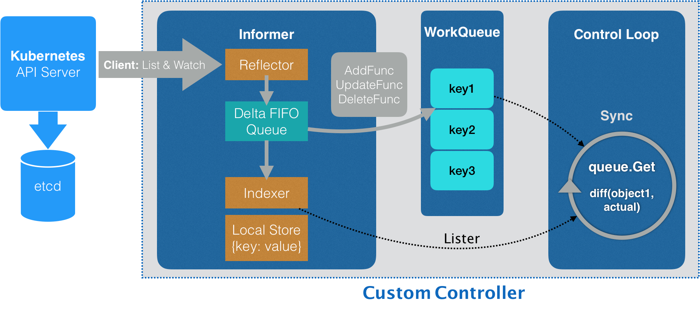

声明式API的设计、特点，以及使用方式。

主要讲述声明式API的工作原理，以及如何利用这套API机制，在Kubernetes里添加自定义的API对象。

一个API对象在etcd里面的完整资源路径，由：Group（API组）、Version(API版本)、Resource（API资源类型）三个部分组成。

```yaml
apiVersion: batch/v2alpha1
kind: CronJob
...

```

CronJob表示Api资源。提交这个Yaml文件之后，转化为资源对象。

Kubernetes是如何对Resource、Group和Version进行解析，从而在Kubernetes项目里面找到CronJob对象的定义？

**首先，Kubernetes会匹配API对象的组。**

这些Api group 的分类是以对象功能为依据的。

**然后，Kubernetes会进一步匹配到API对象的版本号**。

同一个API对象可以有多个版本，正是进行API版本化管理的重要手段。这样保证了向后的兼容。

**最后，Kubernets会匹配API对象的资源类型。**


### CRD(Custom Resource Definition)

[自定义参考文档](https://time.geekbang.org/column/article/41876)

允许用户在Kubernetes中添加一个跟Pod、Node类似的、新的API资源类型，即：自定义API资源。

举例：为Kubernetes添加一个名叫Network的API资源类型。


### 编写自定义控制器

上面讲述了声明式API的实现原理，并且通过一个添加Network对象的实例，讲述了在Kubernetes里添加API资源的过程。

今天，为这个Network自定义的API对象编写一个自定义控制器。

基于声明式API的业务功能实现，往往需要通过控制器模式来"监视"API对象的变化（比如，创建或者删除Network），然后以此来解决实际需要执行的具体工作。


为上面自定义的API对象编写一个自定义控制器。这样Kubernetes才可以更具Network API对象的增删改才做，在真实的环境中作出相应的相应。比如，创建、删除、修改真正的Neutron网络。

这才是Network 这个API对象所关注的"业务逻辑"。

"**声明式API**"并不像"**命令式API**"那样有明显的执行逻辑。

总的来说，编写自定义控制器代码的过程包括：**编写main函数**、**编写自定义控制器的定义**，以及**编写控制器里的业务逻辑**三个部分。

首先，编写这个自定义控制器的main函数；

main函数的主要工作，定义并初始化一个自定义控制器（Custom Controller），然后启动它。主要内容如下所示：

```go
func main() {
  ...
  
  cfg, err := clientcmd.BuildConfigFromFlags(masterURL, kubeconfig)
  ...
  kubeClient, err := kubernetes.NewForConfig(cfg)
  ...
  networkClient, err := clientset.NewForConfig(cfg)
  ...
  
  networkInformerFactory := informers.NewSharedInformerFactory(networkClient, ...)
  
  controller := NewController(kubeClient, networkClient,
  networkInformerFactory.Samplecrd().V1().Networks())
  
  go networkInformerFactory.Start(stopCh)
 
  if err = controller.Run(2, stopCh); err != nil {
    glog.Fatalf("Error running controller: %s", err.Error())
  }
}

```

这个main函数主要通过三步完成了初始化并启动一个自定义控制器的工作。

**第一步**：main 函数根据提供的Mater配置（`APIServer`的地址端口和`kubeconfig`的路径），创建一个`kubernete`s的`client（kubeClient）`和`Network`对象的`client（networkClient）`。

**第二步**：main函数<u>为Network对象创建一个叫作`InformerFactory`的工厂</u>，并使用它生成一个Network对象的Informer，传递给控制器。

**第三步**：main函数启动上述的`informer`，然后执行`controller.Run`，启动自定义控制器。


详细解释一下自定义控制器的工作原理。




**所谓Informer，其实就是一个带有本地缓存和索引机制、可以注册EventHandler的client**。它是自定义控制器和APIServer进行数据同步的重要组件。

具体一点，Informer通过一种ListAndWatch的方法，把APIServer中的API对象缓存到了本地，并负责更新和维护这个缓存。

在ListAndWatch机制下，一旦APIServer端有新的Network实例被创建、删除或者更新，Reflector都会收到"事件"通知。这是，该事件及它对应的API对象组合，称为增量（Delta），被放到一个Delta FIFO Queue中。

另一方面，informer会不断的从这个Delta FIFO Queue里面读取Pod增量。没拿到一个增量，Informer就会判断这个增量里面的事件类型，然后创建或更新本地对象的缓存。这个缓存称为Store。

比如，如果时间类型是Addes（添加对象），那么Informer就会通过一个叫做Index的库把这个增量的API对象保存到本地缓存中，并为它创建索引。相反，如果为Deleted（删除对象），那么Informer就会从本地缓存中删除这个对象。

这个同步本地缓存的工作，是Informaer的第一个职责，也是最重要的。

Informer的第二个职责，则是根据这些事件的类型，触发事先注册好的ResourceEventHandler。这些Handler，需要在创建控制器的时候注册给它对应的Informer。

#### 控制器定义

```go
func NewController(
  kubeclientset kubernetes.Interface,
  networkclientset clientset.Interface,
  networkInformer informers.NetworkInformer) *Controller {
  ...
  controller := &Controller{
    kubeclientset:    kubeclientset,
    networkclientset: networkclientset,
    networksLister:   networkInformer.Lister(),
    networksSynced:   networkInformer.Informer().HasSynced,
    workqueue:        workqueue.NewNamedRateLimitingQueue(...,  "Networks"),
    ...
  }
    networkInformer.Informer().AddEventHandler(cache.ResourceEventHandlerFuncs{
    AddFunc: controller.enqueueNetwork,
    UpdateFunc: func(old, new interface{}) {
      oldNetwork := old.(*samplecrdv1.Network)
      newNetwork := new.(*samplecrdv1.Network)
      if oldNetwork.ResourceVersion == newNetwork.ResourceVersion {
        return
      }
      controller.enqueueNetwork(new)
    },
    DeleteFunc: controller.enqueueNetworkForDelete,
 return controller
}

```

需要注意的是，实际入队的并不是API对象本身，而是它们的key，即：该API对象的<namespace>/<name>。

后面即将编写的控制循环，则会不断地从这个工作队列里面拿到这些Key，然后开始执行真正的控制逻辑。

所谓Informer，就是一个带有本地缓存和索引机制的、可以注册EventHandler的client。它是自定义控制器跟APIServer进行数据同步的重要组件。

更具体一点，Informer通过一种叫做ListAndWatch的方法，把APIServer中的API对象缓存到了本地，并负责更新和维护这个缓存。

ListAndWatch方法的含义：首先，通过APIServer的LIST API获取所有最新版本的API对象；然后，再通过WATCH API来监听所有这些API对象的变化。

而通过监听到这些事件的变化，Informer就可以实时地更新本地缓存，并且调用这些事情对应的EventHandler

此外，在这个过程中，每经过resyncPeriod指定的时间，Informer维护本地缓存，都会使用最近一次List返回的结果强制更新一次，从而保证了缓存的有效性。强制更新缓存的操作称为：resync。

这个定时resync操作，会触发Informer注册"更新"事件。这个更新事件对应的Network对象实际上并没有发生变化，即：新旧两个Network对象的resourceVersion是一样的。这时，不需要对这个更新事件做进一步的处理。

上面就是Informer库的工作原理。


接下来，我们看一下最后的控制循环（Control Loop）部分，也正是在main 函数最后调用的controller.Run()启动的"控制循环"。主要内容如下：

```go
func (c *Controller) Run(threadiness int, stopCh <-chan struct{}) error {
 ...
  if ok := cache.WaitForCacheSync(stopCh, c.networksSynced); !ok {
    return fmt.Errorf("failed to wait for caches to sync")
  }
  
  ...
  for i := 0; i < threadiness; i++ {
    go wait.Until(c.runWorker, time.Second, stopCh)
  }
  
  ...
  return nil
}

```


