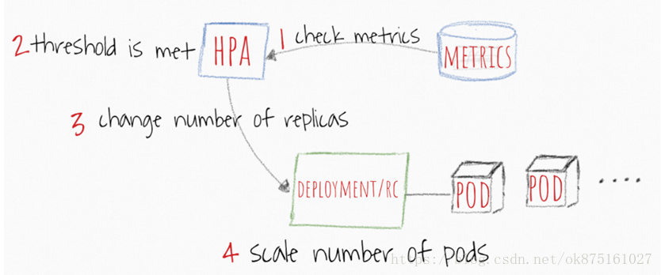
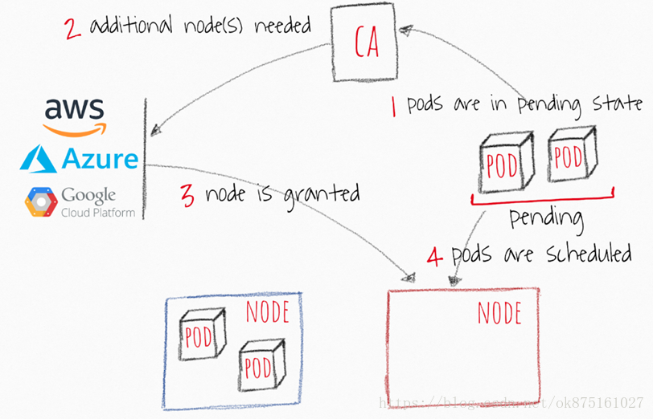

主要介绍一下kubernetes集群的扩容缩容原理。

## 背景

在kubernetes集群之中，由于用户对申请的应用资源（内存、cpu）没有明确的感知，总是会时不时的出现应用莫名被销毁（OOM）或者产生资源的浪费。 

## 存在问题

主要的问题可以归结为以下几点。通俗一点，就是在自己不知道自己「饭量」的时候，随便点了一份「套餐」。会产生两种情况：

- 高估自己的「饭量」，产生「剩饭」造成资源浪费；
- 低估自己的「饭量」，产生「饥饿」自己难受，导致无法工作；

## 需求分析

如何动态的感知、平衡资源的使用情况。

- 保证应用的健康稳定的运行，
- 保证扩、缩容用户无感知；
- 保证资源的合理利用。

针对这种情况我们需要具体分析，产生应用资源不够的根源。

**无状态服务**

主要是web这类应用，由于请求的负载突然过高，导致应用资源的使用极具上升（内存、CPU）。

针对这类应用，资源使用达到一定的阈值时，我们可以对应用进行水平的扩展。当应用负载下降，资源使用达到下限阈值的时候，下线多余的实例，释放资源。

**有状态服务**

针对这种服务，他们对资源的使用要求是比较高的，不是说水平扩容既能解决的（比如，视频转码服务业务）。这个时候，我们就需要动态的根据历史及其当前的使用数值，构建模型，生成推荐的资源使用量，进而进行容器的垂直扩容，选择合适的节点进行部署。

## 解决方案

那么，针对这种情况有没有好的解决方案呢？

当前，业内提供了比较合适的两种解决方案。

[经典解决方案参考](https://medium.com/magalix/kubernetes-autoscaling-101-cluster-autoscaler-horizontal-pod-autoscaler-and-vertical-pod-2a441d9ad231)

#### 1. HPA（水平扩容）

扩容pod的副本数，通过容器的CPU以及Ｍemory来触发扩容或者缩容操作，并且支持自定义指标、多个指标甚至是外部的指标来作为触发扩容或者缩容操作的条件。

**HPA的工作流**

1. HPA每隔30sec来检查指标的值
2. 如果SPECIFIFD 阈值满足条件将会增加pod副本的数量
3. HPA主要更新deployment/replication controller控制器对象的副本数
4. Deployment/replication controller将会创建出来额外需要的pods

**当使用HPA的时候需要注意的地方**

1. HPA检查周期为30s可以通过设置controller manager的horizontal-pod-autoscaler-sync-period参数来改变
2. 默认的HPA相对指标公差为10%
3. HPA在最后一次扩容事件后等待3分钟，以使指标稳定下来。可通过 - horizontal-pod-autoscaler-upscale-delay参数来配置
4. HPA从最后一次缩容事件开始等待5分钟，以避免自动调节器抖动。可通过 - horizontal-pod-autoscaler-downscale-delay参数来配置
5. 相对于replication controller而言，ｈｐａ更加适合与deployment一起配置工作

#### 2. VPA（垂直扩容）

Vertical Pods Autoscaler（VPA）为现有pod分配更多（或更少）的CPU或内存。它可以适用于有状态和无状态的pod，但它主要是为有状态服务而构建的。但是，如果您希望实现最初为pod分配的资源的自动更正，则可以将其用于无状态容器。VPA还可以对OOM（内存不足）事件做出反应。VPA当前要求重新启动pod以更改已分配的CPU和内存。当VPA重新启动pod时，它会考虑pods分发预算（PDB）以确保始终具有所需的最小pod数。您可以设置VPA可以分配给任何pod的资源的最小值和最大值。例如，您可以将最大内存限制限制为不超过8 GB。当您知道当前节点无法为每个容器分配超过8 GB时，这尤其有用。

VPA还有一个名为VPA Recommender的有趣功能。它监视所有pod的历史资源使用情况和OOM事件，以建议request资源的新值。推荐器使用一些智能算法来根据历史指标计算内存和CPU值。它还提供了一个API，通过它可以获取pod描述符并提供建议的request值。

值得一提的是，VPA推荐者不会设置资源的limit值。这可能导致pod垄断节点内的资源。建议你在namespac级别设置一个“限制”值，以避免疯狂消耗内存或CPU

**VPA工作流**

#### 分析：Vertical Pod Autoscaler

[git地址](https://github.com/kubernetes/autoscaler/tree/master/vertical-pod-autoscaler)

整体架构

**主要组件：**

1. We introduce a new type of **API resource**: `VerticalPodAutoscaler`. It consists of a **label selector** to match Pods, the **resources policy** (controls how VPA computes the resources), the **update policy** (controls how changes are applied to Pods) and the recommended Pod resources (an output field).
2. **VPA Recommender** is a new component which **consumes utilization signals and OOM events** for all Pods in the cluster from the [Metrics Server](https://github.com/kubernetes-incubator/metrics-server).
3. VPA Recommender **watches all Pods**, keeps calculating fresh recommended resources for them and **stores the recommendations in the VPA objects**.
4. Additionally the Recommender **exposes a synchronous API** that takes a Pod description and returns recommended resources.
5. <u>All Pod creation requests go through the VPA **Admission Controller**.</u> If the Pod is matched by any VerticalPodAutoscaler object, the admission controller **overrides resources** of containers in the Pod with the recommendation provided by the VPA Recommender. If the Recommender is not available, it falls back to the recommendation cached in the VPA object.
6. <u>**VPA Updater** is a component responsible for **real-time updates** of Pods.</u> If a Pod uses VPA in `"Auto"` mode, the Updater can decide to update it with recommender resources. In MVP this is realized by just evicting the Pod in order to have it recreated with new resources. This approach requires the Pod to belong to a Replica Set (or some other owner capable of recreating it). In future the Updater will take advantage of in-place updates, which would most likely lift this constraint. Because restarting/rescheduling Pods is disruptive to the service, it must be rare.
7. VPA only controls the resource **request** of containers. It sets the limit to infinity. The request is calculated based on analysis of the current and previous runs (see [Recommendation model](https://github.com/kubernetes/community/blob/master/contributors/design-proposals/autoscaling/vertical-pod-autoscaler.md#recommendation-model) below).
8. **History Storage** is a component that consumes utilization signals and OOMs (same data as the Recommender) from the API Server and stores it persistently. It is used by the Recommender to **initialize its state on startup**. It can be backed by an arbitrary database. The first implementation will use [Prometheus](https://github.com/kubernetes/charts/tree/master/stable/prometheus), at least for the resource utilization part.

**核心：（Recommender）**

**The recommender is based on a model of the cluster that it builds in its memory**. The model contains Kubernetes resources: *Pods*, *VerticalPodAutoscalers*, with their configuration (e.g. labels) as well as other information, e.g. usage data for each container.

**After starting the binary, recommender reads the history of running pods and their usage from Prometheus into the model. It then runs in a loop and at each step performs the following actions:**

- **update model with recent information on resources (using listers based on watch),**
- **update model with fresh usage samples from Metrics API,**
- **compute new recommendation for each VPA,**
- **put any changed recommendations into the VPA resources.**

具体的算法有待研究。。。。（to be continue）

#### 4. 其他

##### 1.动态扩容

运行时修改cgroups配置，使其不需要重启就可以进行Pod资源的扩容缩容。当前仅仅针对web应用。

##### 2. 集群扩容

Cluster Autoscaler（CA）根据pending状态的pod来扩展您的群集节点。它会定期检查是否有pending状态的pod，如果需要更多资源并且扩展后的群集仍在用户提供的约束范围内，则会增加群集的大小。CA与云提供商接口以请求更多节点或释放空闲节点。它适用于GCP，AWS和Azure。版本1.0（GA）与kubernetes 1.8一起发布。

**CA工作流**

1. CA每隔10s检查以下pending状态的容器
2. 如果存在因为资源不足导致pending状态的pod存在的时候，尝试创建一个或多个nodes
3. 当node是被cloud provider所管理的，node将会被添加到集群中，成为ready的节点来创建pod
4. Kubernetes调度器分配pending状态的pods到新的node节点上。如果一些pod仍然处于pending状态，这个过程将会继续，将会有更多的nodes添加到集群中

**CA使用的时候注意事项**

1. Cluster Autoscaler确保群集中的所有pod都有一个可以运行的位置，无论是否有任何CPU负载。此外，它会尝试确保群集中没有不需要的节点。（资源）
2. CA在大约30秒内实现了可扩展性需求。
3. 在节点变为不需要之前，CA默认等待10分钟，然后再缩小节点。
4. CA具有扩展器的概念。扩展器提供了不同的策略来选择要添加新节点的节点组。
5. 负责任地使用"[cluster-autoscaler.kubernetes.io/safe-to-evict"："true](http://cluster-autoscaler.kubernetes.io/safe-to-evict"："true)"。如果您设置了所有节点上的许多pod或足够的pod，则会失去很大的缩小灵活性。
6. 使用PodDisruptionBudgets可以防止删除pod并使应用程序的一部分完全无法运行。

### 常见的错误

在不同的论坛上看过，比如Kubernetes　slack和StackOverflow问题，由于一些事实导致的常见问题，许多DevOps错过了自动缩放器。
HPA和VPA依赖于指标和一些历史数据。如果您没有分配足够的资源，您的pod将被OOM杀死，并且永远不会有机会生成指标。在这种情况下，pods上的扩展器可能永远不会发生。扩容是时间敏感的操作。在用户遇到应用程序中的任何中断或崩溃之前，您希望您的pod和群集能够相当快地扩展。您应该考虑容器和群集扩展的平均时间。

1. 最佳案例场景－４分钟
   1. 30秒 - 目标指标值更新：30-60秒
   2. 30秒 - HPA检查指标值：30秒 - >30秒 - HPA检查指标值：30秒 - >
   3. <2秒 - Pods创建之后进入pending状态<2秒　－Pods创建之后进入pending状态
   4. <2秒 - CA看到pending状态的pods，之后调用来创建node 1秒<2秒　－CA看到pending状态的pods，之后调用来创建node 1秒
   5. 3分钟 - cloud provider创建node，之后加入k8s之后等待node变成ready,上线是10分钟
2. (合理)最糟糕的情况 - 12分钟
   1. 60 秒 —目标指标值更新
   2. 30 秒 — HPA检查指标值
   3. < 2 秒 — Pods创建之后进入pending状态
   4. < 2 秒 —CA看到pending状态的pods，之后调用来创建node 1秒
   5. 10 分钟 — cloud provider创建ｎｏｄｅ，之后加入ｋ8s之后等待node变成ready,上线是10分钟

不要将云提供程序可伸缩性机制与CA混淆。CA在集群内部工作，而云提供商的可扩展性机制（例如AWS内部的ASG）基于节点分配工作。它不知道您的pod或应用程序正在发生什么。一起使用它们会使您的群集不稳定并且难以预测行为。