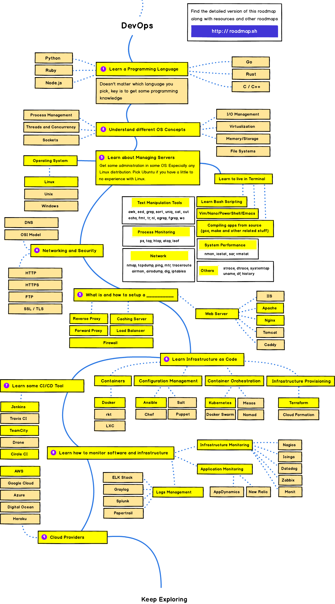
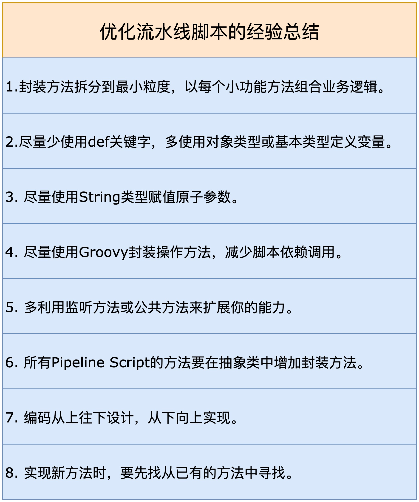
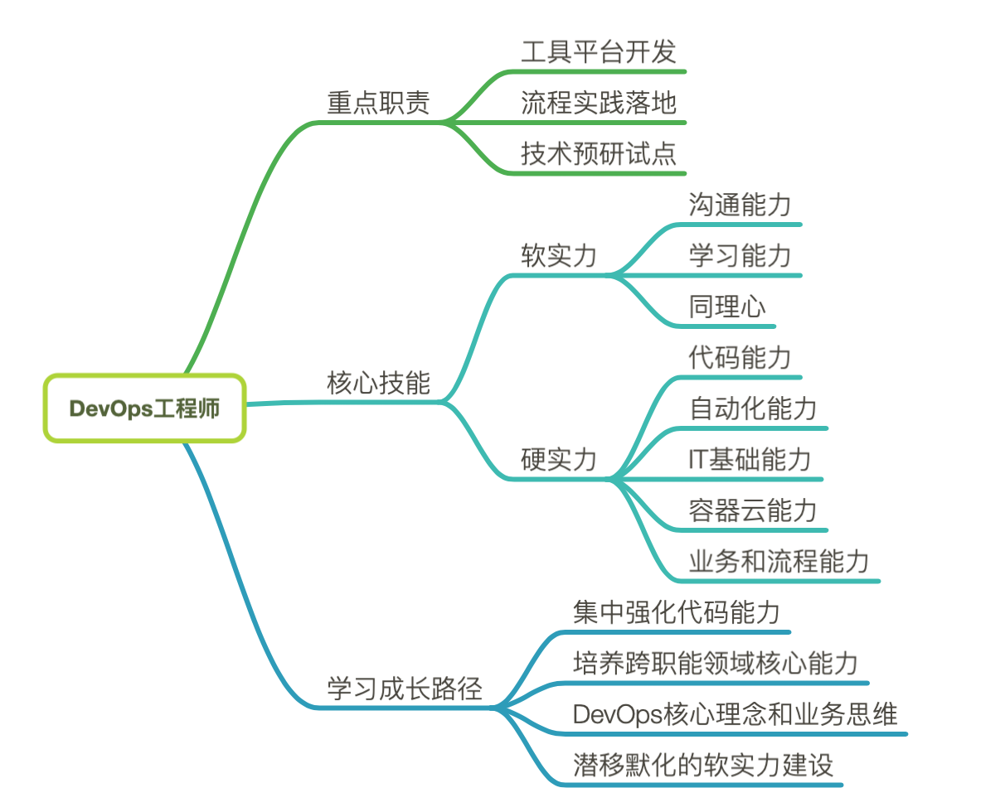

Devops很火，但是是什么？有什么好处？怎么成为这个领域的专家？都不是很清楚，抽出点时间学习一下，了解一下。以备后用。

## 一、学习路径

话不多说，先上图。

[图片地址](https://roadmap.sh/devops)

​	

从上面可以看出，需要学习的东西还是很多啊。

- [ ] 语言
  - [ ] go：经常使用
  - [ ] java：熟练
  - [ ] python：很少使用
  - [ ] c／c++：很久没用
- [ ] 操作系统
  - [ ] 进程管理
  - [ ] 虚拟化
  - [ ] IO管理
  - [ ] 文件系统
  - [ ] 内存／存储
  - [ ] 多线程、并发
  - [ ] 网络编程
- [ ] 服务器管理
  - [ ] shell
  - [ ] Linux
- [ ] 网络与安全
  - [ ] DNS
  - [ ] http
  - [ ] https
  - [ ] SSL／TLS
  - [ ] FTP
- [ ] 配置xxx服务
- [ ] 基础设施即代码
  - [ ] 容器：docker
  - [ ] 容器调度：kubernetes
  - [ ] 配置管理：ansible
- [ ] CI／CD工具
  - [ ] jenkins
- [ ] 监测：软件和基础设施
  - [ ] 基础设施监测
  - [ ] 应用监测
  - [ ] 日志管理
- [ ] 云服务

目前老哥的状态属于啥都懂点，啥都不是特别精通，IT从业者职业发展的大忌。

咋办呢？好好学习、多实践、多深入底层学习啊！！！！:rocket::rocket::rocket::rocket::rocket::rocket::rocket::rocket::rocket::rocket::rocket::rocket::rocket:

这个是要上天的节奏啊！

这个岗位要干啥？要说清楚3个核心问题：

- DevOps工程师在公司内承担的主要职责是什么？
- 为了更好的承担这些职责，需要哪些核心的技能？哪些技能是目前最紧俏的？
- 学习和掌握这些技能，是否存在一条可以参考的路径？

###  1. DevOps工程师的岗位职责

#### 1. 工具平台开发

工具是自动化的载体，而自动化是DevOps的灵魂。随着公司规模的不断变大，研发内部的协作成本也随之水涨船高，那么工具平台的能力就决定了公司交付能力的上限。

但问题是，公司只有大大小小的分散的工具，并没有一套完整的研发协同工作平台。这本身就限制了协作效率的提升，可以想象一下。研发在各种大大小小的系统中跳来跳去，很多功能还是重复的，这个本身就是一种实践的浪费。

比如，你已经在代码审核平台做了代码的评审，结果提测平台上还会问你"是否做过审核？"是不是很烦人？

这背后的主要原因，就是缺乏顶层设计，或者压根就没有人专门负责这个事情。这样一来，团队各自为战，发现一个痛点，开发一个工具，发现一个场景就引入一个系统，再加上考核指标偏爱从0到1的创造性工作。

所以，对于DevOps工程师而言，除了要关注原有的工具重构、新功能的开发之外，更要聚焦于整个软件的交付流程，将现有的工具全面打通，以实现可控的全流程自动化。也就是不仅仅要追求点状的工具，还要包括整条线上的工具链。从而形成覆盖软件交付完整流程的工具体系。

另外，工具平台同样是标准化流程的载体，同时也是DevOps实践的载体，所以在设计实现时，需要考虑这些实践

的支持。比如，在配置管理领域，将一切纳入版本控制是不二法则。那么，在建设工具平台的时候，需要有这样的意识，比如记录流水线的每一次配置变更的版本，并且能够支持快速的对比回溯。

#### 2. 流程实践落地

无论是工具平台的推广落地，还是结合平台的流程改进，都需要有人来做。即使完全相同的工具，在不同人手里，发挥的作用不一样。而且针对流程的优化，也是提升协作效率的有效手段。

如果流程上没有约束开发和测试共同为结果负责，那么开发为什么要和测试共同承担责任呢？除了问题怎么不回互相扯淡呢？如果你在公司里面负责流程改进，遇到问题应该多问几个为什么？找到根本的原因，然后将流程和工具结合，双管齐下地进行改进。

所以，**理念和实践的宣导，内部员工的培训，持续探索和发现流程的潜在优化点，这些也都是 DevOps 工程师要考虑的事情**。

#### 3. 技术预研试点

最后，各种新技术新工具层出不穷，哪些适用于公司现有的业务，哪些是个大坑呢？

如果适合的话，要如何结合公司的实际情况，评估潜在的工具和解决方案，而不是盲目地跟随业界最佳实践呢？类似技术债务的识别和偿还这种重要不紧急的事情，到底什么时候做合适呢？

另外，如果公司决定开始推行单元测试，那么，选用什么样的框架，制定什么样的标准，选择什么样的指标，如何循序渐进地推进呢？

这些同样非常考验团队的功底。如果步子一下子跨得太大了，到最后就可能成为形式主义了。

你可能会觉得，我就是一个小开发、小运维，怎么能推动这么大的事情呢？

但实际上，**DevOps 从来都不是某一个人，或者某一个角色的职责，而是整个研发交付团队所共享的职责**。

**在你力所能及的范围内，比如在你所在的部门内部，开展 DevOps 的理念宣导和技术培训，鼓动领导参加行业的大会，在和上下游团队协作的时候向前一步，这些都是 DevOps 所倡导的自服务团队应该具备的能力**。

###  2. DevOps 工程师的主要技能

说完了 DevOps 工程师主要负责的事情，接下来我们就来看看 DevOps 工程师所要具备的能力。从实用的角度出发，总结了 DevOps 工程师的核心能力模型。

其中，**能力模型**分为两个方面：**专业能力和通用能力**。

**专业能力**也就是常说的硬实力，是 IT 从业人员身上的特有能力，比如软件工程师会写代码。

**通用能力**，更加接近于软实力，这些能力并不局限于某一个岗位或者职业，是所有人都应该努力培养的能力。很多时候，当硬实力到达天花板之后，软实力的差异将决定一个人未来的高度，这一点非常重要。

#### 软实力

先从软实力说起。在企业中，印度裔的工程师往往比华裔工程师的岗位职级要高。为什么会这样呢？每次跟印度工程师交代一个事情，他们总能又快又好地做出一个特别清晰漂亮的 PPT。他们在上学时受过这方面的训练，还专门练习过表达、演讲等技能，可见，事出必有因，软实力对个人的发展至关重要。那么，作为一名 DevOps 工程师，需要具备什么软实力呢？

##### 1.沟通能力

**DevOps 倡导的核心理念就是沟通和协作**，所以，难怪沟通能力会排在软实力的第一名。

在推动 DevOps 落地的过程中，你需要同时具备**向上沟通、向下沟通和横向沟通**的能力。

**提炼 DevOps 实施框架和落地价值，寻求领导层的支持，需要向上沟通**；**打破组织间的边界，建立跨团队的协同，需要横向沟通**；**引导团队快速完善平台工具能力，表明工作的意义和价值，提升大家的主动性，需要向下沟通**。

所以你看，其实每天的工作中都充满了大量的沟通。需要注意的是，沟通能力不仅限于语言能力，很多时候，开发运维的沟通是基于代码完成的。所以，良好的注释风格、清晰结构化的描述方式……这些细节往往也能提升沟通的效率。比如有一种很 DevOps 的方式，就是 ChatOps，是以 GitHub 的 Hubot 为代表的对话式运维，慢慢扩展为人机交互的一种形式。

通过建立一种通用的沟通语言，打破开发和运维之间的隔阂。

##### 2. 同理心

DevOps 希望团队可以共享目标，共担责任，但是实际上，哪个团队不想更加自动化、更加高效地工作呢？

所以，**DevOps 工程师要能够站在对方的角度来看问题，设身处地地想想他们的困难是什么，我能做些什么来帮助他们。**

这种同理心也是弥合团队分歧，建立良好的协作文化所必需的能力。

除此之外，**培养团队以用户为中心的思想**，也是很好的方式。**这里的用户，不是外部用户，而是在交付流程中存在交付关系的上下游部门**。在交付一个版本的时候，要尽力做到最好，而不是不管三七二十一，先丢过去再说。我还是要再强调一下，同理心只有在流程和机制的保证之下才能生根发芽。

##### 3. 学习能力

DevOps 工程师需要了解的东西真得很多，因此，能够在有限的时间里快速学习新的技能，并且有意愿主动地改进提升，也是一种能力。在 DevOps 工程师的眼里，从来没有“完美”二字。

比如完美的流程、完美的技术实现、完美的软件架构等。他们似乎天生就有一种能力，那就是能发现问题并时刻想着可以做到更好。但实际上，如果没有日积月累的思考，没有外部优秀实践的学习，没有开放的沟通和交流，是没有办法知道，原来还有一种更好的工作方式的。引用质量管理大师戴明博士的一句话：Don’t just do the same things better – find better things to do.很多时候，我们都在等待一个完美的时机，**比方说，你打算学习一个新的知识点，但要等到工作都完成了，没人来打扰，有大段的时间投入才开始学习。但实际上，哪来这么多准备就绪的时候呢？真正的学习者都是在没有条件来创造条件的过程中学习的。**

所以，如果想开始学习 DevOps，我信奉的原则只有一个，那就是先干再说。

#### DevOps 工程师必备的硬实力

所谓硬实力，说白了就是指一个人的技术能力。软实力通常是“只可意会不可言传”的，但技术本身就具体多了，重要的是，技术水平的高低相对来说也更好衡量。在公司里面，技术人员要想获得晋升，重点就是依靠技术能力。

IT 行业覆盖的技术领域非常广，而且近些年的新技术也是层出不穷的，从入门到精通任何一门技术，都需要大量时间和精力的投入。那么，在面对这么多技术的时候，究竟要选择从哪个开始入手，真是一个难题。对于希望成为 DevOps 工程师，甚至是 DevOps 专家的你来说，究竟有哪些必须掌握的核心技术呢？

##### 1. 代码能力

现在这个时代，代码能力可以说是最重要的硬实力了。IT 行业自然不用说，像运维有运维开发，测试也有测试开发，就连产品经理都要懂代码，不然可能都没办法跟开发同学顺畅交流。

对于工具平台自身的建设而言，代码能力自然是重中之重。这不仅仅在于通过写代码来实现工具平台本身，还在于你能了解开发的完整过程。这些平台的用户每天跟代码打交道的时间可能比跟人打交道的时间还多，如果你不能理解他们的日常工作方式，那么你做出来的工具平台，又怎么能真正解决团队的问题呢？

这里提到的代码能力包含两个方面，分别是**脚本语言能力**和**高级语言编程能力**。

- **脚本语言能力**。这对于运维工程师来说自然是驾轻就熟，各种 VIM、Emacs 手到擒来，Shell 和 Python 也是轻车熟路。而对于开发人员来说，难点不在于语法本身，而在于对关联操作系统和命令的理解上。毕竟，脚本语言是一种快速的自动化手段，追求的是高效开发，简单易用。

- **高级语言编程能力**。你需要至少掌握一门高级语言，无论是 Java、Python 还是 Ruby 和 PHP。其实语言只是工具，你不用过度纠结于选择哪门语言，要求只有一个，就是你能用它来解决实际问题，比如能够支持你实现面向移动端或者 Web 端的工具平台开发。为了写出好代码，而不仅仅是写出能用的代码，你也需要对于一些常见的开发框架和开发模式有所了解。这是一个相对漫长的过程，绝对不是什么“21 天精通 XX 语言”就够了。**因为看得懂和写得好，完全是两码事。**

好的代码是需要不断打磨和推敲的。与其说写好代码是一门技术，不如说是一种信仰。我们团队的内部沟通群名叫作“WBC 团队”，“WBC”也就是“Write Better Code”的缩写，这其实也是我们团队对自己的一种激励。在日常的开发过程中，我们会不断发现和总结更好的实现方式，在内部分享，互相学习，从而持续提升代码能力。我截取了一部分我们最近优化流水线脚本的经验总结，你可以参考一下。其实，每个人都能总结出自己的代码心经。

##### 2. 自动化能力

在自动化方面，你首先需要对 CI/CD，也就是持续集成和持续交付，建立起比较全面的认知。因为 CI/CD 可以说是 DevOps 工程领域的核心实践，目前大部分公司都在集中建设软件的持续交付能力，尤其是以流水线为代表的持续交付平台，很多时候就同 DevOps 平台划上了等号。

接下来，**为了实现全流程的自动化，你需要能够<u>熟练使用 CI/CD 各个关键节点</u>上的典型工具，并且了解它们的设计思路**。

一方面，目前很多公司都在拥抱开源，参与开源，开源工具自身的成熟度也非常高，并且逐渐取代商业工具，成为了主流方案。通过直接使用开源工具，或者基于开源工具进行二次开发，也是自动化领域投入产出比最高的方式。所以，像**版本控制工具 Git**、**代码托管平台 Gitlab**、**CI 工具 Jenkins**、**代码扫描工具 Sonar**、**自动化配置管理 Ansible**、**容器领域的 Docker、K8S** 等等，这些高频使用的工具都是你优先学习的目标。

另一方面，**无论是开源工具，还是自研工具，工具与工具之间的链路打通也是自动化的重要因素**。所以，**在理解开源工具的实现方式的基础上，就要能做到进可攻，退可守。无论是封装，还是自研，有了工具的加持，CI/CD 也会更加游刃有余**。

关于 **DevOps 的工具图谱**，我跟你分享一个信通院的 DevOps 能力成熟度模型版本，供你参考。**值得注意的是，工具不在多，而在精**。其实，工具的设计思路和理念有共通之处，只要精通单个节点上的工具，就可以做到以点带面。

##### 3. IT 基础能力

我始终认为，运维是个特别值得尊敬的工种，也是 DevOps 诞生的原点。**如果你不是运维出身，那你要重点掌握运维的基础概念，最起码要了解 Linux 操作系统方面的基础知识，包括一些常用的系统命令使用，以及网络基础和路由协议等。**毕竟，对于开发者来说，他们通常习惯基于 IDE（集成开发环境）图形界面工作。比如，如果问一个 iOS 开发同学怎么通过命令行的方式进行构建调试，或者如何用代码的方式实现工程的自动化配置，他可能就答不上来了。

另外，随着**基础设施即代码**的技术不断成熟，**你还要能看懂环境的配置信息，应用自动化构建、运行和部署的方式等，甚至可以自行修改环境和应用配置，这样才能实现所谓的开发自运维。**虽然在大多数公司，运维的专业能力一般都会通过运维平台对外提供服务，但对于基础概念，还是需要既知其然，也知其所以然。

##### 4. 容器云能力

云计算对于软件开发和部署所带来的变化是革命性的。未来企业上云，或者基于云平台的软件开发会慢慢成为主流。而容器技术又天生适合 DevOps，Kubernetes 可以说是云时代的 Linux，基于它所建立的一整套生态环境，为应用云化带来了极大的便利。

所以，无论是容器技术的代表 Docker，还是实际上的容器编排标准 Kubernetes，你也同样需要熟悉和掌握。尤其是在云时代，基于容器技术的应用开发和部署方式，都是 DevOps 工程师必须了解的。

##### 5. 业务和流程能力

在任何时候，**DevOps 的目标都是服务于业务目标**，DevOps 本身也从来不是墨守成规的方式，而是代表了一种变革的力量。**所以，加强对业务的理解，有助于识别出 DevOps 改进的重点方向，而流程化的思维建设，有助于突破单点，放眼全局。**

很多时候，**企业需要的不仅仅是一个工具，而是工具所关联的一整套解决方案，其中最重要的就是业务流程**。

对于 DevOps 工程师来说，**要有能力发现当前流程中的瓶颈点，并且知道一个更加优化的流程应该是怎样的**，这一点也是制约工程师进一步拓展能力的瓶颈之一。

举个例子，**对于开发 DevOps 平台工具来说，你可能认为最合适承担的团队就是开发团队，因为他们的代码能力最强。但是实际上，DevOps 平台的设计，很多时候都是由最熟悉企业内部研发流程的团队来主导的。**正因为 DevOps 工程师的工作应该同业务紧密联系，更加关注于全局交付视角，所以很多时候，配置管理、质量管理、项目管理和技术运维团队更多地在承担相近的角色。毕竟，**只有方向正确，所做的一切才是加法**。

#### 学习路径

那么，要想成为 DevOps 工程师，是否有一条普适性的学习路径呢？

实际上，这个问题就跟我们要在公司推行 DevOps，是否存在一条通用的改进路径一样，并不是一个容易回答的问题。

从前面的能力模型可以看出，**DevOps 工程师特别符合现在这个时代的要求，他具备多重复合能力，是典型的全栈工程师，或者“梳子型”人才**。因为**只有这样，才能充分弥合不同角色之间的认知鸿沟，堪称团队内部的万金油**。

基于过往在公司内部推行 DevOps 的经验，以及当前行业的发展趋势，有几条建议：

##### 1. 集中强化代码能力

未来的世界是软件驱动的世界。我们以前总说的必备能力，比如外语、开车等，未来都可以被软件所取代。而编程能力即将成为下一个必备能力，甚至连国务院发布的《新一代人工智能发展规划》中都提到，要在中小学普及推广编程教育。

而写可以用的代码，和写好的代码之间，距离绝不只是一点点而已。你可能会说，以后都用人工智能来编程了，可问题是人工智能从何而来？又是谁来训练和标注人工智能的呢？所以，越是基础的能力，越不会过时，比如数学、核心的编程思想、数据结构，以及基于代码构建对世界的认知和建模能力。

所以，如果你现在只是刚开始接触代码，我建议你给自己定一个目标，专门强化自己的代码能力，至少花 1 年时间，从新手变成熟手，这对于你未来在 IT 行业的发展，至关重要。

可以基于成熟的开源软件来边学习边应用，比如像 Adminset 这种轻量级的自动化运维平台，已经可以解决大多数中小公司的问题了。其实，**代码能力不仅仅是掌握语法和框架，更重要的是基于场景，整体设计数据和业务流程，并通过代码实现出来。毕竟，只有结合实际的应用场景进行学习，才是最有效率的**。

##### 2. 培养跨职能领域核心能力

相信经过几年的工作，你已经具备了当前岗位所需要的基本能力，这是你当前赖以为生的根本。那么在这些能力的基础上，逐步发展跨领域跨界的能力，尤其是那些核心能力，就成了投入产出比最高的事情。

举个例子，**如果你是软件开发工程师，那么恭喜你，你已经走在了代码的道路上，接下来，运维能力就是你要尝试攻克的下一个目标**。而**在这些目标中，比如操作系统、自动化部署以及云能力，就是你要最优先发展的跨界能力，因为它们是运维的核心，也是了解运维最好的出发点**。

反过来说，如果你从事的是运维行业，那么除了常用的脚本以外，核心代码能力就是你的目标。

其实，我们每天的工作其实都离不开跨界，比如，运维每天部署的应用，为什么要部署这么多实例？每个实例之间的调用关系又是怎样的？多问几个为什么，往往就有新的收获。

不仅如此，在接触跨领域的时候，除了基础核心技能，那些最常见的工具，你也要花时间来了解。现在网上的资料足够多，快速入门应该并不困难。

##### 3. DevOps 核心理念和业务思维

如果你不理解 DevOps 到底是什么，那何谈成为 DevOps 工程师呢？

因此，**像 DevOps 中的核心理念，比如<u>精益敏捷</u>、<u>持续交付</u>，以及<u>很多实践</u>，你都要有所了解**。

DevOps 在公司的落地是大势所趋，也许你所在的团队也会参与其中，那么除了做好自己的本职工作外，你也可以多参与，多思考，看看推进的过程是怎样的，涉及到的角色又在做些什么，项目的整体进展和计划是什么。

**在实战中练习和补齐短板，对于积累经验来说，是不可或缺的**。

很多时候，**不是没有学习的机会，只是我们自己不想看到罢了**。

另外，可能你现在距离业务还比较远，那么你可以尝试了解一些大的业务目标，多跟你所在团队的上下游进行沟通，看看他们现在的关注点在什么地方。

既然业务的目标需要整个团队紧密协作才能完成，那么每个团队都是其中的一份子，所以他们身上也同样体现了业务的目标。

##### 4. 潜移默化的软实力建设

类似沟通能力、同理心、自驱力、学习能力、主动性等，无论从事任何职业，都是你身上的闪光点。

很多天生或者从小养成的习惯，需要长时间潜移默化的训练才能有效果。很多时候，IT 从业人员给人的印象都是不善表达，再加上东方文化的影响，本身就比较含蓄，这对很多沟通和表达来说，都是潜在的障碍。

**这个时候，就要尽量把握已有的机会，比如多参加团队内部的读书分享、公司内部的讲师培训报名等**。即便刚开始分享的内容还不足你脑中的 1%，但至少也是一个好的起点。我的建议就是 6 个字：**勤练习，多总结**。就像 DevOps 一样，持续改进和持续反馈，培养自己的自信心。

