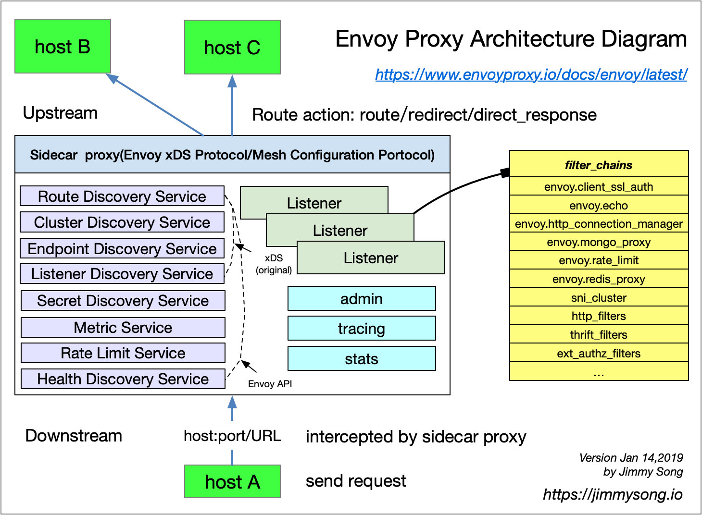
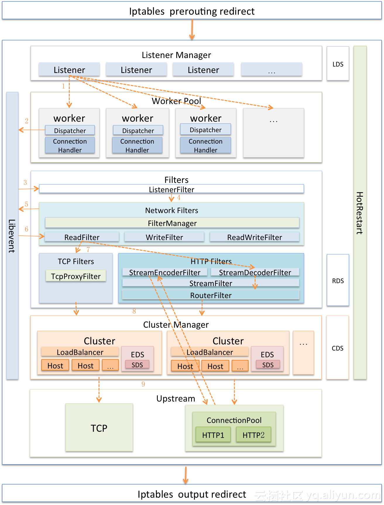

写在前面，我们要搞的是远洋巨舰，而不是小沟里面的小帆船。:passenger_ship:

## 背景

当前公司很多项目已经进行了容器化，部署了kubernetes集群。算是开始迈入了ClouldNative时代，为了充分挖掘cloudnative带来的红利，同时紧追时代前沿趋势。进行微服务的service mesh化改造。

service mesh的好处不用多说了，简单介绍关键几点：

- 支持微服务治理与业务逻辑解耦
  - 精简框架SDK，屏蔽升级、bug对应用的影响；
  - 路由、熔断、负载均衡、服务发现、服务注册、服务下线等；
  - 统一升级管理：基础技术设施平滑升级、高可用；
- 支持多语言，提供统一的基础技术设施功能，降低接入成本；
- 支持redis、mq、mysql的mesh化，中间件统一化管理，降低业务接入成本（就是代理，比较远）；

有了 Service Mesh 之后，我们就可以把 SDK 中的大部分能力从应用中剥离出来，拆解为独立进程，以 Sidecar 的模式部署。通过将服务治理能力下沉到基础设施，可以让业务更加专注于业务逻辑，中间件团队则更加专注于各种通用能力，真正实现独立演进，透明升级，提升整体效率。

## 存在的问题

既然ServiceMesh那么好，还说啥啊？撸起袖子就是干。。。

然而理想很丰满，现实确实也很骨感。结合公司当前的情况，需要填的坑还是很多的。。。

[Service Mesh 在『路口』的产品思考与实践：务实是根本](https://www.infoq.cn/article/WRqddodtDy9xYp48ijdg)

这篇文章讲的很好，结合当前的技术背景，如何丝滑的将ServiceMesh落地，还是需要考虑很多问题的。

> 在一片未开发过的土地上施工确实是很舒服的，因为空间很大，也没有周遭各种限制，可以使用各种新技术、新理念，我们国家近几十年来的一些新区新城的建设就属于这类。而在一片已经开发过的土地上施工就大不一样了，周围环境会有各种限制，比如地下可能有各种管线，一不小心就挖断了，附近还有各种大楼，稍有不慎就可能把楼给挖塌了，所以做起事来就要非常小心，设计方案时也会受到各种约束，无法自由发挥。
>
> 对于软件工程，其实也是一样的，Greenfield 对应着全新的项目或新的系统，Brownfield 对应着成熟的项目或遗留系统。
>
> 我相信大部分程序员都是喜欢做全新的项目的，包括我自己也是一样。因为可以使用新的技术、新的框架，可以按照事物本来的样子去做系统设计，自由度很高。而在开发 / 维护一个成熟的项目时就不太一样了，一方面项目已经稳定运行，逻辑也非常复杂，所以无法很方便地换成新的技术、新的框架，在设计新功能时也会碍于已有的架构和代码实现做很多妥协，另一方面前人可能不知不觉挖了很多坑，稍有不慎就会掉进坑里，所以行事必须要非常小心，尤其是在做大的架构改变的时候。
>

### 现实场景

#### 1. Brownfield 应用当道

**在现实中，目前大部分的公司还没有走向云原生，或者还刚刚在开始探索，所以大量的应用其实还跑在非 K8s 的体系中，比如跑在虚拟机上或者是基于独立的服务注册中心构建微服务体系。**

虽然确实有少量 Greenfield 应用已经在基于云原生来构建了，但现实是那些大量的 Brownfield 应用是公司业务的顶梁柱，承载着更大的业务价值，所以**如何把它们纳入 Service Mesh 统一管控，从而带来更大的价值，也就成了更需要优先考虑的话题**。

​																			独立的服务注册中心

#### 2. 云原生方案

离生产级尚有一定距离另一方面，目前 Istio 在整体性能上还存在一些有待解决的点：

- **Mixer**：
  - **Mixer 的性能问题，一直都是 Istio 中最被人诟病的地方**；
  - 尤其在 Istio 1.1/1.2 版本之后引入了 Out-Of-Process Adapter，更是雪上加霜；
  - 从落地的角度看，**Mixer V1** 糟糕至极的性能，已经是“生命无法承受之重”。对于一般规模的生产级落地而言，Mixer 性能已经是难于接受，更不要提大规模落地……
  - **Mixer V2 方案则给了社区希望**：将 Mixer 合并进 Sidecar，引入 web assembly 进行 Adapter 扩展，这是我们期待的 Mixer 落地的正确姿势，是 Mixer 的未来，是 Mixer 的『诗和远方』。然而社区望穿秋水，但 Mixer V2 迟迟未能启动，长期处于 In Review 状态，远水解不了近渴；
- **Pilot**：
  - Pilot 是一个被 Mixer 掩盖的重灾区：长期以来大家的性能关注点都在 Mixer，表现糟糕而且问题明显的 Mixer 一直在吸引火力。但是当选择放弃 Mixer（典型如官方在 Istio 新版本中提供的关闭 Mixer 的配置开关）之后，Pilot 的性能问题也就很快浮出水面；
  - 我们实践下来发现 Pilot 目前主要有两大问题：1）无法支撑海量数据 2）每次变化都会触发全量推送，性能较差；

### 当下『路口』我们该怎么走？

我们都非常笃信云原生就是未来，是我们的『诗和远方』，但是眼下的现实情况是一方面 Brownfield 应用当道，另一方面云原生的 Service Mesh 方案自身离生产级还有一定的距离，所以在当下这个『路口』我们该怎么走？

其实如前面所述，我们采用 Service Mesh 方案的初心是因为它的架构改变可以带来很多好处，如：服务治理与业务逻辑解耦、异构语言统一治理、金融级网络安全等，而且我们相信这些好处不管对 Greenfield 应用还是 Brownfield 应用都是非常需要的，甚至在现阶段对 Brownfield 应用产生的业务价值会远远大于 Greenfield 应用。

所以从『务实』的角度来看，我们首先还是要探索出一套现阶段切实可行的方案，**不仅要支持 Greenfield 应用，更要能支持 Brownfield 应用，从而可以真正把 Service Mesh 落到实处，产生业务价值**。

# 业内现有方案

主要研究了三种实现方案：

- 云原生Istio+envoy
- 美团点评OCTO2.0
- 蚂蚁金服MOSN+Istio

## 1. 云原生：Istio mesh =envoy+Istio

### 1. 数据平面：Envoy 

####  1. 术语（构成组件）

​	

**Host/主机**：能够进行网络通信的实体（如移动设备、服务器上的应用程序）。主机是逻辑网络应用程序。一块物理硬件上可能运行有多个主机，只要它们是可以独立寻址的。

**Downstream/下游**：下游主机连接到 Envoy，发送请求并接收响应。

**Upstream/上游**：上游主机接收来自 Envoy 的连接和请求，并返回响应。

**Listener/监听器**：监听器是命名网地址（例如，端口、unix domain socket等)，可以被下游客户端连接。Envoy 暴露一个或者多个监听器给下游主机连接。

**Cluster/集群**：集群是指 Envoy 连接到的逻辑上相同的一组上游主机。Envoy 通过[服务发现](https://www.servicemesher.com/envoy/intro/arch_overview/service_discovery.html#arch-overview-service-discovery)来发现集群的成员。可以选择通过[主动健康检查](https://www.servicemesher.com/envoy/intro/arch_overview/health_checking.html#arch-overview-health-checking)来确定集群成员的健康状态。Envoy 通过[负载均衡策略](https://www.servicemesher.com/envoy/intro/arch_overview/load_balancing.html#arch-overview-load-balancing)决定将请求路由到哪个集群成员。

**Mesh/网格**：一组主机，协调好以提供一致的网络拓扑。在本文档中，“Envoy mesh”是一组 Envoy 代理，它们构成了分布式系统的消息传递基础，这个分布式系统由很多不同服务和应用程序平台组成。

**Runtime configuration/运行时配置**：外置实时配置系统，和 Envoy 一起部署。可以更改配置设置，影响操作，而无需重启 Envoy 或更改主要配置。

#### 2. XDS协议

下面这张图大家在了解 Service Mesh 的时候可能都看到过，每个方块代表一个服务的示例，例如 Kubernetes 中的一个 Pod（其中包含了 sidecar proxy），xDS 协议控制了 Istio Service Mesh 中所有流量的具体行为，即将下图中的方块链接到了一起。

xDS 协议是由 [Envoy](https://envoyproxy.io/) 提出的，在 Envoy v2 版本 API 中最原始的 xDS 协议只指 CDS、EDS、LDS 和 RDS。

下面我们以两个 service，每个 service 都有两个实例的例子来看下 Envoy 的 xDS 协议。

上图中的箭头不是流量在进入 Enovy Proxy 后的路径或路由，而是想象的一种 Envoy 中 xDS 接口处理的顺序并非实际顺序，其实 xDS 之间也是有交叉引用的。

Envoy 通过查询文件或管理服务器来动态发现资源。概括地讲，对应的发现服务及其相应的 API 被称作 *xDS*。Envoy 通过**订阅（subscription）**方式来获取资源，订阅方式有以下三种：

- **文件订阅**：监控指定路径下的文件，发现动态资源的最简单方式就是将其保存于文件，并将路径配置在 [ConfigSource](https://www.envoyproxy.io/docs/envoy/latest/api-v2/api/v2/core/config_source.proto#core-configsource) 中的 `path` 参数中。
- **gRPC 流式订阅**：每个 xDS API 可以单独配置 [`ApiConfigSource`](https://www.envoyproxy.io/docs/envoy/latest/api-v2/api/v2/core/config_source.proto#core-apiconfigsource)，指向对应的上游管理服务器的集群地址。
- **轮询 REST-JSON 轮询订阅**：单个 xDS API 可对 REST 端点进行的同步（长）轮询。

以上的 xDS 订阅方式详情请参考 [xDS 协议解析](https://jimmysong.io/istio-handbook/concepts/envoy-xds-protocol.html)。Istio 使用的 gRPC 流式订阅的方式配置所有的数据平面的 sidecar proxy。

#### 3. 实现原理／整体架构

Envoy采用了类Nginx的架构，方式是：多线程 + 非阻塞 + 异步IO（Libevent）。

Envoy的另一特点是**支持配置信息的热更新**，其功能由XDS模块完成，XDS是个统称，具体包括:

- ADS（Aggregated Discovery Service）
- SDS（[Service Discovery Service](https://yq.aliyun.com/go/articleRenderRedirect?url=https%3A%2F%2Fwww.envoyproxy.cn%2FIntroduction%2FArchitectureoverview%2FDynamicconfiguration.html)）
- EDS（[Endpoint Discovery Service](https://yq.aliyun.com/go/articleRenderRedirect?url=https%3A%2F%2Fwww.envoyproxy.cn%2FIntroduction%2FArchitectureoverview%2FDynamicconfiguration.html)）
- CDS（[Cluster Discovery Service](https://yq.aliyun.com/go/articleRenderRedirect?url=https%3A%2F%2Fwww.envoyproxy.cn%2FIntroduction%2FArchitectureoverview%2FDynamicconfiguration.html)）
- RDS（[Route Discovery Service](https://yq.aliyun.com/go/articleRenderRedirect?url=https%3A%2F%2Fwww.envoyproxy.cn%2FIntroduction%2FArchitectureoverview%2FDynamicconfiguration.html)）
- LDS（[Listener Discovery Service](https://yq.aliyun.com/go/articleRenderRedirect?url=https%3A%2F%2Fwww.envoyproxy.cn%2FIntroduction%2FArchitectureoverview%2FDynamicconfiguration.html)）

**XDS模块功能**是向Istio的Pilot获取动态配置信息，拉取配置方式分为V1与V2版本，V1采用HTTP，V2采用gRPC。

**Envoy还支持热重启，即重启时可以做到无缝衔接，其基本实现原理是：**

1. 将统计信息与锁放到共享内存中。
2. **新老进程采用基本的RPC协议使用Unix Domain Socket通讯。**
3. **新进程启动并完成所有初始化工作后，向老进程请求监听套接字的副本。**
4. **新进程接管套接字后，通知老进程关闭套接字。**
5. **通知老进程终止自己。**

### 2. 控制平面：Istio 

**流量管理(Pilot)**：控制服务之间的流量和API调用的流向，使得调用更灵活可靠，并使网络在恶劣情况下更加健壮。
**可观察性**：过集成zipkin等服务，快速了解服务之间的依赖关系，以及它们之间流量的本质和流向，从而提供快速识别问题的能力。
**策略执行(mixer)**：将组织策略应用于服务之间的互动，确保访问策略得以执行，资源在消费者之间良好分配。策略的更改是通过配置网格而不是修改应用程序代码。
**服务身份和安全(Istio-auth)**：为网格中的服务提供可验证身份，并提供保护服务流量的能力，使其可以在不同可信度的网络上流转。

#### Istio架构

Istio 服务网格逻辑上分为数据平面和控制平面。

**数据平面**：由一组以 sidecar 方式部署的智能代理（Envoy）组成。这些代理可以调节和控制微服务及 Mixer 之间所有的网络通信。
**控制平面**：负责管理和配置代理来路由流量。此外控制平面配置 Mixer 以实施策略和收集遥测数据。

#### Mixer
Mixer 是一个独立于平台的组件，负责在服务网格上执行访问控制和使用策略，并从 Envoy 代理和其他服务收集遥测数据。代理提取请求级属性，发送到 Mixer 进行评估。有关属性提取和策略评估的更多信息，请参见 Mixer 配置。

Mixer 中包括一个灵活的插件模型，使其能够接入到各种主机环境和基础设施后端，从这些细节中抽象出 Envoy 代理和 Istio 管理的服务。

 #### Pilot
控制面中负责流量管理的组件为Pilot。

Pilot 为 Envoy sidecar 提供服务发现功能，为智能路由（例如 A/B 测试、金丝雀部署等）和弹性（超时、重试、熔断器等）提供流量管理功能。它将控制流量行为的高级路由规则转换为特定于 Envoy 的配置，并在运行时将它们传播到 sidecar。

Pilot 将平台特定的服务发现机制抽象化并将其合成为符合 Envoy 数据平面 API 的任何 sidecar 都可以使用的标准格式。这种松散耦合使得 Istio 能够在多种环境下运行（例如，Kubernetes、Consul、Nomad），同时保持用于流量管理的相同操作界面。

**Platform Adapter**: 平台适配器。针对多种集群管理平台实现的控制器，得到API server的DNS服务注册信息（即service名与podIP的对应表）、入口资源以及存储流量管理规则的第三方资源
**Abstract Model**：维护了envoy中对service的规范表示。接收上层获取的service信息转化为规范模型
**Envoy API**：下发服务发现、流量规则到envoy上
**Rules API**：由运维人员管理。可通过API配置高级管理规则。

#### Citadel

 [Citadel](https://istio.io/zh/docs/concepts/security/) 通过内置身份和凭证管理可以提供强大的服务间和最终用户身份验证。可用于升级服务网格中未加密的流量，并为运维人员提供基于服务标识而不是网络控制的强制执行策略的能力。从 0.5 版本开始，Istio 支持[基于角色的访问控制](https://istio.io/zh/docs/concepts/security/#认证)，以控制谁可以访问您的服务。

## 2. 蚂蚁金服 serviceMesh=Isotio二次开发+MOSN

### 1. 整体架构

**SofaMOSN**：本质上是基于Envoy的golang实现+二次开发支持自定义功能。

**SofaMesh**：基于Istio的改进版（二次开发）。

### 业务支持（已落地项目）

SOFAMosn 作为底层的高性能安全网络代理，支撑了阿里的 RPC，MSG，GATEWAY 等业务场景。

**最终落地架构（云原生）：**

**产品层能力说明（个人理解）：**

- 运维能力：proxy升级、热部署、回滚、降级、关闭mesh
- 监控能力：整个系统的可视化，白盒
- 流量调控：按需调度，灰度等
- 安全能力：TLS流量安全加密
- 扩展能力：迅速支持新的mesh功能。

## 数据平面：Mosn

本质上基于Envoy的golang实现的二次开发。实现了自定义的需求：安全、多协议等。

## 控制面：SOFAMesh

**Istio 改造版**，落地过程中精简为 Pilot 和 Citadel，Mixer 直接集成在数据面中避免多一跳的开销。

具体的改造工作如下：

- 稳定性增强
- 性能优化
- 监控能力
- 证书下发
- MCP优化

### 稳定性增强

我们先梳理下 Pilot 提供的服务能力，从功能实现上来看，Pilot 是一个 Controller + gRPC Server 的服务，通过 List/Watch 各类 K8s 资源，进行整合计算生成 XDS 协议的下发内容，并提供 gRPC 接口服务。 gRPC 接口服务这个环节，如何保证接口服务支撑大规模 Sidecar 实例，是规模化的一道难题。

**负载均衡**

要具备规模化能力，横向扩展能力是基础。Pilot 的访问方式我们采用常用的 DNSRR 方案，Sidecar 随机访问 Pilot  实例。由于是长连接访问，所以在扩容时，原有的连接没有重连，会造成负载不均。为解决这个问题，我们给 Pilot  增加了连接限流、熔断、定期重置连接功能，并配合 Sidecar 散列重连逻辑，避免产生连接风暴。

- 连接限流

为了降低大量 MOSN 同时连接同一个 Pilot 实例的风险，在 gRPC 首次连接时，Pilot 增加基于令牌桶方案的流控能力，控制新连接的处理响应，并将等待超时的连接主动断连，等待 Sidecar 下一次重连。

- 熔断

基于使用场景的压测数据，限制单实例 Pilot 同时可服务的 Sidecar 数量上限，超过熔断值的新连接会被Pilot 主动拒绝。

- 定期重置

为了实现负载均衡，对于已经存在的旧连接，应该怎么处理呢？我们选择了 Pilot 主动断开连接，不过断开连接的周期怎么定是个技术活。要考虑错开大促峰值，退避扩缩容窗口之类，这个具体值就不列出来了，大家按各自的业务场景来决定就好了。

- Sidecar 散列重连

最后还有一点是 Client 端的配合，我们会控制 Sidecar 重连 Pilot 时，采用退避式重试逻辑，避免对 DNS 和 Pilot 造成负载压力。

### 性能优化

规模化的另一道难题是怎么保证服务的性能。在 Pilot 的场景，我们最关注的当然是配置下发的时效性了。性能优化离不开细节，其中部分优化是通用的，也有部分优化是面向业务场景定制的，接下来会分享下我们优化的一些细节点。

- 首次请求优化

社区方案里 Pilot 是通过 Pod.Status 来获取 Pod 的 IP 信息，在小集群的测试中，这个时间基本秒级内可以完成。然而在大集群生产环境中，我们发现 Status 的更新事件时间较慢，甚至出现超过 10s 以上的情况，而且延迟时间不稳定，会增加 Pilot 首次下发的时延。我们通过与基础设施 K8s 打通，由 PaaS 侧将 Pod 分配到的 IP 直接标记到Pod.Annotation 上，从而实现在第一次获取 Pod 事件时，就可以获取到 IP，将该环节的时延减少到0。

- 按需获取 & Custom Resource 缓存

这是一个面向 DBMesh 业务场景的定制性优化，是基于按需获取的逻辑来实现的。其目的在于解决 DBMesh CR 数量过多，过大导致的性能问题，同时避免 Pilot 由于 List/Watch CR 资源导致 OOM 问题，Pilot 采用按需缓存和过期失效的策略来优化内存占用。 

- 局部推送

社区方案中当 Pilot List/Watch 的资源发生变更时，会触发全部 Sidecar 的配置推送，这种方案在生产环境大规模集群下，性能开销是巨大的。举个具体例子，如果单个集群有 10W 以上的 Pod 数量，任何一个 Pod 的变更事件都会触发全部 Sidecar 的下发，这样的性能开销是不可接受的。

优化的思路也比较简单，如果能够控制下发范围，那就可以将配置下发限制在需要感知变更的 Sidecar 范围里。为此，我们定义了 ScopeConfig CRD 用于描述各类资源信息与哪些 Pod 相关，这样 Pilot 就可以预先计算出配置变更的影响范围，然后只针对受影响的 Sidecar 推送配置。

- 其他优化

强管控能力是大促基本配备，我们给 Pilot Admin API 补充了一些额外能力，支持动态变更推送频率、推送限流、日志级别等功能。

### 监控能力

安全生产的基本要求是要具备快速定位和及时止血能力，那么对于 Pilot 来说，我们需要关注的核心功能是配置下发能力，该能力有两个核心监控指标：

- 下发时效性

针对下发的时效性，我们在社区的基础上补充完善了部分下发性能指标，如下发的配置大小分布，下发时延等。

- 配置准确性

而对于配置准确性验证是相对比较复杂的，因为配置的准确性需要依赖 Sidecar 和 Pilot 的配置双方进行检验，因此我们在控制面里引入了 Inspector 组件，定位于配置巡检，版本扫描等运维相关功能模块。

配置巡检的流程如下：

1. Pilot 下发配置时，将配置的摘要信息与配置内容同步下发；
2. MOSN 接收配置时，缓存新配置的摘要信息，并通过 Admin API 暴露查询接口；
3. Inspector 基于控制面的 CR 和 Pod 等信息，计算出对应 MOSN 的配置摘要信息，然后请求 MOSN 接口，对比配置摘要信息是否一致；

由于 Sidecar 的数量较大，Inspector 在巡检时，支持基于不同的巡检策略执行。大体可以分为以下两类：

1. 周期性自动巡检，一般使用抽样巡检；
2. SRE 主动触发检查机制；

## Citadel 安全方案

### 证书方案

**Sidecar 基于社区 SDS 方案 （Secret Discovery Service），支持证书动态发现和热更新能力**。同时蚂蚁金服是一家金融科技公司，对安全有更高的要求，不使用 Citadel 的证书自签发能力，而是通过对接内部 KMS 系统获取证书。同时提供证书缓存和证书推送更新能力。

我们先来看看架构图，请看图：

对整体架构有个大致理解后，我们分解下 Sidecar 获取证书的流程，一图胜千言，再上图：

补充说明下图中的每一步环节：

- Citadel 与 Citadel Agent (nodeagent) 组件通过 MCP 协议(Mesh Configuration Protocol) 同步 Pod 和 CR 信息，避免 Citadel Agent 直接请求 API Server 导致 API Server 负载过高；
- MOSN 通过 Unix Domain Socket 方式向 Citadel Agent 发起 SDS 请求；
- Citadel Agent 会进行防篡改校验，并提取 appkey；
- Citadel Agent 携带 appkey 请求 Citadel 签发证书；
- Citadel 检查证书是否已缓存，如无证书，则向 KMS 申请签发证书；
- KMS 会将签发的证书响应回 Citadel，另外 KMS 也支持证书过期轮换通知；
- Citadel 收到证书后，会将证书层层传递，最终到达MOSN ；

### 国密通信

国密通信是基于 TLS 通信实现的，采用更复杂的加密套件来实现安全通信。该功能核心设计是由 Policy 和 Certificate 两部分组成：

- Pilot 负责 Policy 的下发；
- Citadel 负责 Certificate 下发 （基于 SDS 证书方案）；

在落地过程中，仅依靠社区的 PERMISSIVE TLS MODE 还不能满足蚂蚁金服可灰度、可监控、可应急的三板斧要求。所以在社区方案的基础上，引入 Pod 粒度的 Sidecar 范围选择能力（也是基于 ScopeConfig ），方案基本如下图所示：

流程如下：

- Pilot List/Watch ScopeConfig CRD 和 Policy CRD ，基于 Pod Label 选择 Pod 粒度范围实例；
- Provider 端 MOSN 收到 Pilot 下发的国密配置后，通过 SDS 方案获取证书，成功获取证书后，会将服务状态推送至 SOFARegistry；
- SOFARegistry 通知 Consumer 端 MOSN 特定 Provider 端已开启国密通信状态，重新发起建连请求；

### MCP 优化

Citadel Agent 通过 Citadel 去同步 POD 及 CRD 等信息，虽然避免了 Node 粒度部署的 Citadel Agent 对 API Server 的压力。但是使用 MCP 协议同步数据时，我们遇到了以下两个挑战：

1. 大集群部署时，POD 数量在 10W 以上时，全量通信的话，每次需同步的信息在 100M 以上，性能开销巨大，网络带宽开销也不可忽视；
2. Pod 和 CR 信息变更频繁，高频的全量推送直接制约了可拓展性，同时效率极低；

**为了解决以上两个问题，就需要对 MCP 实现进行改造。改造的目标很明确，那就是减少同步信息量，降低推送频率。为此，我们强化了社区 MCP 的实现，补充了这些功能：**

1. 为 MCP 协议**支持增量信息同步模式**，性能大幅优于**社区原生方案全量 MCP 同步**方式；
2. Citadel Agent 是 Node 粒度组件，基于最小信息可见集的想法，Citadel 在同步信息给 Citadel Agent 时，通过 Host IP ，Pod 及 CR 上的 Label 筛选出最小集，仅推送每个 Citadel Agent 自身服务范围的信息；
3. 更进一步，基于 Pod 和 CR 的变更事件可以预先知道需要推送给哪些 Citadel Agent 实例，只对感知变更的Citadel Agent 触发推送事件，即支持局部推送能力；

## 3. 美团点评OCTO2.0

- Service Mesh 模式下，**各语言的通信框架一般仅负责编解码，而编解码的逻辑往往是不变的。**核心的治理功能（如路由、限流等）主要由 Sidecar 代理和控制大脑协同完成，从而实现一套治理体系，所有语言通用。
- **中间件易变的逻辑尽量下沉到 Sidecar 和控制大脑中，后续升级中间件基本不需要业务配合。**SDK 主要包含很轻薄且不易变的逻辑，从而实现了业务和中间件的解耦。
- **新融入的异构技术体系可以通过轻薄的 SDK 接入美团治理体系**（技术体系难兼容，本质是它们各自有独立的运行规范，在 Service Mesh 模式下运行规范核心内容就是控制面和Sidecar）。
- **控制大脑集中掌控了所有节点的信息，进而可以做一些全局最优的决策**，比如服务预热、根据负载动态调整路由等能力。

总结一下，在当前治理体系进行 Mesh 化改造可以进一步提升治理能力，美团也将 Mesh 化改造后的 OCTO 定义为下一代服务治理系统 OCTO2.0（内部名字是OCTO Mesh）。

### OCTO Mesh 技术选型

在启动设计阶段时，我们有一个非常明确的意识：在大规模、同时治理能力丰富的前提下进行 Mesh 改造需要考虑的问题，与治理体系相对薄弱且期望依托于 Service Mesh 丰富治理能力的考量点，还是有非常大的差异的。总结下来，技术选型需要重点关注以下四个方面：

- **OCTO 体系已经历近5年的迭代，形成了一系列的标准与规范**，进行 Service Mesh 改造治理体系架构的升级范围会很大，**在确保技术方案可以落地的同时，也要屏蔽技术升级或只需要业务做很低成本的改动**。
- **治理能力不能减弱，在保证对齐的基础上逐渐提供更精细化、更易用的运营能力。**
- **能应对超大规模的挑战，技术方案务必能确保支撑当前量级甚至当前N倍的增量，系统自身也不能成为整个治理体系的瓶颈。**
- **尽量与社区保持亲和，一定程度上与社区协同演进**。

**数据面方面**： Envoy 会成为数据面的事实标准，同时 Filter 模式及 xDS 的设计对扩展比较友好，未来功能的丰富、性能优化也与标准关系较弱。

**控制面**自研为主的决策需要考量的内容就比较复杂了，总体而言需要考虑如下几个方面：

- 截止发稿前，美团容器化主要采用富容器的模式，这种模式下**强行与 Istio 及 Kubernetes 的数据模型匹配改造成本极高，同时 Istio API也尚未确定**。
- 截止发稿前，**Istio 在集群规模变大时较容易出现性能问题，无法支撑美团数万应用、数十万节点的的体量，同时数十万节点规模的 Kubernetes 集群也需要持续优化探索**。
- Istio 的功能**无法满足 OCTO 复杂精细的治理需求**，如流量录制回放压测、更复杂的路由策略等。
- **项目启动时非容器应用占比较高**，技术方案**需要兼容存量非容器应用**。

### OCTO Mesh 架构设计

上面这张图展示了 OCTO Mesh 的整体架构。从下至上来看，逻辑上分为业务进程及通信框架 SDK 层、数据平面层、控制平面层、治理体系协作的所有周边生态层。

**先来重点介绍下业务进程及SDK层、数据平面层：**

- OCTO Proxy （数据面Sidecar代理内部叫OCTO Proxy）**与业务进程采用1对1的方式部署**。
- OCTO Proxy **与业务进程采用 UNIX Domain Socket 做进程间通信**（这里**没有选择使用 Istio 默认的 iptables 流量劫持，主要考虑美团内部基本是使用的统一化私有协议通信，富容器模式没有用 Kubernetes 的命名服务模型，iptables 管理起来会很复杂，而 iptables 复杂后性能会出现较高的损耗。**）；OCTO Proxy 间跨节点采用 TCP 通信，采用和进程间同样的协议，保证了客户端和服务端具备独立升级的能力。
- 为了提升效率同时减少人为错误，我们独立**建设了 OCTO Proxy 管理系统**，**部署在每个实例上的 LEGO Agent 负责 OCTO Proxy 的保活和热升级，类似于 Istio 的 Pilot Agent，这种方式可以将人工干预降到较低，提升运维效率。**
- **数据面与控制面通过双向流式通信。**路由部分交互方式是增强语义的 xDS，增强语义是因为当前的 xDS 无法满足美团更复杂的路由需求；除路由外，该通道承载着众多的治理功能的指令及配置下发，我们设计了一系列的自定义协议。

控制面（内部名字是Adcore）自研为主，整体分为：Adcore Pilot、Adcore Dispatcher、集中式健康检查系统、节点管理模块、监控预警模块。此外独立建设了统一元数据管理及 Mesh 体系内的服务注册发现系统 Meta Server 模块。每个模块的具体职责如下：

- Adcore Pilot 是个独立集群，模块承载着大部分核心治理功能的管控，相当于整个系统的大脑，也是直接与数据面交互的模块。
- Adcore Dispatcher 也是独立集群，该模块是供治理体系协作的众多子系统便捷接入 Mesh 体系的接入中心。
- 不同于 Envoy 的 P2P 节点健康检查模式，OCTO Mesh 体系使用的是集中式健康检查。
- 控制面会节点管理系统负责采集每个节点的运行时信息，并根据节点的状态做全局性的最优治理的决策和执行。
- 监控预警系统是保障 Mesh 自身稳定性而建设的模块，实现了自身的可观测性，当出现故障时能快速定位，同时也会对整个系统做实时巡检。
- 与Istio 基于 Kubernetes 来做寻址和元数据管理不同，OCTO Mesh 由独立的 Meta Server 负责 Mesh 自身众多元信息的管理和命名服务。

### 关键设计解析

大规模治理体系 Mesh 化建设成功落地的关键点有：

- **系统水平扩展能力方面**，可以支撑数万应用/百万级节点的治理。
- **功能扩展性方面**，可以支持各类异构治理子系统融合打通。
- 能**应对 Mesh 化改造后链路复杂的可用性、可靠性要求**。
- 具备**成熟完善的 Mesh 运维体系**。

围绕这四点，便可以在**系统能力**、**治理能力**、**稳定性**、**运营效率**方面支撑美团当前多倍体量的新架构落地。

对于社区 Istio 方案，要想实现超大规模应用集群落地，需要完成较多的技术改造。主要是因为 Istio 水平扩展能力相对薄弱，内部冗余操作较多，整体稳定性建设较为薄弱。

**针对上述问题，我们的解决思路如下：**

- 控制面每个节点并不承载所有治理数据，系统整体做水平扩展，在此基础上提升每个实例的整体吞吐量和性能。
- 当出现机房断网等异常情况时，可以应对瞬时流量骤增的能力。
- 只做必要的 P2P 模式健康检查，配合集中式健康检查进行百万级节点管理。

按需加载和数据分片主要由 Adcore Pilot 配合 Meta Server 实现。

Pilot 的逻辑架构分为 SessionMgr、Snapshot、Diplomat 三个部分：

- SessionMgr 管理每个数据面会话的全生命周期、会话的创建、交互及销毁等一系列动作及流程；
- Snapshot 维护数据最新的一致性快照，对下将资源的更新同步给 SessionMgr 处理，对上响应各平台的数据变更通知，进行计算并将存在关联关系的一组数据做快照缓存。
- Diplomat 模块负责与服务治理系统的众多平台对接，只有该模块会与第三方平台直接产生依赖。

控制面**每个 Pilot 节点并不会把整个注册中心及其他数据都加载进来，而是按需加载自己管控的 Sidecar 所需要的相关治理数据**，即**从 SessionMgr 请求的应用所负责的相关治理数据，以及该应用关注的对端服务注册信息。**另外**同一个应用的所有 OCTO Proxy 应该由同一个Pilot 实例管控，否则全局状态下又容易趋近于全量了**。

具体是怎么实现的呢？

答案是 Meta Server，自己实现控制面机器服务发现的同时精细化控制路由规则，从而在应用层面实现了数据分片。

Meta Server 管控每个Pilot节点负责应用 OCTO Proxy的归属关系。

当 Pilot 实例启动会注册到 Meta Server，此后定时发送心跳进行续租，长时间心跳异常会自动剔除。在 Meta Server 内部实现了较为复杂的一致性哈希策略，会综合节点的应用、机房、负载等信息进行分组。

当一个 Pilot 节点异常或发布时，隶属该 Pilot 的 OCTO Proxy 都会有规律的连接到接替节点，而不会全局随机连接对后端注册中心造成风暴。

当异常或发布后的节点恢复后，划分出去的 OCTO Proxy 又会有规则的重新归属当前 Pilot 实例管理。

对于关注节点特别多的应用 OCTO Proxy，也可以独立部署 Pilot，通过 Meta Server 统一进行路由管理。

Mesh体系的命名服务需要 Pilot 与注册中心打通，常规的实现方式如左图所示（以 Zookeeper为例），每个 OCTO Proxy 与 Pilot 建立会话时，**作为客户端角色会向注册中心订阅自身所关注的服务端变更监听器**，假设这个服务需要访问100个应用，则至少需要注册100个 Watcher 。假设该应用存在1000个实例同时运行，就会注册 100*1000 = 100000 个 Watcher，超过1000个节点的应用在美团内部还是蛮多的。

另外还有**很多应用关注的对端节点相同，会造成大量的冗余监听**。

**当规模较大后，网络抖动或业务集中发布时，很容易引发风暴效应把控制面和后端的注册中心打挂。**

针对这个问题，我们**采用分层订阅的方案解决**。

**每个 OCTO Proxy 的会话并不直接与注册中心或其他的发布订阅系统交互，变更的通知全部由 Snapshot 快照层管理。**

Snapshot 内部又划分为3层：

- Data Cache 层对接并缓存注册中心及其他系统的原始数据，**粒度是应用**；
- Node Snapshot 层则是**保留经过计算的节点粒度的数据**；
- Ability Manager 层内部会做索引和映射的管理，**当注册中心存在节点状态变更时，会通过索引将变更推送给关注变更的 OCTO Proxy**。

对于刚刚提到的场景，隔离一层后1000个节点仅需注册100个 Watcher，一个 Watcher 变更后仅会有一条变更信息到 Data Cache 层，再根据索引向1000个 OCTO Proxy 通知，从而极大的降低了注册中心及 Pilot 的负载。

Snapshot 层除了减少不必要交互提升性能外，也会将计算后的数据格式化缓存下来，一方面瞬时大量相同的请求会在快照层被缓存挡住，另一方面也便于将存在关联的数据统一打包到一起，避免并发问题。这里参考了Envoy-Control-Plane的设计，Envoy-Control-Plane会将包含xDS的所有数据全部打包在一起，而我们是将数据隔离开，如路由、鉴权完全独立，当路由数据变更时不会去拉取并更新鉴权信息。

**预加载主要目的是提升服务冷启动性能，Meta Server 的路由规则由我们制定，所以这里提前在 Pilot 节点中加载好最新的数据，当业务进程启动时，Proxy 就可以立即从 Snapshot 中获取到数据，避免了首次访问慢的问题。**

Istio 默认每个 Envoy 代理对整个集群中所有其余 Envoy 进行 P2P 健康检测，当集群有N个节点时，一个检测周期内（往往不会很长）就需要做N的平方次检测，另外当集群规模变大时所有节点的负载就会相应提高，这都将成为扩展部署的极大障碍。

不同于全集群扫描，美团采用了集中式的健康检查方式，同时配合必要的P2P检测。具体实现方式是：由中心服务 Scanner 监测所有节点的状态，当 Scanner 主动检测到节点异常或 Pilot 感知连接变化通知 Scanner 扫描确认节点异常时， Pilot 立刻通过 eDS 更新节点状态给 Proxy，这种模式下检测周期内仅需要检测 N 次。Google 的Traffic Director 也采用了类似的设计，但大规模使用需要一些技巧：第一个是为了避免机房自治的影响而选择了同机房检测方式，第二个是为了减少中心检测机器因自己 GC 或网络异常造成误判，而采用了Double Check 的机制。

此外除了集中健康检查，还会对频繁失败的对端进行心跳探测，根据探测结果进行降权或摘除操作提升成功率。

## 4.方案对比

**DP数据平面：**

|          | 方案                | 优点                                        | 缺点                        | 语言 |
| -------- | ------------------- | ------------------------------------------- | --------------------------- | ---- |
| 云原生   | 开源Envoy           | 社区紧密结合，功能众多                      | 和公司的贴合度不够；C++开发 | C++  |
| 美团点评 | 基于Envoy的二次开发 | 社区紧密结合，功能众多，自定义功能二次开发  | 和公司语言栈不匹配，不开源  | C++  |
| 蚂蚁金服 | 自研Mosn            | 自定义，照着Envoy结合自己的语言栈开发，开源 | 开源的更新较慢              | go   |

总结：

- 自研、二次开发：比较接地气，整合了公司现有的技术栈；
- 个人比较倾向于基于MOSN自研
  - 需要紧随社区的趋势，兼容社区的协议；
  - 具有高扩展性，兼容性。
  - 背靠阿里，社区活跃。

**CP控制平面：**

|          | 方案              | 优点                                                      | 缺点                                                         | 语言 |
| -------- | ----------------- | --------------------------------------------------------- | ------------------------------------------------------------ | ---- |
| 云原生   | Istio             | 社区贡献众多，插件众多                                    | 和公司的紧密型不够；水平扩容不够，基于p2p的健康监测影响性能，全量广播或网络抖动易引起网络风暴 | go   |
| 美团点评 | 自研adcore        | 分布式，易扩展，稳定，部分下发，扩展性强，兼容社区XDS协议 | 暂时没有看到，架构复杂度较高                                 | c++  |
| 蚂蚁金服 | 基于Istio二次开发 | 社区一致+支持自定义                                       | 同Istio                                                      | go   |

总结：

- Istio最新的优化方案进度较慢，等不了开源；
- 个人倾向于美团的实现方案，但是未开源实现困难较高；基于istio的二次开发，实现复杂度较低；

## 小结

**不管是美团还是蚂蚁金服，他们的落地方案都是基于自身的条件来进行，与自己的技术栈充分结合。**

美团的**自研控制平面adcore**，其内部大多数的概念在其之前OCTO1.0 的基础之面，他的微服务实现方式就是在每台物理机上面部署代理sg-agent来实现的，内部的通信协议都是基于自身的OCTO-RPC来进行。

蚂蚁金服源于阿里体系，因此其数据平面根据其需要支持了很多协议，比如dubbo、sofarpc等。

因此，不管采用哪种方案，自定义的开发还是需要的（不管是自研，还是基于开源的二次开发）。其本质就是将应用基础设施封装下沉到平台层面。简化业务开发人员的心智负担，使其专注于业务代码开发，提升应用的迭代效率。

## 蚂蚁金服SOFASTACK落地的经验（采用）

落地模式采用蚂蚁的方式，平滑过渡，兼容老的服务。

### SOFAStack 双模微服务平台

我们的服务网格产品名是 SOFAStack 双模微服务平台，这里的『双模微服务』是指传统微服务和 Service Mesh 双剑合璧，即『基于 SDK 的传统微服务』可以和『基于 Sidecar 的 Service Mesh 微服务』实现下列目标：

- **互联互通**：两个体系中的应用可以相互访问；
- **平滑迁移**：应用可以在两个体系中迁移，对于调用该应用的其他应用，做到透明无感知；
- **异构演进**：在互联互通和平滑迁移实现之后，我们就可以根据实际情况进行灵活的应用改造和架构演进；

在控制面上，我们引入了 Pilot 实现配置的下发（如服务路由规则），在服务发现上保留了独立的 SOFA 服务注册中心。

在数据面上，我们使用了自研的 MOSN，不仅支持 SOFA 应用，同时也支持 Dubbo 和 Spring Cloud 应用。在部署模式上，我们不仅支持容器 /K8s，同时也支持虚拟机场景。

### 大规模场景下的服务发现

要在蚂蚁金服落地，首先一个需要考虑的就是如何支撑双十一这样的大规模场景。前面已经提到，目前 Pilot 本身在集群容量上比较有限，无法支撑海量数据，同时每次变化都会触发全量推送，无法应对大规模场景下的服务发现。

所以，我们的方案是保留独立的 SOFA 服务注册中心来支持千万级的服务实例信息和秒级推送，业务应用通过直连 Sidecar 来实现服务注册和发现。

###  流量劫持

Service Mesh 中另一个重要的话题就是如何实现流量劫持：使得业务应用的 Inbound 和 Outbound 服务请求都能够经过 Sidecar 处理。

**区别于社区的 iptables 等流量劫持方案，我们的方案就显得比较简单直白了，以下图为例**：

- 假设服务端运行在 1.2.3.4 这台机器上，监听 20880 端口，首先服务端会向自己的 Sidecar 发起服务注册请求，告知 Sidecar 需要注册的服务以及 IP + 端口 (1.2.3.4:20880)；
- 服务端的 Sidecar 会向 SOFA 服务注册中心发起服务注册请求，告知需要注册的服务以及 IP + 端口，不过这里需要注意的是注册上去的并不是业务应用的端口 (20880)，而是 Sidecar 自己监听的一个端口 (例如：20881)；
- 调用端向自己的 Sidecar 发起服务订阅请求，告知需要订阅的服务信息；
- 调用端的 Sidecar 向调用端推送服务地址，这里需要注意的是推送的 IP 是本机，端口是调用端的 Sidecar 监听的端口 (例如：20882)；
- 调用端的 Sidecar 会向 SOFA 服务注册中心发起服务订阅请求，告知需要订阅的服务信息；
- SOFA 服务注册中心向调用端的 Sidecar 推送服务地址 (1.2.3.4:20881)；

经过上述的服务发现过程，流量劫持就显得非常自然了：

- 调用端拿到的『服务端』地址是 127.0.0.1:20882，所以就会向这个地址发起服务调用；
- 调用端的 Sidecar 接收到请求后，通过解析请求头，可以得知具体要调用的服务信息，然后获取之前从服务注册中心返回的地址后就可以发起真实的调用 (1.2.3.4:20881)；
- 服务端的 Sidecar 接收到请求后，经过一系列处理，最终会把请求发送给服务端 (127.0.0.1:20880)；

可能会有人问，为啥不采用 iptables 的方案呢？主要的原因是一方面 iptables 在规则配置较多时，性能下滑严重，另一个更为重要的方面是它的管控性和可观测性不好，出了问题比较难排查。

###  平滑迁移

平滑迁移可能是整个方案中最为重要的一个环节了，前面也提到，在目前任何一家公司都存在着大量的 Brownfield 应用，它们有些可能承载着公司最有价值的业务，稍有闪失就会给公司带来损失，有些可能是非常核心的应用，稍有抖动就会造成故障，所以对于 Service Mesh 这样一个大的架构改造，平滑迁移是一个必选项，同时还需要支持可灰度和可回滚。

得益于独立的服务注册中心，我们的平滑迁移方案也非常简单直白：

**1. 初始状态**

以一个服务为例，初始有一个服务提供者，有一个服务调用者。

**2. 透明迁移调用方**

在我们的方案中，对于先迁移调用方还是先迁移服务方没有任何要求，这里假设调用方希望先迁移到 Service Mesh 上，那么只要在调用方开启 Sidecar 的注入即可，服务方完全不感知调用方是否迁移了。所以调用方可以采用灰度的方式一台一台开启 Sidecar，如果有问题直接回滚即可。

**3. 透明迁移服务方**

假设服务方希望先迁移到 Service Mesh 上，那么只要在服务方开启 Sidecar 的注入即可，调用方完全不感知服务方是否迁移了。所以服务方可以采用灰度的方式一台一台开启 Sidecar，如果有问题直接回滚即可。

**4. 终态**

## 总结

### 落地方式

采用sofastack的平滑迁移；

### 数据平面

基于Mosn的二次开发，紧跟社区；

- 当前mainstay的服务发现是基于nacos的http的接口，可兼容到sidecar，相当符合。

- 根据mainstay服务治理的功能，sidecar里面将这些功能实现，下沉到这里。

### 控制平面

从复杂度来看：

- 根据蚂蚁金服的优化方法，精简istio功能。基于Istio的二次开发难度较低；
- 根据美团的实现方式，问题考虑的比较全面，性能较高，可基于这些优化策略，精简istio的功能。优化的点较多复杂度略高。

### 切入点

- 多语言微服务的支持，提供统一治理功能
  - mainstay的很多高级功能在其他语言上支持较低，sidecar助其全部实现。
  - 版本升级、管理
- mysql、消息mesh的支持
  - 先提供单机版本的agent（符合sidecar标准）部署在物理机上；
  - 提供多语言的精简的统一sdk。
  - 降低开发接入成本；
  - 统一标准接口API；
  - 提供消息自定义路由功能；
- 微软开源了"面向locahost编程"的dapr项目，[很是炫酷](https://github.com/dapr/dapr)
- 那么，可以在物理机的agent里面实现servicemesh的功能，将这些灰区的服务整合到整个mesh当中，提升mesh的价值。做到承上启下的关键作用。
- nile功能需要丰富一下，支持mesh的功能。

### 提出的要求

- 系统性能必须要高，不能掉链子、拖后腿。成为系统的瓶颈。
- 支持高可用，控制平面可水平扩展。
- 兼容开源协议；
- 插件化开发，扩展性高。

